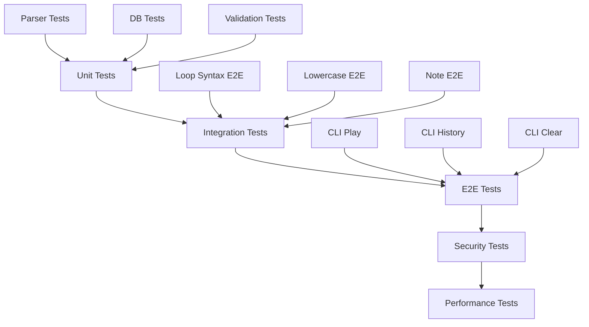

# テスト項目書: REQ-CLI-003 MML Syntax Extension

## メタ情報

| 項目 | 内容 |
|------|------|
| ドキュメントID | TEST-CLI-003 |
| 対応設計書 | BASIC-CLI-003_MML-Syntax-Extension.md (v1.0.0) |
| 作成日 | 2026-01-11 |
| ステータス | ドラフト |
| 対象バージョン | sine-mml v2.1 (Phase 2.0継続) |

---

## 1. テスト方針

### 1.1 テストレベル

| レベル | 対象 | カバレッジ目標 |
|--------|------|---------------|
| Unit | パーサー、DB操作、バリデーション | 95%以上 |
| Integration | CLI引数処理、DB永続化 | 90%以上 |
| E2E | CLIコマンド実行、ユーザーフロー | 主要パス100% |

### 1.2 テスト優先度

| 優先度 | 説明 | 実装タイミング |
|--------|------|---------------|
| P0 | クリティカルパス（必須機能） | Sprint 1 Week 1 |
| P1 | 重要機能（エラーハンドリング） | Sprint 1 Week 2 |
| P2 | エッジケース（境界値） | Sprint 2 |

### 1.3 テスト環境

- **OS**: macOS, Linux (CI環境)
- **Rust**: 1.70+
- **テストフレームワーク**: 
  - ユニットテスト: Rust標準 `#[test]`
  - E2Eテスト: `assert_cmd`, `predicates`, `tempfile`
- **データベース**: SQLite (in-memory for tests)

---

## 2. テスト対象機能一覧

| 機能ID | 機能名 | 概要 | 優先度 |
|--------|--------|------|--------|
| F-023 | MMLループ構文 | `[]` で囲んだ範囲を指定回数ループ | P0 |
| F-024 | 小文字MML記述 | 小文字でMMLコマンドを記述可能 | P0 |
| F-025 | 履歴メモ機能 | `--note` オプションで履歴にメモを付与 | P1 |
| F-026 | 履歴削除機能 | `clear-history` コマンドで全履歴削除 | P1 |
| F-027 | DBマイグレーション | v1→v2スキーマ移行（`note`カラム追加） | P0 |

---

## 3. ユニットテスト項目

### 3.1 F-023: MMLループ構文（パーサー）

#### TC-023-U-001: 基本ループ構文の解析

| 項目 | 内容 |
|------|------|
| 優先度 | P0 |
| テスト対象 | `Parser::parse_loop()` |
| 前提条件 | トークナイザーが `[CDEF]3` をトークン列に変換済み |
| 入力 | `[CDEF]3` |
| 期待結果 | `Command::Loop { commands: [C,D,E,F], escape_index: None, repeat_count: 3 }` |

**テストコード雛形:**
```rust
#[test]
fn test_parse_basic_loop() {
    let input = "[CDEF]3";
    let mml = parse(input).unwrap();
    
    assert_eq!(mml.commands.len(), 1);
    match &mml.commands[0] {
        Command::Loop { commands, escape_index, repeat_count } => {
            assert_eq!(commands.len(), 4);
            assert_eq!(*escape_index, None);
            assert_eq!(*repeat_count, 3);
        }
        _ => panic!("Expected Loop command"),
    }
}
```

---

#### TC-023-U-002: ループ回数省略時のデフォルト値

| 項目 | 内容 |
|------|------|
| 優先度 | P0 |
| テスト対象 | `Parser::parse_loop()` |
| 前提条件 | - |
| 入力 | `[CDEF]` |
| 期待結果 | `repeat_count = 1` |

**テストコード雛形:**
```rust
#[test]
fn test_loop_default_count() {
    let input = "[CDEF]";
    let mml = parse(input).unwrap();
    
    match &mml.commands[0] {
        Command::Loop { repeat_count, .. } => {
            assert_eq!(*repeat_count, 1);
        }
        _ => panic!("Expected Loop command"),
    }
}
```

---

#### TC-023-U-003: 脱出ポイント付きループ

| 項目 | 内容 |
|------|------|
| 優先度 | P0 |
| テスト対象 | `Parser::parse_loop()` |
| 前提条件 | - |
| 入力 | `[CD:EF]2` |
| 期待結果 | `escape_index = Some(2)`, 展開後: `CDEFCD` |

**テストコード雛形:**
```rust
#[test]
fn test_loop_with_escape_point() {
    let input = "[CD:EF]2";
    let mml = parse(input).unwrap();
    
    match &mml.commands[0] {
        Command::Loop { commands, escape_index, repeat_count } => {
            assert_eq!(commands.len(), 4); // C, D, E, F
            assert_eq!(*escape_index, Some(2)); // After D
            assert_eq!(*repeat_count, 2);
            
            // Test expansion
            let expanded = expand_loop(commands, *escape_index, *repeat_count);
            assert_eq!(expanded.len(), 6); // CDEFCD
        }
        _ => panic!("Expected Loop command"),
    }
}
```

---

#### TC-023-U-004: ループ回数上限値（99回）

| 項目 | 内容 |
|------|------|
| 優先度 | P1 |
| テスト対象 | `Parser::parse_loop()` |
| 前提条件 | - |
| 入力 | `[CDEF]99` |
| 期待結果 | 正常に解析、`repeat_count = 99` |

**テストコード雛形:**
```rust
#[test]
fn test_loop_max_count() {
    let input = "[CDEF]99";
    let mml = parse(input).unwrap();
    
    match &mml.commands[0] {
        Command::Loop { repeat_count, .. } => {
            assert_eq!(*repeat_count, 99);
        }
        _ => panic!("Expected Loop command"),
    }
}
```

---

#### TC-023-U-005: ループ回数超過エラー（100回以上）

| 項目 | 内容 |
|------|------|
| 優先度 | P1 |
| テスト対象 | `Parser::parse_loop()` |
| 前提条件 | - |
| 入力 | `[CDEF]100` |
| 期待結果 | `ParseError::InvalidLoopCount(100)` |

**テストコード雛形:**
```rust
#[test]
fn test_loop_count_exceeds_limit() {
    let input = "[CDEF]100";
    let err = parse(input).unwrap_err();
    
    match err {
        ParseError::InvalidLoopCount(count) => {
            assert_eq!(count, 100);
        }
        _ => panic!("Expected InvalidLoopCount error"),
    }
}
```

---

#### TC-023-U-006: ネストしたループのエラー

| 項目 | 内容 |
|------|------|
| 優先度 | P1 |
| テスト対象 | `Parser::parse_loop()` |
| 前提条件 | - |
| 入力 | `[[CDEF]2]3` |
| 期待結果 | `ParseError::NestedLoopNotSupported` |

**テストコード雛形:**
```rust
#[test]
fn test_nested_loop_error() {
    let input = "[[CDEF]2]3";
    let err = parse(input).unwrap_err();
    
    match err {
        ParseError::NestedLoopNotSupported { position } => {
            assert!(position > 0);
        }
        _ => panic!("Expected NestedLoopNotSupported error"),
    }
}
```

---

#### TC-023-U-007: 閉じ括弧なしエラー

| 項目 | 内容 |
|------|------|
| 優先度 | P1 |
| テスト対象 | `Parser::parse_loop()` |
| 前提条件 | - |
| 入力 | `[CDEF` |
| 期待結果 | `ParseError::UnmatchedBracket { expected: ']', position: ... }` |

**テストコード雛形:**
```rust
#[test]
fn test_unmatched_opening_bracket() {
    let input = "[CDEF";
    let err = parse(input).unwrap_err();
    
    match err {
        ParseError::UnmatchedBracket { expected, .. } => {
            assert_eq!(expected, ']');
        }
        _ => panic!("Expected UnmatchedBracket error"),
    }
}
```

---

#### TC-023-U-008: 開き括弧なしエラー

| 項目 | 内容 |
|------|------|
| 優先度 | P1 |
| テスト対象 | `Parser::parse_loop()` |
| 前提条件 | - |
| 入力 | `CDEF]` |
| 期待結果 | `ParseError::UnexpectedToken { found: ']', ... }` |

**テストコード雛形:**
```rust
#[test]
fn test_unmatched_closing_bracket() {
    let input = "CDEF]";
    let err = parse(input).unwrap_err();
    
    match err {
        ParseError::UnexpectedToken { found, .. } => {
            assert_eq!(found, Token::LoopEnd);
        }
        _ => panic!("Expected UnexpectedToken error"),
    }
}
```

---

#### TC-023-U-009: 複数の脱出ポイントエラー

| 項目 | 内容 |
|------|------|
| 優先度 | P2 |
| テスト対象 | `Parser::parse_loop()` |
| 前提条件 | - |
| 入力 | `[C:D:E]2` |
| 期待結果 | `ParseError::MultipleEscapePoints` |

**テストコード雛形:**
```rust
#[test]
fn test_multiple_escape_points_error() {
    let input = "[C:D:E]2";
    let err = parse(input).unwrap_err();
    
    match err {
        ParseError::MultipleEscapePoints { position } => {
            assert!(position > 0);
        }
        _ => panic!("Expected MultipleEscapePoints error"),
    }
}
```

---

#### TC-023-U-010: ループ展開処理の正確性

| 項目 | 内容 |
|------|------|
| 優先度 | P0 |
| テスト対象 | `expand_loop()` |
| 前提条件 | - |
| 入力 | `commands: [C,D,E,F], escape_index: None, repeat_count: 3` |
| 期待結果 | `[C,D,E,F,C,D,E,F,C,D,E,F]` (12要素) |

**テストコード雛形:**
```rust
#[test]
fn test_expand_loop_without_escape() {
    let commands = vec![
        Command::Note(Note { pitch: Pitch::C, .. }),
        Command::Note(Note { pitch: Pitch::D, .. }),
        Command::Note(Note { pitch: Pitch::E, .. }),
        Command::Note(Note { pitch: Pitch::F, .. }),
    ];
    
    let expanded = expand_loop(&commands, None, 3);
    assert_eq!(expanded.len(), 12);
}
```

---

### 3.2 F-024: 小文字MML記述（正規化）

#### TC-024-U-001: 小文字音符の正規化

| 項目 | 内容 |
|------|------|
| 優先度 | P0 |
| テスト対象 | `normalize_input()` |
| 前提条件 | - |
| 入力 | `cdefgab` |
| 期待結果 | `CDEFGAB` |

**テストコード雛形:**
```rust
#[test]
fn test_normalize_lowercase_notes() {
    let input = "cdefgab";
    let normalized = normalize_input(input);
    assert_eq!(normalized, "CDEFGAB");
}
```

---

#### TC-024-U-002: 小文字コマンドの正規化

| 項目 | 内容 |
|------|------|
| 優先度 | P0 |
| テスト対象 | `normalize_input()` |
| 前提条件 | - |
| 入力 | `o5 l8 t140 v10 r` |
| 期待結果 | `O5 L8 T140 V10 R` |

**テストコード雛形:**
```rust
#[test]
fn test_normalize_lowercase_commands() {
    let input = "o5 l8 t140 v10 r";
    let normalized = normalize_input(input);
    assert_eq!(normalized, "O5 L8 T140 V10 R");
}
```

---

#### TC-024-U-003: 大文字小文字混在の正規化

| 項目 | 内容 |
|------|------|
| 優先度 | P0 |
| テスト対象 | `normalize_input()` |
| 前提条件 | - |
| 入力 | `CdEfGaB` |
| 期待結果 | `CDEFGAB` |

**テストコード雛形:**
```rust
#[test]
fn test_normalize_mixed_case() {
    let input = "CdEfGaB";
    let normalized = normalize_input(input);
    assert_eq!(normalized, "CDEFGAB");
}
```

---

#### TC-024-U-004: 記号・数値は変換しない

| 項目 | 内容 |
|------|------|
| 優先度 | P1 |
| テスト対象 | `normalize_input()` |
| 前提条件 | - |
| 入力 | `c#4 d-8 e+16` |
| 期待結果 | `C#4 D-8 E+16` |

**テストコード雛形:**
```rust
#[test]
fn test_normalize_preserves_symbols_and_numbers() {
    let input = "c#4 d-8 e+16";
    let normalized = normalize_input(input);
    assert_eq!(normalized, "C#4 D-8 E+16");
}
```

---

#### TC-024-U-005: ループ構文と小文字の組み合わせ

| 項目 | 内容 |
|------|------|
| 優先度 | P0 |
| テスト対象 | `parse()` (統合) |
| 前提条件 | - |
| 入力 | `[cdef]3` |
| 期待結果 | `[CDEF]3` と同じ結果 |

**テストコード雛形:**
```rust
#[test]
fn test_lowercase_loop_syntax() {
    let input_lower = "[cdef]3";
    let input_upper = "[CDEF]3";
    
    let mml_lower = parse(input_lower).unwrap();
    let mml_upper = parse(input_upper).unwrap();
    
    assert_eq!(mml_lower, mml_upper);
}
```

---

#### TC-024-U-006: Unicode文字は変換しない

| 項目 | 内容 |
|------|------|
| 優先度 | P2 |
| テスト対象 | `normalize_input()` |
| 前提条件 | - |
| 入力 | `c あいうえお d` |
| 期待結果 | `C あいうえお D` |

**テストコード雛形:**
```rust
#[test]
fn test_normalize_preserves_unicode() {
    let input = "c あいうえお d";
    let normalized = normalize_input(input);
    assert_eq!(normalized, "C あいうえお D");
}
```

---

### 3.3 F-025: 履歴メモ機能（DB操作）

#### TC-025-U-001: メモ付き履歴の保存

| 項目 | 内容 |
|------|------|
| 優先度 | P0 |
| テスト対象 | `HistoryRepository::save()` |
| 前提条件 | DB初期化済み |
| 入力 | `mml: "CDEF", note: Some("My melody")` |
| 期待結果 | 履歴ID返却、DBに保存される |

**テストコード雛形:**
```rust
#[test]
fn test_save_history_with_note() {
    let conn = Connection::open_in_memory().unwrap();
    initialize(&conn).unwrap();
    let repo = HistoryRepository::new(Arc::new(Mutex::new(conn)));
    
    let id = repo.save("CDEF", "sine", 0.5, 120, Some("My melody")).unwrap();
    assert!(id > 0);
    
    let entry = repo.get_by_id(id).unwrap();
    assert_eq!(entry.note, Some("My melody".to_string()));
}
```

---

#### TC-025-U-002: メモなし履歴の保存

| 項目 | 内容 |
|------|------|
| 優先度 | P0 |
| テスト対象 | `HistoryRepository::save()` |
| 前提条件 | DB初期化済み |
| 入力 | `mml: "CDEF", note: None` |
| 期待結果 | `note` カラムが NULL |

**テストコード雛形:**
```rust
#[test]
fn test_save_history_without_note() {
    let conn = Connection::open_in_memory().unwrap();
    initialize(&conn).unwrap();
    let repo = HistoryRepository::new(Arc::new(Mutex::new(conn)));
    
    let id = repo.save("CDEF", "sine", 0.5, 120, None).unwrap();
    let entry = repo.get_by_id(id).unwrap();
    assert_eq!(entry.note, None);
}
```

---

#### TC-025-U-003: UTF-8メモの保存

| 項目 | 内容 |
|------|------|
| 優先度 | P1 |
| テスト対象 | `HistoryRepository::save()` |
| 前提条件 | DB初期化済み |
| 入力 | `note: Some("あいうえお🎵")` |
| 期待結果 | UTF-8文字列が正しく保存・取得される |

**テストコード雛形:**
```rust
#[test]
fn test_save_history_with_utf8_note() {
    let conn = Connection::open_in_memory().unwrap();
    initialize(&conn).unwrap();
    let repo = HistoryRepository::new(Arc::new(Mutex::new(conn)));
    
    let note = "あいうえお🎵";
    let id = repo.save("CDEF", "sine", 0.5, 120, Some(note)).unwrap();
    let entry = repo.get_by_id(id).unwrap();
    assert_eq!(entry.note, Some(note.to_string()));
}
```

---

#### TC-025-U-004: メモ長さ制限（500文字）

| 項目 | 内容 |
|------|------|
| 優先度 | P1 |
| テスト対象 | `validate_note()` |
| 前提条件 | - |
| 入力 | 500文字のメモ |
| 期待結果 | 正常に保存される |

**テストコード雛形:**
```rust
#[test]
fn test_note_max_length() {
    let note = "a".repeat(500);
    let result = validate_note(&note);
    assert!(result.is_ok());
}
```

---

#### TC-025-U-005: メモ長さ超過エラー

| 項目 | 内容 |
|------|------|
| 優先度 | P1 |
| テスト対象 | `validate_note()` |
| 前提条件 | - |
| 入力 | 501文字のメモ |
| 期待結果 | `ValidationError::NoteTooLong` |

**テストコード雛形:**
```rust
#[test]
fn test_note_exceeds_max_length() {
    let note = "a".repeat(501);
    let err = validate_note(&note).unwrap_err();
    
    match err {
        ValidationError::NoteTooLong { length, max } => {
            assert_eq!(length, 501);
            assert_eq!(max, 500);
        }
        _ => panic!("Expected NoteTooLong error"),
    }
}
```

---

#### TC-025-U-006: 空文字列メモの保存

| 項目 | 内容 |
|------|------|
| 優先度 | P2 |
| テスト対象 | `HistoryRepository::save()` |
| 前提条件 | DB初期化済み |
| 入力 | `note: Some("")` |
| 期待結果 | 空文字列が保存される |

**テストコード雛形:**
```rust
#[test]
fn test_save_history_with_empty_note() {
    let conn = Connection::open_in_memory().unwrap();
    initialize(&conn).unwrap();
    let repo = HistoryRepository::new(Arc::new(Mutex::new(conn)));
    
    let id = repo.save("CDEF", "sine", 0.5, 120, Some("")).unwrap();
    let entry = repo.get_by_id(id).unwrap();
    assert_eq!(entry.note, Some("".to_string()));
}
```

---

### 3.4 F-026: 履歴削除機能（DB操作）

#### TC-026-U-001: 全履歴削除

| 項目 | 内容 |
|------|------|
| 優先度 | P0 |
| テスト対象 | `HistoryRepository::clear_all()` |
| 前提条件 | 履歴が3件存在 |
| 入力 | - |
| 期待結果 | 全履歴が削除され、件数0 |

**テストコード雛形:**
```rust
#[test]
fn test_clear_all_history() {
    let conn = Connection::open_in_memory().unwrap();
    initialize(&conn).unwrap();
    let repo = HistoryRepository::new(Arc::new(Mutex::new(conn)));
    
    // Insert 3 entries
    repo.save("CDE", "sine", 0.5, 120, None).unwrap();
    repo.save("FGA", "square", 0.7, 140, None).unwrap();
    repo.save("BCD", "sawtooth", 0.3, 100, None).unwrap();
    
    assert_eq!(repo.count().unwrap(), 3);
    
    repo.clear_all().unwrap();
    assert_eq!(repo.count().unwrap(), 0);
}
```

---

#### TC-026-U-002: 空の履歴を削除

| 項目 | 内容 |
|------|------|
| 優先度 | P1 |
| テスト対象 | `HistoryRepository::clear_all()` |
| 前提条件 | 履歴が0件 |
| 入力 | - |
| 期待結果 | エラーなく完了 |

**テストコード雛形:**
```rust
#[test]
fn test_clear_empty_history() {
    let conn = Connection::open_in_memory().unwrap();
    initialize(&conn).unwrap();
    let repo = HistoryRepository::new(Arc::new(Mutex::new(conn)));
    
    assert_eq!(repo.count().unwrap(), 0);
    
    let result = repo.clear_all();
    assert!(result.is_ok());
    assert_eq!(repo.count().unwrap(), 0);
}
```

---

### 3.5 F-027: DBマイグレーション（v1→v2）

#### TC-027-U-001: v1からv2へのマイグレーション

| 項目 | 内容 |
|------|------|
| 優先度 | P0 |
| テスト対象 | `migrate()` |
| 前提条件 | v1スキーマのDB（`note`カラムなし） |
| 入力 | - |
| 期待結果 | `note`カラムが追加され、バージョンが2に更新 |

**テストコード雛形:**
```rust
#[test]
fn test_migrate_v1_to_v2() {
    let conn = Connection::open_in_memory().unwrap();
    
    // Create v1 schema
    conn.execute(
        "CREATE TABLE history (
            id INTEGER PRIMARY KEY,
            mml TEXT NOT NULL,
            waveform TEXT NOT NULL,
            volume REAL NOT NULL,
            bpm INTEGER NOT NULL,
            created_at TEXT NOT NULL
        )",
        [],
    ).unwrap();
    
    conn.execute(
        "CREATE TABLE schema_version (version INTEGER PRIMARY KEY)",
        [],
    ).unwrap();
    
    conn.execute("INSERT INTO schema_version (version) VALUES (1)", []).unwrap();
    
    // Insert v1 data
    conn.execute(
        "INSERT INTO history (mml, waveform, volume, bpm, created_at) 
         VALUES ('CDE', 'sine', 0.5, 120, '2026-01-01')",
        [],
    ).unwrap();
    
    // Run migration
    migrate(&conn).unwrap();
    
    // Verify version updated
    let version: i64 = conn.query_row(
        "SELECT version FROM schema_version",
        [],
        |row| row.get(0),
    ).unwrap();
    assert_eq!(version, 2);
    
    // Verify note column exists
    let note: Option<String> = conn.query_row(
        "SELECT note FROM history WHERE id = 1",
        [],
        |row| row.get(0),
    ).unwrap();
    assert_eq!(note, None);
}
```

---

#### TC-027-U-002: v2スキーマの再マイグレーション（冪等性）

| 項目 | 内容 |
|------|------|
| 優先度 | P0 |
| テスト対象 | `migrate()` |
| 前提条件 | v2スキーマのDB（`note`カラムあり） |
| 入力 | - |
| 期待結果 | 変更なし、エラーなし |

**テストコード雛形:**
```rust
#[test]
fn test_migrate_v2_idempotent() {
    let conn = Connection::open_in_memory().unwrap();
    initialize(&conn).unwrap(); // Creates v2 schema
    
    // Run migration again
    let result = migrate(&conn);
    assert!(result.is_ok());
    
    // Verify version still 2
    let version: i64 = conn.query_row(
        "SELECT version FROM schema_version",
        [],
        |row| row.get(0),
    ).unwrap();
    assert_eq!(version, 2);
}
```

---

#### TC-027-U-003: 既存データの保持

| 項目 | 内容 |
|------|------|
| 優先度 | P0 |
| テスト対象 | `migrate()` |
| 前提条件 | v1スキーマに3件のデータ |
| 入力 | - |
| 期待結果 | 全データが保持され、`note`カラムはNULL |

**テストコード雛形:**
```rust
#[test]
fn test_migrate_preserves_existing_data() {
    let conn = Connection::open_in_memory().unwrap();
    
    // Create v1 schema with data
    conn.execute(
        "CREATE TABLE history (
            id INTEGER PRIMARY KEY,
            mml TEXT NOT NULL,
            waveform TEXT NOT NULL,
            volume REAL NOT NULL,
            bpm INTEGER NOT NULL,
            created_at TEXT NOT NULL
        )",
        [],
    ).unwrap();
    
    conn.execute(
        "INSERT INTO history (mml, waveform, volume, bpm, created_at) 
         VALUES ('CDE', 'sine', 0.5, 120, '2026-01-01')",
        [],
    ).unwrap();
    
    conn.execute(
        "INSERT INTO history (mml, waveform, volume, bpm, created_at) 
         VALUES ('FGA', 'square', 0.7, 140, '2026-01-02')",
        [],
    ).unwrap();
    
    // Run migration
    migrate(&conn).unwrap();
    
    // Verify data preserved
    let count: i64 = conn.query_row(
        "SELECT COUNT(*) FROM history",
        [],
        |row| row.get(0),
    ).unwrap();
    assert_eq!(count, 2);
    
    // Verify note is NULL for existing data
    let notes: Vec<Option<String>> = conn
        .prepare("SELECT note FROM history ORDER BY id")
        .unwrap()
        .query_map([], |row| row.get(0))
        .unwrap()
        .collect::<Result<Vec<_>, _>>()
        .unwrap();
    
    assert_eq!(notes, vec![None, None]);
}
```

---

#### TC-027-U-004: 新規DB作成時はv2スキーマ

| 項目 | 内容 |
|------|------|
| 優先度 | P0 |
| テスト対象 | `initialize()` |
| 前提条件 | 空のDB |
| 入力 | - |
| 期待結果 | v2スキーマで作成される（`note`カラムあり） |

**テストコード雛形:**
```rust
#[test]
fn test_initialize_creates_v2_schema() {
    let conn = Connection::open_in_memory().unwrap();
    initialize(&conn).unwrap();
    
    // Verify version is 2
    let version: i64 = conn.query_row(
        "SELECT version FROM schema_version",
        [],
        |row| row.get(0),
    ).unwrap();
    assert_eq!(version, 2);
    
    // Verify note column exists
    let result = conn.execute(
        "INSERT INTO history (mml, waveform, volume, bpm, note, created_at) 
         VALUES ('CDE', 'sine', 0.5, 120, 'test', '2026-01-01')",
        [],
    );
    assert!(result.is_ok());
}
```

---

## 4. 統合テスト項目

### 4.1 F-023: MMLループ構文（統合）

#### TC-023-I-001: ループ構文のエンドツーエンド解析

| 項目 | 内容 |
|------|------|
| 優先度 | P0 |
| テスト対象 | `parse()` → `expand_loop()` → `synthesize()` |
| 前提条件 | - |
| 入力 | `[CDEF]3` |
| 期待結果 | 12個の音符が生成される |

**テストコード雛形:**
```rust
#[test]
fn test_loop_syntax_end_to_end() {
    let input = "[CDEF]3";
    let mml = parse(input).unwrap();
    
    // Expand loops
    let expanded = expand_all_loops(&mml.commands);
    
    // Count notes
    let note_count = expanded.iter()
        .filter(|cmd| matches!(cmd, Command::Note(_)))
        .count();
    
    assert_eq!(note_count, 12);
}
```

---

#### TC-023-I-002: 複数ループの組み合わせ

| 項目 | 内容 |
|------|------|
| 優先度 | P1 |
| テスト対象 | `parse()` |
| 前提条件 | - |
| 入力 | `[CDE]2 [FGA]3` |
| 期待結果 | 最初のループ: 6音符、2番目のループ: 9音符 |

**テストコード雛形:**
```rust
#[test]
fn test_multiple_loops() {
    let input = "[CDE]2 [FGA]3";
    let mml = parse(input).unwrap();
    
    assert_eq!(mml.commands.len(), 2);
    
    match &mml.commands[0] {
        Command::Loop { repeat_count, .. } => assert_eq!(*repeat_count, 2),
        _ => panic!("Expected Loop"),
    }
    
    match &mml.commands[1] {
        Command::Loop { repeat_count, .. } => assert_eq!(*repeat_count, 3),
        _ => panic!("Expected Loop"),
    }
}
```

---

### 4.2 F-024: 小文字MML記述（統合）

#### TC-024-I-001: 小文字MMLの完全な解析

| 項目 | 内容 |
|------|------|
| 優先度 | P0 |
| テスト対象 | `parse()` (正規化含む) |
| 前提条件 | - |
| 入力 | `t120 l4 o5 cdefgab >c` |
| 期待結果 | `T120 L4 O5 CDEFGAB >C` と同じAST |

**テストコード雛形:**
```rust
#[test]
fn test_lowercase_mml_full_parse() {
    let input_lower = "t120 l4 o5 cdefgab >c";
    let input_upper = "T120 L4 O5 CDEFGAB >C";
    
    let mml_lower = parse(input_lower).unwrap();
    let mml_upper = parse(input_upper).unwrap();
    
    assert_eq!(mml_lower, mml_upper);
}
```

---

### 4.3 F-025: 履歴メモ機能（統合）

#### TC-025-I-001: メモ付き履歴の保存と取得

| 項目 | 内容 |
|------|------|
| 優先度 | P0 |
| テスト対象 | `save()` → `get_all()` |
| 前提条件 | DB初期化済み |
| 入力 | メモ付き履歴を3件保存 |
| 期待結果 | 全履歴が正しく取得され、メモが表示される |

**テストコード雛形:**
```rust
#[test]
fn test_save_and_retrieve_history_with_notes() {
    let conn = Connection::open_in_memory().unwrap();
    initialize(&conn).unwrap();
    let repo = HistoryRepository::new(Arc::new(Mutex::new(conn)));
    
    repo.save("CDE", "sine", 0.5, 120, Some("First")).unwrap();
    repo.save("FGA", "square", 0.7, 140, Some("Second")).unwrap();
    repo.save("BCD", "sawtooth", 0.3, 100, None).unwrap();
    
    let entries = repo.get_all().unwrap();
    assert_eq!(entries.len(), 3);
    assert_eq!(entries[0].note, Some("First".to_string()));
    assert_eq!(entries[1].note, Some("Second".to_string()));
    assert_eq!(entries[2].note, None);
}
```

---

## 5. E2Eテスト項目

### 5.1 F-023: MMLループ構文（E2E）

#### TC-023-E-001: ループ構文でのCLI再生

| 項目 | 内容 |
|------|------|
| 優先度 | P0 |
| テスト対象 | `sine-mml play "[CDEF]3"` |
| 前提条件 | バイナリがビルド済み |
| 入力 | `sine-mml play "[CDEF]3"` |
| 期待結果 | 正常終了（exit code 0） |

**テストコード雛形:**
```rust
#[test]
fn test_cli_play_with_loop_syntax() {
    let mut cmd = Command::new(env!("CARGO_BIN_EXE_sine-mml"));
    cmd.arg("play")
        .arg("[CDEF]3")
        .timeout(std::time::Duration::from_secs(5));
    
    cmd.assert().code(predicate::in_iter([0i32]));
}
```

---

#### TC-023-E-002: ループ回数超過エラーのCLI表示

| 項目 | 内容 |
|------|------|
| 優先度 | P1 |
| テスト対象 | `sine-mml play "[CDEF]100"` |
| 前提条件 | バイナリがビルド済み |
| 入力 | `sine-mml play "[CDEF]100"` |
| 期待結果 | エラーメッセージ表示、exit code 1 |

**テストコード雛形:**
```rust
#[test]
fn test_cli_loop_count_error() {
    let mut cmd = Command::new(env!("CARGO_BIN_EXE_sine-mml"));
    cmd.arg("play").arg("[CDEF]100");
    
    cmd.assert()
        .failure()
        .stderr(predicate::str::contains("Loop count must be 1-99"));
}
```

---

#### TC-023-E-003: ネストループエラーのCLI表示

| 項目 | 内容 |
|------|------|
| 優先度 | P1 |
| テスト対象 | `sine-mml play "[[CDEF]2]3"` |
| 前提条件 | バイナリがビルド済み |
| 入力 | `sine-mml play "[[CDEF]2]3"` |
| 期待結果 | エラーメッセージ表示、exit code 1 |

**テストコード雛形:**
```rust
#[test]
fn test_cli_nested_loop_error() {
    let mut cmd = Command::new(env!("CARGO_BIN_EXE_sine-mml"));
    cmd.arg("play").arg("[[CDEF]2]3");
    
    cmd.assert()
        .failure()
        .stderr(predicate::str::contains("Nested loops are not supported"));
}
```

---

### 5.2 F-024: 小文字MML記述（E2E）

#### TC-024-E-001: 小文字MMLでのCLI再生

| 項目 | 内容 |
|------|------|
| 優先度 | P0 |
| テスト対象 | `sine-mml play "cdefgab"` |
| 前提条件 | バイナリがビルド済み |
| 入力 | `sine-mml play "cdefgab"` |
| 期待結果 | 正常終了（exit code 0） |

**テストコード雛形:**
```rust
#[test]
fn test_cli_play_with_lowercase_mml() {
    let mut cmd = Command::new(env!("CARGO_BIN_EXE_sine-mml"));
    cmd.arg("play")
        .arg("cdefgab")
        .timeout(std::time::Duration::from_secs(5));
    
    cmd.assert().code(predicate::in_iter([0i32]));
}
```

---

#### TC-024-E-002: 小文字とループの組み合わせ

| 項目 | 内容 |
|------|------|
| 優先度 | P0 |
| テスト対象 | `sine-mml play "[cdef]3"` |
| 前提条件 | バイナリがビルド済み |
| 入力 | `sine-mml play "[cdef]3"` |
| 期待結果 | 正常終了（exit code 0） |

**テストコード雛形:**
```rust
#[test]
fn test_cli_lowercase_with_loop() {
    let mut cmd = Command::new(env!("CARGO_BIN_EXE_sine-mml"));
    cmd.arg("play")
        .arg("[cdef]3")
        .timeout(std::time::Duration::from_secs(5));
    
    cmd.assert().code(predicate::in_iter([0i32]));
}
```

---

### 5.3 F-025: 履歴メモ機能（E2E）

#### TC-025-E-001: --noteオプションでの再生

| 項目 | 内容 |
|------|------|
| 優先度 | P0 |
| テスト対象 | `sine-mml play "CDEF" --note "My melody"` |
| 前提条件 | バイナリがビルド済み |
| 入力 | `sine-mml play "CDEF" --note "My melody"` |
| 期待結果 | 正常終了、履歴にメモが保存される |

**テストコード雛形:**
```rust
#[test]
fn test_cli_play_with_note() {
    let mut cmd = Command::new(env!("CARGO_BIN_EXE_sine-mml"));
    cmd.arg("play")
        .arg("CDEF")
        .arg("--note")
        .arg("My melody")
        .timeout(std::time::Duration::from_secs(5));
    
    cmd.assert().code(predicate::in_iter([0i32]));
    
    // Verify history contains note
    let mut history_cmd = Command::new(env!("CARGO_BIN_EXE_sine-mml"));
    history_cmd.arg("history");
    history_cmd.assert()
        .success()
        .stdout(predicate::str::contains("My melody"));
}
```

---

#### TC-025-E-002: UTF-8メモの表示

| 項目 | 内容 |
|------|------|
| 優先度 | P1 |
| テスト対象 | `sine-mml play "CDEF" --note "あいうえお🎵"` |
| 前提条件 | バイナリがビルド済み |
| 入力 | `sine-mml play "CDEF" --note "あいうえお🎵"` |
| 期待結果 | 履歴にUTF-8文字列が正しく表示される |

**テストコード雛形:**
```rust
#[test]
fn test_cli_note_with_utf8() {
    let mut cmd = Command::new(env!("CARGO_BIN_EXE_sine-mml"));
    cmd.arg("play")
        .arg("CDEF")
        .arg("--note")
        .arg("あいうえお🎵")
        .timeout(std::time::Duration::from_secs(5));
    
    cmd.assert().code(predicate::in_iter([0i32]));
    
    let mut history_cmd = Command::new(env!("CARGO_BIN_EXE_sine-mml"));
    history_cmd.arg("history");
    history_cmd.assert()
        .success()
        .stdout(predicate::str::contains("あいうえお🎵"));
}
```

---

#### TC-025-E-003: メモ長さ超過エラー

| 項目 | 内容 |
|------|------|
| 優先度 | P1 |
| テスト対象 | `sine-mml play "CDEF" --note "<501文字>"` |
| 前提条件 | バイナリがビルド済み |
| 入力 | 501文字のメモ |
| 期待結果 | エラーメッセージ表示、exit code 1 |

**テストコード雛形:**
```rust
#[test]
fn test_cli_note_too_long() {
    let long_note = "a".repeat(501);
    let mut cmd = Command::new(env!("CARGO_BIN_EXE_sine-mml"));
    cmd.arg("play")
        .arg("CDEF")
        .arg("--note")
        .arg(&long_note);
    
    cmd.assert()
        .failure()
        .stderr(predicate::str::contains("Note must be 500 characters or less"));
}
```

---

#### TC-025-E-004: 履歴表示でのメモ列

| 項目 | 内容 |
|------|------|
| 優先度 | P0 |
| テスト対象 | `sine-mml history` |
| 前提条件 | メモ付き履歴とメモなし履歴が存在 |
| 入力 | `sine-mml history` |
| 期待結果 | メモ列が表示され、メモなしは "-" |

**テストコード雛形:**
```rust
#[test]
fn test_cli_history_displays_note_column() {
    // Play with note
    let mut cmd1 = Command::new(env!("CARGO_BIN_EXE_sine-mml"));
    cmd1.arg("play")
        .arg("CDEF")
        .arg("--note")
        .arg("Test note")
        .timeout(std::time::Duration::from_secs(5));
    cmd1.assert().code(predicate::in_iter([0i32]));
    
    // Play without note
    let mut cmd2 = Command::new(env!("CARGO_BIN_EXE_sine-mml"));
    cmd2.arg("play")
        .arg("GAB")
        .timeout(std::time::Duration::from_secs(5));
    cmd2.assert().code(predicate::in_iter([0i32]));
    
    // Check history
    let mut history_cmd = Command::new(env!("CARGO_BIN_EXE_sine-mml"));
    history_cmd.arg("history");
    history_cmd.assert()
        .success()
        .stdout(predicate::str::contains("Note"))
        .stdout(predicate::str::contains("Test note"))
        .stdout(predicate::str::contains("-"));
}
```

---

### 5.4 F-026: 履歴削除機能（E2E）

#### TC-026-E-001: 確認プロンプトで削除実行（y）

| 項目 | 内容 |
|------|------|
| 優先度 | P0 |
| テスト対象 | `sine-mml clear-history` |
| 前提条件 | 履歴が存在 |
| 入力 | `y` |
| 期待結果 | 全履歴削除、成功メッセージ表示 |

**テストコード雛形:**
```rust
#[test]
fn test_cli_clear_history_confirm_yes() {
    use std::io::Write;
    
    // Create history
    let mut cmd = Command::new(env!("CARGO_BIN_EXE_sine-mml"));
    cmd.arg("play")
        .arg("CDEF")
        .timeout(std::time::Duration::from_secs(5));
    cmd.assert().code(predicate::in_iter([0i32]));
    
    // Clear history with "y" input
    let mut clear_cmd = Command::new(env!("CARGO_BIN_EXE_sine-mml"));
    clear_cmd.arg("clear-history")
        .write_stdin("y\n");
    
    clear_cmd.assert()
        .success()
        .stdout(predicate::str::contains("全ての履歴を削除しました"));
    
    // Verify history is empty
    let mut history_cmd = Command::new(env!("CARGO_BIN_EXE_sine-mml"));
    history_cmd.arg("history");
    history_cmd.assert()
        .success()
        .stdout(predicate::str::contains("履歴がありません"));
}
```

---

#### TC-026-E-002: 確認プロンプトでキャンセル（n）

| 項目 | 内容 |
|------|------|
| 優先度 | P0 |
| テスト対象 | `sine-mml clear-history` |
| 前提条件 | 履歴が存在 |
| 入力 | `n` |
| 期待結果 | 削除キャンセル、履歴は保持される |

**テストコード雛形:**
```rust
#[test]
fn test_cli_clear_history_cancel() {
    // Create history
    let mut cmd = Command::new(env!("CARGO_BIN_EXE_sine-mml"));
    cmd.arg("play")
        .arg("CDEF")
        .timeout(std::time::Duration::from_secs(5));
    cmd.assert().code(predicate::in_iter([0i32]));
    
    // Clear history with "n" input
    let mut clear_cmd = Command::new(env!("CARGO_BIN_EXE_sine-mml"));
    clear_cmd.arg("clear-history")
        .write_stdin("n\n");
    
    clear_cmd.assert()
        .success()
        .stdout(predicate::str::contains("キャンセルしました"));
    
    // Verify history still exists
    let mut history_cmd = Command::new(env!("CARGO_BIN_EXE_sine-mml"));
    history_cmd.arg("history");
    history_cmd.assert()
        .success()
        .stdout(predicate::str::contains("CDEF"));
}
```

---

#### TC-026-E-003: 無効な入力でエラー

| 項目 | 内容 |
|------|------|
| 優先度 | P1 |
| テスト対象 | `sine-mml clear-history` |
| 前提条件 | 履歴が存在 |
| 入力 | `invalid` |
| 期待結果 | エラーメッセージ表示 |

**テストコード雛形:**
```rust
#[test]
fn test_cli_clear_history_invalid_input() {
    let mut clear_cmd = Command::new(env!("CARGO_BIN_EXE_sine-mml"));
    clear_cmd.arg("clear-history")
        .write_stdin("invalid\n");
    
    clear_cmd.assert()
        .failure()
        .stderr(predicate::str::contains("無効な入力です"));
}
```

---

#### TC-026-E-004: 大文字入力の許可（Y, YES）

| 項目 | 内容 |
|------|------|
| 優先度 | P2 |
| テスト対象 | `sine-mml clear-history` |
| 前提条件 | 履歴が存在 |
| 入力 | `Y` または `YES` |
| 期待結果 | 削除実行 |

**テストコード雛形:**
```rust
#[test]
fn test_cli_clear_history_uppercase_yes() {
    for input in &["Y\n", "YES\n", "yes\n"] {
        // Create history
        let mut cmd = Command::new(env!("CARGO_BIN_EXE_sine-mml"));
        cmd.arg("play")
            .arg("CDEF")
            .timeout(std::time::Duration::from_secs(5));
        cmd.assert().code(predicate::in_iter([0i32]));
        
        // Clear with uppercase
        let mut clear_cmd = Command::new(env!("CARGO_BIN_EXE_sine-mml"));
        clear_cmd.arg("clear-history")
            .write_stdin(input);
        
        clear_cmd.assert()
            .success()
            .stdout(predicate::str::contains("全ての履歴を削除しました"));
    }
}
```

---

## 6. エッジケース・境界値テスト

### 6.1 ループ構文の境界値

| TC-ID | 対象 | 境界条件 | テスト値 | 期待結果 |
|-------|------|---------|---------|---------|
| TC-023-B-001 | ループ回数 | 最小値 | `[CDEF]1` | 正常（1回実行） |
| TC-023-B-002 | ループ回数 | 最大値 | `[CDEF]99` | 正常（99回実行） |
| TC-023-B-003 | ループ回数 | 境界-1 | `[CDEF]0` | エラー（1以上必須） |
| TC-023-B-004 | ループ回数 | 境界+1 | `[CDEF]100` | エラー（99以下必須） |
| TC-023-B-005 | ループ内容 | 空ループ | `[]3` | エラーまたは警告 |
| TC-023-B-006 | 脱出ポイント | 先頭 | `[:CDEF]2` | 正常（2回目は空） |
| TC-023-B-007 | 脱出ポイント | 末尾 | `[CDEF:]2` | 正常（脱出なしと同じ） |

### 6.2 メモ長さの境界値

| TC-ID | 対象 | 境界条件 | テスト値 | 期待結果 |
|-------|------|---------|---------|---------|
| TC-025-B-001 | メモ長さ | 最小値 | `""` | 正常（空文字列） |
| TC-025-B-002 | メモ長さ | 最大値 | 500文字 | 正常 |
| TC-025-B-003 | メモ長さ | 境界-1 | 499文字 | 正常 |
| TC-025-B-004 | メモ長さ | 境界+1 | 501文字 | エラー |
| TC-025-B-005 | メモ内容 | NULL | `None` | 正常（NULL保存） |
| TC-025-B-006 | メモ内容 | Unicode | `"🎵🎶🎼"` | 正常 |

---

## 7. 特殊ケーステスト

### 7.1 ループ構文の特殊ケース

| TC-ID | ケース | 入力 | 期待結果 |
|-------|--------|------|---------|
| TC-023-S-001 | 連続ループ | `[CDE]2[FGA]3` | 両方正常に解析 |
| TC-023-S-002 | ループ内の休符 | `[C R D]2` | 正常（休符も繰り返し） |
| TC-023-S-003 | ループ内のコマンド | `[O5 C D E]2` | 正常（コマンドも繰り返し） |
| TC-023-S-004 | 空白を含むループ | `[ C D E F ]3` | 正常（空白は無視） |
| TC-023-S-005 | 脱出ポイントのみ | `[:]2` | エラーまたは警告 |

### 7.2 小文字記述の特殊ケース

| TC-ID | ケース | 入力 | 期待結果 |
|-------|--------|------|---------|
| TC-024-S-001 | 全角文字混在 | `c　d　e` | 正規化後も全角空白保持 |
| TC-024-S-002 | 特殊記号 | `c#+ d-b` | 正常（記号は変換しない） |
| TC-024-S-003 | 数値混在 | `c4 d8 e16` | 正常（数値は変換しない） |

### 7.3 メモの特殊ケース

| TC-ID | ケース | 入力 | 期待結果 |
|-------|--------|------|---------|
| TC-025-S-001 | 改行を含むメモ | `"Line1\nLine2"` | 正常（改行保持） |
| TC-025-S-002 | タブを含むメモ | `"Tab\there"` | 正常（タブ保持） |
| TC-025-S-003 | 引用符を含むメモ | `"Quote \"test\""` | 正常（エスケープ処理） |
| TC-025-S-004 | SQLインジェクション試行 | `"'; DROP TABLE--"` | 正常（プリペアドステートメントで防御） |

---

## 8. セキュリティテスト項目

| TC-ID | テスト観点 | テスト内容 | 期待結果 |
|-------|-----------|-----------|---------|
| TC-SEC-001 | DoS攻撃防止 | ループ回数100回以上 | エラー（上限99回） |
| TC-SEC-002 | DoS攻撃防止 | 極端に長いMML文字列（10MB） | エラーまたはタイムアウト |
| TC-SEC-003 | SQLインジェクション | メモに `'; DROP TABLE history--` | 正常（エスケープされる） |
| TC-SEC-004 | SQLインジェクション | MMLに `'; DELETE FROM history--` | 正常（エスケープされる） |
| TC-SEC-005 | パストラバーサル | `--output "../../../etc/passwd"` | エラー（パス検証） |
| TC-SEC-006 | メモリ枯渇 | ループ回数99回×長いMML | メモリ制限内で動作 |

---

## 9. パフォーマンステスト項目

| TC-ID | テスト対象 | 条件 | 目標値 |
|-------|-----------|------|--------|
| TC-P-001 | ループ展開 | `[CDEFGAB]99` | 10ms以内 |
| TC-P-002 | 小文字正規化 | 1000文字のMML | 1ms以内 |
| TC-P-003 | 履歴削除 | 1000件の履歴 | 100ms以内 |
| TC-P-004 | DBマイグレーション | 10000件の履歴 | 500ms以内 |
| TC-P-005 | メモ付き履歴保存 | 500文字のメモ | 5ms以内 |

---

## 10. テストカバレッジ目標

| レイヤー | 目標カバレッジ | 備考 |
|---------|--------------|------|
| Parser (loop, normalize) | 100% | クリティカルパス |
| DB (migration, note) | 100% | データ永続化 |
| CLI (args, handlers) | 95% | ユーザー入力処理 |
| Integration | 90% | コンポーネント連携 |
| E2E | 100% | 主要ユーザーフロー |

---

## 11. テスト実行順序



---

## 12. テストデータ

### 12.1 正常系テストデータ

```json
{
  "loop_syntax": {
    "basic": "[CDEF]3",
    "with_escape": "[CD:EF]2",
    "max_count": "[CDEF]99",
    "min_count": "[CDEF]1"
  },
  "lowercase_mml": {
    "notes": "cdefgab",
    "commands": "t120 l4 o5",
    "mixed": "CdEfGaB"
  },
  "note": {
    "simple": "My first melody",
    "utf8": "あいうえお🎵",
    "max_length": "a".repeat(500)
  }
}
```

### 12.2 異常系テストデータ

```json
{
  "loop_syntax": {
    "over_limit": "[CDEF]100",
    "nested": "[[CDEF]2]3",
    "unmatched_open": "[CDEF",
    "unmatched_close": "CDEF]"
  },
  "note": {
    "too_long": "a".repeat(501),
    "sql_injection": "'; DROP TABLE history--"
  }
}
```

---

## 13. テスト環境構築手順

### 13.1 ローカル環境

```bash
# 1. 依存関係インストール
cargo build

# 2. ユニットテスト実行
cargo test --lib

# 3. 統合テスト実行
cargo test --test '*'

# 4. E2Eテスト実行
cargo test --test cli_integration

# 5. カバレッジ測定
cargo tarpaulin --out Html
```

### 13.2 CI環境

```yaml
# .github/workflows/test.yml
name: Test

on: [push, pull_request]

jobs:
  test:
    runs-on: ubuntu-latest
    steps:
      - uses: actions/checkout@v3
      - uses: actions-rs/toolchain@v1
        with:
          toolchain: stable
      - name: Run tests
        run: cargo test --all-features
      - name: Run E2E tests
        run: cargo test --test cli_integration
```

---

## 14. テスト実施記録

| 実施日 | テスト種別 | 実施者 | 結果 | 備考 |
|--------|-----------|--------|------|------|
| YYYY-MM-DD | Unit | - | - | - |
| YYYY-MM-DD | Integration | - | - | - |
| YYYY-MM-DD | E2E | - | - | - |

---

## 15. 既知の問題・制約事項

| ID | 問題 | 影響 | 対応方針 |
|----|------|------|---------|
| - | - | - | - |

---

## 16. 変更履歴

| バージョン | 日付 | 変更内容 | 担当者 |
|-----------|------|----------|--------|
| 1.0.0 | 2026-01-11 | 初版作成 | test-spec-writer |

---

## 付録A: テストケース一覧サマリー

### ユニットテスト: 31件
- F-023 (ループ構文): 10件
- F-024 (小文字記述): 6件
- F-025 (履歴メモ): 6件
- F-026 (履歴削除): 2件
- F-027 (DBマイグレーション): 4件
- 境界値テスト: 3件

### 統合テスト: 4件
- F-023: 2件
- F-024: 1件
- F-025: 1件

### E2Eテスト: 13件
- F-023: 3件
- F-024: 2件
- F-025: 4件
- F-026: 4件

### セキュリティテスト: 6件
### パフォーマンステスト: 5件

**合計: 59テストケース**

---

## 付録B: エラーメッセージ一覧

| エラーコード | メッセージ | 発生条件 |
|------------|-----------|---------|
| E-LOOP-001 | `Loop count must be 1-99 (found: {count})` | ループ回数が範囲外 |
| E-LOOP-002 | `Nested loops are not supported` | ネストしたループ |
| E-LOOP-003 | `Unmatched '[' at position {pos}` | 閉じ括弧なし |
| E-LOOP-004 | `Unexpected ']' at position {pos}` | 開き括弧なし |
| E-LOOP-005 | `Multiple escape points are not supported` | 複数の脱出ポイント |
| E-NOTE-001 | `Note must be 500 characters or less (found: {len})` | メモ長さ超過 |
| E-HIST-001 | `無効な入力です。'y' または 'n' を入力してください。` | 確認プロンプトの無効入力 |

---

**END OF DOCUMENT**
