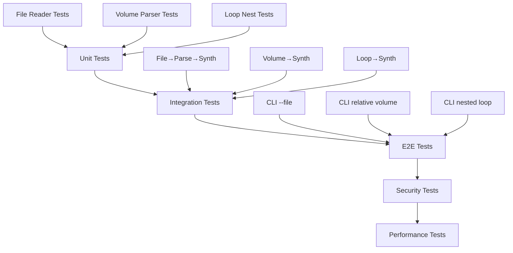

# テスト項目書: REQ-CLI-004 MML Advanced Features

## メタ情報

| 項目 | 内容 |
|------|------|
| ドキュメントID | TEST-CLI-004 |
| 対応設計書 | BASIC-CLI-004_MML-Advanced-Features.md (v1.0.0) |
| 作成日 | 2026-01-12 |
| ステータス | ドラフト |
| 対象バージョン | sine-mml v2.1 (Phase 2.1) |

---

## 1. テスト方針

### 1.1 テストレベル

| レベル | 対象 | カバレッジ目標 |
|--------|------|---------------|
| Unit | ファイル読み取り、相対ボリューム、ループネスト | 95%以上 |
| Integration | CLI引数処理、パーサー統合 | 90%以上 |
| E2E | CLIコマンド実行、ユーザーフロー | 主要パス100% |

### 1.2 テスト優先度

| 優先度 | 説明 | 実装タイミング |
|--------|------|---------------|
| P0 | クリティカルパス（必須機能） | Sprint 1 Week 1 |
| P1 | 重要機能（エラーハンドリング） | Sprint 1 Week 2 |
| P2 | エッジケース（境界値） | Sprint 2 |

### 1.3 テスト環境

- **OS**: macOS, Linux (CI環境)
- **Rust**: 1.70+
- **テストフレームワーク**: 
  - ユニットテスト: Rust標準 `#[test]`
  - E2Eテスト: `assert_cmd`, `predicates`, `tempfile`
- **データベース**: SQLite (in-memory for tests)

---

## 2. テスト対象機能一覧

| 機能ID | 機能名 | 概要 | 優先度 |
|--------|--------|------|--------|
| F-027 | MMLファイル読み取り | `.mml`ファイルからMMLを読み込み | P0 |
| F-028 | 相対ボリューム指定 | `V+n`, `V-n`で相対的な音量変更 | P0 |
| F-029 | ループネスト対応 | ループ構文のネスト（最大5階層） | P0 |

---

## 3. ユニットテスト項目

### 3.1 F-027: MMLファイル読み取り

#### TC-027-U-001: 基本的なファイル読み込み

| 項目 | 内容 |
|------|------|
| 優先度 | P0 |
| テスト対象 | `read_mml_file()` |
| 前提条件 | 有効な`.mml`ファイルが存在 |
| 入力 | `song.mml` (内容: `CDEFGAB`) |
| 期待結果 | `Ok("CDEFGAB")` |

**テストコード雛形:**
```rust
#[test]
fn test_read_mml_file_basic() {
    let dir = tempdir().unwrap();
    let file_path = dir.path().join("test.mml");
    let mut file = File::create(&file_path).unwrap();
    writeln!(file, "CDEFGAB").unwrap();

    let result = read_mml_file(file_path.to_str().unwrap());
    assert!(result.is_ok());
    assert_eq!(result.unwrap(), "CDEFGAB");
}
```

---

#### TC-027-U-002: コメント行の除去

| 項目 | 内容 |
|------|------|
| 優先度 | P0 |
| テスト対象 | `read_mml_file()` |
| 前提条件 | コメント行を含む`.mml`ファイル |
| 入力 | `# Comment\nCDEF\n# Another\nGAB` |
| 期待結果 | `Ok("CDEF GAB")` |

**テストコード雛形:**
```rust
#[test]
fn test_read_mml_file_removes_comments() {
    let dir = tempdir().unwrap();
    let file_path = dir.path().join("test.mml");
    let mut file = File::create(&file_path).unwrap();
    writeln!(file, "# Comment").unwrap();
    writeln!(file, "CDEF").unwrap();
    writeln!(file, "# Another").unwrap();
    writeln!(file, "GAB").unwrap();

    let result = read_mml_file(file_path.to_str().unwrap());
    assert_eq!(result.unwrap(), "CDEF GAB");
}
```

---

#### TC-027-U-003: 空行の除去

| 項目 | 内容 |
|------|------|
| 優先度 | P0 |
| テスト対象 | `read_mml_file()` |
| 前提条件 | 空行を含む`.mml`ファイル |
| 入力 | `CDEF\n\nGAB\n\n` |
| 期待結果 | `Ok("CDEF GAB")` |

**テストコード雛形:**
```rust
#[test]
fn test_read_mml_file_removes_empty_lines() {
    let dir = tempdir().unwrap();
    let file_path = dir.path().join("test.mml");
    let mut file = File::create(&file_path).unwrap();
    writeln!(file, "CDEF").unwrap();
    writeln!(file, "").unwrap();
    writeln!(file, "GAB").unwrap();
    writeln!(file, "").unwrap();

    let result = read_mml_file(file_path.to_str().unwrap());
    assert_eq!(result.unwrap(), "CDEF GAB");
}
```

---

#### TC-027-U-004: ファイル未発見エラー

| 項目 | 内容 |
|------|------|
| 優先度 | P0 |
| テスト対象 | `read_mml_file()` |
| 前提条件 | ファイルが存在しない |
| 入力 | `nonexistent.mml` |
| 期待結果 | `Err("ファイルが見つかりません")` |

**テストコード雛形:**
```rust
#[test]
fn test_read_mml_file_not_found() {
    let result = read_mml_file("nonexistent.mml");
    assert!(result.is_err());
    assert!(result.unwrap_err().to_string().contains("ファイルが見つかりません"));
}
```

---

#### TC-027-U-005: 不正な拡張子エラー

| 項目 | 内容 |
|------|------|
| 優先度 | P1 |
| テスト対象 | `read_mml_file()` |
| 前提条件 | `.mml`以外の拡張子 |
| 入力 | `song.txt` |
| 期待結果 | `Err("ファイル拡張子は .mml である必要があります")` |

**テストコード雛形:**
```rust
#[test]
fn test_read_mml_file_invalid_extension() {
    let dir = tempdir().unwrap();
    let file_path = dir.path().join("test.txt");
    let mut file = File::create(&file_path).unwrap();
    writeln!(file, "CDEFGAB").unwrap();

    let result = read_mml_file(file_path.to_str().unwrap());
    assert!(result.is_err());
    assert!(result.unwrap_err().to_string().contains("ファイル拡張子は .mml である必要があります"));
}
```

---

#### TC-027-U-006: ファイルサイズ超過エラー

| 項目 | 内容 |
|------|------|
| 優先度 | P1 |
| テスト対象 | `read_mml_file()` |
| 前提条件 | 1MB超のファイル |
| 入力 | 1,000,001バイトのファイル |
| 期待結果 | `Err("ファイルサイズが大きすぎます")` |

**テストコード雛形:**
```rust
#[test]
fn test_read_mml_file_too_large() {
    let dir = tempdir().unwrap();
    let file_path = dir.path().join("large.mml");
    let mut file = File::create(&file_path).unwrap();
    // 1MB超のファイルを作成
    for _ in 0..100_001 {
        writeln!(file, "CDEFGAB").unwrap();
    }

    let result = read_mml_file(file_path.to_str().unwrap());
    assert!(result.is_err());
    assert!(result.unwrap_err().to_string().contains("ファイルサイズが大きすぎます"));
}
```

---

#### TC-027-U-007: 空ファイルエラー

| 項目 | 内容 |
|------|------|
| 優先度 | P1 |
| テスト対象 | `read_mml_file()` |
| 前提条件 | コメントと空行のみのファイル |
| 入力 | `# Comment\n\n` |
| 期待結果 | `Err("ファイルにMMLが含まれていません")` |

**テストコード雛形:**
```rust
#[test]
fn test_read_mml_file_empty() {
    let dir = tempdir().unwrap();
    let file_path = dir.path().join("empty.mml");
    let mut file = File::create(&file_path).unwrap();
    writeln!(file, "# Only comments").unwrap();
    writeln!(file, "").unwrap();

    let result = read_mml_file(file_path.to_str().unwrap());
    assert!(result.is_err());
    assert!(result.unwrap_err().to_string().contains("ファイルにMMLが含まれていません"));
}
```

---

#### TC-027-U-008: UTF-8エンコーディング

| 項目 | 内容 |
|------|------|
| 優先度 | P1 |
| テスト対象 | `read_mml_file()` |
| 前提条件 | UTF-8エンコードのファイル |
| 入力 | `# あいうえお\nCDEF` |
| 期待結果 | `Ok("CDEF")` |

**テストコード雛形:**
```rust
#[test]
fn test_read_mml_file_utf8() {
    let dir = tempdir().unwrap();
    let file_path = dir.path().join("test.mml");
    let mut file = File::create(&file_path).unwrap();
    writeln!(file, "# あいうえお").unwrap();
    writeln!(file, "CDEF").unwrap();

    let result = read_mml_file(file_path.to_str().unwrap());
    assert_eq!(result.unwrap(), "CDEF");
}
```

---

#### TC-027-U-009: 行頭空白を含むコメント

| 項目 | 内容 |
|------|------|
| 優先度 | P2 |
| テスト対象 | `read_mml_file()` |
| 前提条件 | 行頭に空白があるコメント |
| 入力 | `  # Comment\nCDEF` |
| 期待結果 | `Ok("CDEF")` |

**テストコード雛形:**
```rust
#[test]
fn test_read_mml_file_comment_with_leading_whitespace() {
    let dir = tempdir().unwrap();
    let file_path = dir.path().join("test.mml");
    let mut file = File::create(&file_path).unwrap();
    writeln!(file, "  # Comment").unwrap();
    writeln!(file, "CDEF").unwrap();

    let result = read_mml_file(file_path.to_str().unwrap());
    assert_eq!(result.unwrap(), "CDEF");
}
```

---

#### TC-027-U-010: 複数行のMML

| 項目 | 内容 |
|------|------|
| 優先度 | P0 |
| テスト対象 | `read_mml_file()` |
| 前提条件 | 複数行のMML |
| 入力 | `T120 L8 O5\nCDEF\nGAB >C` |
| 期待結果 | `Ok("T120 L8 O5 CDEF GAB >C")` |

**テストコード雛形:**
```rust
#[test]
fn test_read_mml_file_multiline() {
    let dir = tempdir().unwrap();
    let file_path = dir.path().join("test.mml");
    let mut file = File::create(&file_path).unwrap();
    writeln!(file, "T120 L8 O5").unwrap();
    writeln!(file, "CDEF").unwrap();
    writeln!(file, "GAB >C").unwrap();

    let result = read_mml_file(file_path.to_str().unwrap());
    assert_eq!(result.unwrap(), "T120 L8 O5 CDEF GAB >C");
}
```

---

### 3.2 F-028: 相対ボリューム指定

#### TC-028-U-001: 絶対値指定（既存仕様維持）

| 項目 | 内容 |
|------|------|
| 優先度 | P0 |
| テスト対象 | `parse_volume()` |
| 前提条件 | - |
| 入力 | `V10` |
| 期待結果 | `VolumeValue::Absolute(10)` |

**テストコード雛形:**
```rust
#[test]
fn test_volume_absolute() {
    let input = "V10 C";
    let mml = parse(input).unwrap();
    
    match &mml.commands[0] {
        Command::Volume(Volume { value: VolumeValue::Absolute(10) }) => {},
        _ => panic!("Expected Absolute(10)"),
    }
}
```

---

#### TC-028-U-002: 相対値指定（増加）

| 項目 | 内容 |
|------|------|
| 優先度 | P0 |
| テスト対象 | `parse_volume()` |
| 前提条件 | - |
| 入力 | `V+2` |
| 期待結果 | `VolumeValue::Relative(2)` |

**テストコード雛形:**
```rust
#[test]
fn test_volume_relative_increase() {
    let input = "V10 C V+2 D";
    let mml = parse(input).unwrap();
    
    match &mml.commands[2] {
        Command::Volume(Volume { value: VolumeValue::Relative(2) }) => {},
        _ => panic!("Expected Relative(2)"),
    }
}
```

---

#### TC-028-U-003: 相対値指定（減少）

| 項目 | 内容 |
|------|------|
| 優先度 | P0 |
| テスト対象 | `parse_volume()` |
| 前提条件 | - |
| 入力 | `V-3` |
| 期待結果 | `VolumeValue::Relative(-3)` |

**テストコード雛形:**
```rust
#[test]
fn test_volume_relative_decrease() {
    let input = "V10 C V-3 D";
    let mml = parse(input).unwrap();
    
    match &mml.commands[2] {
        Command::Volume(Volume { value: VolumeValue::Relative(-3) }) => {},
        _ => panic!("Expected Relative(-3)"),
    }
}
```

---

#### TC-028-U-004: デフォルト増加（V+）

| 項目 | 内容 |
|------|------|
| 優先度 | P0 |
| テスト対象 | `parse_volume()` |
| 前提条件 | - |
| 入力 | `V+` |
| 期待結果 | `VolumeValue::Relative(1)` |

**テストコード雛形:**
```rust
#[test]
fn test_volume_default_increase() {
    let input = "V10 C V+ D";
    let mml = parse(input).unwrap();
    
    match &mml.commands[2] {
        Command::Volume(Volume { value: VolumeValue::Relative(1) }) => {},
        _ => panic!("Expected Relative(1)"),
    }
}
```

---

#### TC-028-U-005: デフォルト減少（V-）

| 項目 | 内容 |
|------|------|
| 優先度 | P0 |
| テスト対象 | `parse_volume()` |
| 前提条件 | - |
| 入力 | `V-` |
| 期待結果 | `VolumeValue::Relative(-1)` |

**テストコード雛形:**
```rust
#[test]
fn test_volume_default_decrease() {
    let input = "V10 C V- D";
    let mml = parse(input).unwrap();
    
    match &mml.commands[2] {
        Command::Volume(Volume { value: VolumeValue::Relative(-1) }) => {},
        _ => panic!("Expected Relative(-1)"),
    }
}
```

---

#### TC-028-U-006: 上限クランプ（15）

| 項目 | 内容 |
|------|------|
| 優先度 | P1 |
| テスト対象 | `Synthesizer::apply_volume()` |
| 前提条件 | `current_velocity = 15` |
| 入力 | `VolumeValue::Relative(2)` |
| 期待結果 | `current_velocity = 15`（クランプ） |

**テストコード雛形:**
```rust
#[test]
fn test_volume_clamp_upper() {
    let input = "V15 C V+2 D";
    let mml = parse(input).unwrap();
    
    // シンセサイザーでクランプされることを確認
    let synthesizer = Synthesizer::new(44100, 100, WaveformType::Sine);
    let samples = synthesizer.synthesize(&mml).unwrap();
    
    // クランプされて15になることを確認（実装依存）
    assert!(samples.len() > 0);
}
```

---

#### TC-028-U-007: 下限クランプ（0）

| 項目 | 内容 |
|------|------|
| 優先度 | P1 |
| テスト対象 | `Synthesizer::apply_volume()` |
| 前提条件 | `current_velocity = 0` |
| 入力 | `VolumeValue::Relative(-2)` |
| 期待結果 | `current_velocity = 0`（クランプ） |

**テストコード雛形:**
```rust
#[test]
fn test_volume_clamp_lower() {
    let input = "V0 C V-2 D";
    let mml = parse(input).unwrap();
    
    // シンセサイザーでクランプされることを確認
    let synthesizer = Synthesizer::new(44100, 100, WaveformType::Sine);
    let samples = synthesizer.synthesize(&mml).unwrap();
    
    // クランプされて0になることを確認（実装依存）
    assert!(samples.len() > 0);
}
```

---

#### TC-028-U-008: 絶対値範囲外エラー

| 項目 | 内容 |
|------|------|
| 優先度 | P1 |
| テスト対象 | `parse_volume()` |
| 前提条件 | - |
| 入力 | `V20` |
| 期待結果 | `ParseError::InvalidNumber` |

**テストコード雛形:**
```rust
#[test]
fn test_volume_absolute_out_of_range() {
    let input = "V20 C";
    let result = parse(input);
    
    assert!(result.is_err());
    match result.unwrap_err() {
        ParseError::InvalidNumber { value: 20, .. } => {},
        _ => panic!("Expected InvalidNumber error"),
    }
}
```

---

#### TC-028-U-009: 複数の相対値指定

| 項目 | 内容 |
|------|------|
| 優先度 | P0 |
| テスト対象 | `parse()` |
| 前提条件 | - |
| 入力 | `V5 C V+10 D V-8 E` |
| 期待結果 | C: V5, D: V15, E: V7 |

**テストコード雛形:**
```rust
#[test]
fn test_volume_multiple_relative() {
    let input = "V5 C V+10 D V-8 E";
    let mml = parse(input).unwrap();
    
    // パース成功を確認
    assert_eq!(mml.commands.len(), 6);
}
```

---

#### TC-028-U-010: 大きな相対値のクランプ

| 項目 | 内容 |
|------|------|
| 優先度 | P2 |
| テスト対象 | `parse_volume()` |
| 前提条件 | - |
| 入力 | `V+128` |
| 期待結果 | `VolumeValue::Relative(15)`（パーサーでクランプ） |

**テストコード雛形:**
```rust
#[test]
fn test_volume_large_relative_value() {
    let input = "V10 C V+128 D";
    let mml = parse(input).unwrap();
    
    match &mml.commands[2] {
        Command::Volume(Volume { value: VolumeValue::Relative(delta) }) => {
            assert_eq!(*delta, 15); // クランプされる
        },
        _ => panic!("Expected Relative"),
    }
}
```

---

### 3.3 F-029: ループネスト対応

#### TC-029-U-001: 2階層ネスト

| 項目 | 内容 |
|------|------|
| 優先度 | P0 |
| テスト対象 | `parse_loop()`, `expand_loop()` |
| 前提条件 | - |
| 入力 | `[ CDE [ FGAB ]2 ]3` |
| 期待結果 | 展開後: `CDE FGABFGAB` × 3回 |

**テストコード雛形:**
```rust
#[test]
fn test_loop_nest_2_levels() {
    let input = "[ CDE [ FGAB ]2 ]3";
    let mml = parse(input).unwrap();
    
    // 展開後は33個のコマンド（CDE FGABFGAB × 3回）
    assert_eq!(mml.commands.len(), 33);
}
```

---

#### TC-029-U-002: 3階層ネスト

| 項目 | 内容 |
|------|------|
| 優先度 | P0 |
| テスト対象 | `parse_loop()`, `expand_loop()` |
| 前提条件 | - |
| 入力 | `[ [ [ C ]2 D ]2 E ]2` |
| 期待結果 | 展開後: `CC D CC D E CC D CC D E` |

**テストコード雛形:**
```rust
#[test]
fn test_loop_nest_3_levels() {
    let input = "[ [ [ C ]2 D ]2 E ]2";
    let mml = parse(input).unwrap();
    
    // 展開後は10個のコマンド
    assert_eq!(mml.commands.len(), 10);
}
```

---

#### TC-029-U-003: 4階層ネスト

| 項目 | 内容 |
|------|------|
| 優先度 | P1 |
| テスト対象 | `parse_loop()`, `expand_loop()` |
| 前提条件 | - |
| 入力 | `[ [ [ [ C ]2 D ]2 E ]2 F ]2` |
| 期待結果 | 正常に展開 |

**テストコード雛形:**
```rust
#[test]
fn test_loop_nest_4_levels() {
    let input = "[ [ [ [ C ]2 D ]2 E ]2 F ]2";
    let mml = parse(input).unwrap();
    
    // 正常に解析されることを確認
    assert!(mml.commands.len() > 0);
}
```

---

#### TC-029-U-004: 5階層ネスト（最大）

| 項目 | 内容 |
|------|------|
| 優先度 | P0 |
| テスト対象 | `parse_loop()`, `expand_loop()` |
| 前提条件 | - |
| 入力 | `[ [ [ [ [ C ]2 D ]2 E ]2 F ]2 G ]2` |
| 期待結果 | 正常に展開 |

**テストコード雛形:**
```rust
#[test]
fn test_loop_nest_5_levels_max() {
    let input = "[ [ [ [ [ C ]2 D ]2 E ]2 F ]2 G ]2";
    let mml = parse(input).unwrap();
    
    // 正常に解析されることを確認
    assert!(mml.commands.len() > 0);
}
```

---

#### TC-029-U-005: 6階層ネストエラー

| 項目 | 内容 |
|------|------|
| 優先度 | P0 |
| テスト対象 | `parse_loop()` |
| 前提条件 | - |
| 入力 | `[ [ [ [ [ [ C ]2 ]2 ]2 ]2 ]2 ]2` |
| 期待結果 | `ParseError::LoopNestTooDeep` |

**テストコード雛形:**
```rust
#[test]
fn test_loop_nest_too_deep() {
    let input = "[ [ [ [ [ [ C ]2 ]2 ]2 ]2 ]2 ]2";
    let result = parse(input);
    
    assert!(result.is_err());
    match result.unwrap_err() {
        ParseError::LoopNestTooDeep { max_depth: 5, .. } => {},
        _ => panic!("Expected LoopNestTooDeep error"),
    }
}
```

---

#### TC-029-U-006: ネスト内の脱出ポイント

| 項目 | 内容 |
|------|------|
| 優先度 | P1 |
| テスト対象 | `parse_loop()`, `expand_loop()` |
| 前提条件 | - |
| 入力 | `[ [ CD:EF ]2 GAB ]2` |
| 期待結果 | 展開後: `CDEFCD GAB CDEFCD GAB` |

**テストコード雛形:**
```rust
#[test]
fn test_loop_nest_with_escape_point() {
    let input = "[ [ CD:EF ]2 GAB ]2";
    let mml = parse(input).unwrap();
    
    // 展開後は14個のコマンド
    assert_eq!(mml.commands.len(), 14);
}
```

---

#### TC-029-U-007: ループ展開数超過エラー

| 項目 | 内容 |
|------|------|
| 優先度 | P1 |
| テスト対象 | `expand_loop()` |
| 前提条件 | - |
| 入力 | `[ [ [ C ]99 ]99 ]99` |
| 期待結果 | `ParseError::LoopExpandedTooLarge` |

**テストコード雛形:**
```rust
#[test]
fn test_loop_expanded_too_large() {
    let input = "[ [ [ C ]99 ]99 ]99";
    let result = parse(input);
    
    assert!(result.is_err());
    match result.unwrap_err() {
        ParseError::LoopExpandedTooLarge { max_commands: 10_000, .. } => {},
        _ => panic!("Expected LoopExpandedTooLarge error"),
    }
}
```

---

#### TC-029-U-008: 空ループのネスト

| 項目 | 内容 |
|------|------|
| 優先度 | P2 |
| テスト対象 | `parse_loop()` |
| 前提条件 | - |
| 入力 | `[ [ ]2 ]2` |
| 期待結果 | 正常に解析（空のコマンド列） |

**テストコード雛形:**
```rust
#[test]
fn test_loop_nest_empty() {
    let input = "[ [ ]2 ]2";
    let mml = parse(input).unwrap();
    
    // 空のループも正常に解析される
    assert_eq!(mml.commands.len(), 0);
}
```

---

#### TC-029-U-009: ループ回数0のネスト

| 項目 | 内容 |
|------|------|
| 優先度 | P2 |
| テスト対象 | `parse_loop()` |
| 前提条件 | - |
| 入力 | `[ [ C ]0 ]2` |
| 期待結果 | `ParseError::InvalidLoopCount` |

**テストコード雛形:**
```rust
#[test]
fn test_loop_nest_zero_count() {
    let input = "[ [ C ]0 ]2";
    let result = parse(input);
    
    assert!(result.is_err());
    match result.unwrap_err() {
        ParseError::InvalidLoopCount { value: 0, .. } => {},
        _ => panic!("Expected InvalidLoopCount error"),
    }
}
```

---

#### TC-029-U-010: ネスト深度カウントの正確性

| 項目 | 内容 |
|------|------|
| 優先度 | P0 |
| テスト対象 | `Parser::loop_depth` |
| 前提条件 | - |
| 入力 | `[ [ C ]2 ]2 [ D ]2` |
| 期待結果 | 各ループ終了後、`loop_depth = 0` |

**テストコード雛形:**
```rust
#[test]
fn test_loop_depth_tracking() {
    let input = "[ [ C ]2 ]2 [ D ]2";
    let mml = parse(input).unwrap();
    
    // 正常に解析されることを確認
    assert!(mml.commands.len() > 0);
}
```

---

## 4. 統合テスト項目

### 4.1 F-027: MMLファイル読み取り（統合）

#### TC-027-I-001: ファイル読み込み→パース→合成

| 項目 | 内容 |
|------|------|
| 優先度 | P0 |
| テスト対象 | `read_mml_file()` → `parse()` → `synthesize()` |
| 前提条件 | 有効な`.mml`ファイル |
| 入力 | `song.mml` (内容: `T120 L4 CDEFGAB`) |
| 期待結果 | 正常に音声合成される |

**テストコード雛形:**
```rust
#[test]
fn test_file_to_synthesis_integration() {
    let dir = tempdir().unwrap();
    let file_path = dir.path().join("test.mml");
    let mut file = File::create(&file_path).unwrap();
    writeln!(file, "T120 L4 CDEFGAB").unwrap();

    let mml_string = read_mml_file(file_path.to_str().unwrap()).unwrap();
    let mml = parse(&mml_string).unwrap();
    let synthesizer = Synthesizer::new(44100, 100, WaveformType::Sine);
    let samples = synthesizer.synthesize(&mml).unwrap();
    
    assert!(samples.len() > 0);
}
```

---

### 4.2 F-028: 相対ボリューム指定（統合）

#### TC-028-I-001: 相対ボリューム→合成

| 項目 | 内容 |
|------|------|
| 優先度 | P0 |
| テスト対象 | `parse()` → `synthesize()` |
| 前提条件 | - |
| 入力 | `V10 C V+2 D V-3 E` |
| 期待結果 | 音量が変化する音声が生成される |

**テストコード雛形:**
```rust
#[test]
fn test_relative_volume_synthesis() {
    let input = "V10 C V+2 D V-3 E";
    let mml = parse(input).unwrap();
    let synthesizer = Synthesizer::new(44100, 100, WaveformType::Sine);
    let samples = synthesizer.synthesize(&mml).unwrap();
    
    assert!(samples.len() > 0);
}
```

---

### 4.3 F-029: ループネスト対応（統合）

#### TC-029-I-001: ネストループ→合成

| 項目 | 内容 |
|------|------|
| 優先度 | P0 |
| テスト対象 | `parse()` → `synthesize()` |
| 前提条件 | - |
| 入力 | `[ CDE [ FGAB ]2 ]3` |
| 期待結果 | 正常に音声合成される |

**テストコード雛形:**
```rust
#[test]
fn test_nested_loop_synthesis() {
    let input = "[ CDE [ FGAB ]2 ]3";
    let mml = parse(input).unwrap();
    let synthesizer = Synthesizer::new(44100, 100, WaveformType::Sine);
    let samples = synthesizer.synthesize(&mml).unwrap();
    
    assert!(samples.len() > 0);
}
```

---

## 5. E2Eテスト項目

### 5.1 F-027: MMLファイル読み取り（E2E）

#### TC-027-E-001: --fileオプションでの再生

| 項目 | 内容 |
|------|------|
| 優先度 | P0 |
| テスト対象 | `sine-mml play --file song.mml` |
| 前提条件 | バイナリがビルド済み、`song.mml`が存在 |
| 入力 | `sine-mml play --file song.mml` |
| 期待結果 | 正常終了（exit code 0） |

**テストコード雛形:**
```rust
#[test]
fn test_cli_play_with_file() {
    let dir = tempdir().unwrap();
    let file_path = dir.path().join("test.mml");
    let mut file = File::create(&file_path).unwrap();
    writeln!(file, "CDEFGAB").unwrap();

    let mut cmd = Command::new(env!("CARGO_BIN_EXE_sine-mml"));
    cmd.arg("play")
        .arg("--file")
        .arg(file_path.to_str().unwrap())
        .timeout(std::time::Duration::from_secs(5));
    
    cmd.assert().code(predicate::in_iter([0i32]));
}
```

---

#### TC-027-E-002: ファイル未発見エラー

| 項目 | 内容 |
|------|------|
| 優先度 | P1 |
| テスト対象 | `sine-mml play --file nonexistent.mml` |
| 前提条件 | バイナリがビルド済み |
| 入力 | `sine-mml play --file nonexistent.mml` |
| 期待結果 | エラーメッセージ表示、exit code 1 |

**テストコード雛形:**
```rust
#[test]
fn test_cli_file_not_found() {
    let mut cmd = Command::new(env!("CARGO_BIN_EXE_sine-mml"));
    cmd.arg("play")
        .arg("--file")
        .arg("nonexistent.mml");
    
    cmd.assert()
        .failure()
        .stderr(predicate::str::contains("ファイルが見つかりません"));
}
```

---

#### TC-027-E-003: 不正な拡張子エラー

| 項目 | 内容 |
|------|------|
| 優先度 | P1 |
| テスト対象 | `sine-mml play --file song.txt` |
| 前提条件 | バイナリがビルド済み、`song.txt`が存在 |
| 入力 | `sine-mml play --file song.txt` |
| 期待結果 | エラーメッセージ表示、exit code 1 |

**テストコード雛形:**
```rust
#[test]
fn test_cli_invalid_extension() {
    let dir = tempdir().unwrap();
    let file_path = dir.path().join("test.txt");
    let mut file = File::create(&file_path).unwrap();
    writeln!(file, "CDEFGAB").unwrap();

    let mut cmd = Command::new(env!("CARGO_BIN_EXE_sine-mml"));
    cmd.arg("play")
        .arg("--file")
        .arg(file_path.to_str().unwrap());
    
    cmd.assert()
        .failure()
        .stderr(predicate::str::contains("ファイル拡張子は .mml である必要があります"));
}
```

---

#### TC-027-E-004: --fileと--noteの組み合わせ

| 項目 | 内容 |
|------|------|
| 優先度 | P1 |
| テスト対象 | `sine-mml play --file song.mml --note "My song"` |
| 前提条件 | バイナリがビルド済み、`song.mml`が存在 |
| 入力 | `sine-mml play --file song.mml --note "My song"` |
| 期待結果 | 正常終了、履歴にメモが保存される |

**テストコード雛形:**
```rust
#[test]
fn test_cli_file_with_note() {
    let dir = tempdir().unwrap();
    let file_path = dir.path().join("test.mml");
    let mut file = File::create(&file_path).unwrap();
    writeln!(file, "CDEFGAB").unwrap();

    let mut cmd = Command::new(env!("CARGO_BIN_EXE_sine-mml"));
    cmd.arg("play")
        .arg("--file")
        .arg(file_path.to_str().unwrap())
        .arg("--note")
        .arg("My song")
        .timeout(std::time::Duration::from_secs(5));
    
    cmd.assert().code(predicate::in_iter([0i32]));
}
```

---

### 5.2 F-028: 相対ボリューム指定（E2E）

#### TC-028-E-001: 相対ボリュームでの再生

| 項目 | 内容 |
|------|------|
| 優先度 | P0 |
| テスト対象 | `sine-mml play "V10 C V+2 D V-3 E"` |
| 前提条件 | バイナリがビルド済み |
| 入力 | `sine-mml play "V10 C V+2 D V-3 E"` |
| 期待結果 | 正常終了（exit code 0） |

**テストコード雛形:**
```rust
#[test]
fn test_cli_relative_volume() {
    let mut cmd = Command::new(env!("CARGO_BIN_EXE_sine-mml"));
    cmd.arg("play")
        .arg("V10 C V+2 D V-3 E")
        .timeout(std::time::Duration::from_secs(5));
    
    cmd.assert().code(predicate::in_iter([0i32]));
}
```

---

#### TC-028-E-002: デフォルト増減での再生

| 項目 | 内容 |
|------|------|
| 優先度 | P0 |
| テスト対象 | `sine-mml play "V10 C V+ D V- E"` |
| 前提条件 | バイナリがビルド済み |
| 入力 | `sine-mml play "V10 C V+ D V- E"` |
| 期待結果 | 正常終了（exit code 0） |

**テストコード雛形:**
```rust
#[test]
fn test_cli_default_volume_change() {
    let mut cmd = Command::new(env!("CARGO_BIN_EXE_sine-mml"));
    cmd.arg("play")
        .arg("V10 C V+ D V- E")
        .timeout(std::time::Duration::from_secs(5));
    
    cmd.assert().code(predicate::in_iter([0i32]));
}
```

---

#### TC-028-E-003: 絶対値範囲外エラー

| 項目 | 内容 |
|------|------|
| 優先度 | P1 |
| テスト対象 | `sine-mml play "V20 C"` |
| 前提条件 | バイナリがビルド済み |
| 入力 | `sine-mml play "V20 C"` |
| 期待結果 | エラーメッセージ表示、exit code 1 |

**テストコード雛形:**
```rust
#[test]
fn test_cli_volume_out_of_range() {
    let mut cmd = Command::new(env!("CARGO_BIN_EXE_sine-mml"));
    cmd.arg("play")
        .arg("V20 C");
    
    cmd.assert()
        .failure()
        .stderr(predicate::str::contains("Invalid number"));
}
```

---

### 5.3 F-029: ループネスト対応（E2E）

#### TC-029-E-001: 2階層ネストでの再生

| 項目 | 内容 |
|------|------|
| 優先度 | P0 |
| テスト対象 | `sine-mml play "[ CDE [ FGAB ]2 ]3"` |
| 前提条件 | バイナリがビルド済み |
| 入力 | `sine-mml play "[ CDE [ FGAB ]2 ]3"` |
| 期待結果 | 正常終了（exit code 0） |

**テストコード雛形:**
```rust
#[test]
fn test_cli_nested_loop_2_levels() {
    let mut cmd = Command::new(env!("CARGO_BIN_EXE_sine-mml"));
    cmd.arg("play")
        .arg("[ CDE [ FGAB ]2 ]3")
        .timeout(std::time::Duration::from_secs(5));
    
    cmd.assert().code(predicate::in_iter([0i32]));
}
```

---

#### TC-029-E-002: 5階層ネストでの再生

| 項目 | 内容 |
|------|------|
| 優先度 | P0 |
| テスト対象 | `sine-mml play "[ [ [ [ [ C ]2 ]2 ]2 ]2 ]2"` |
| 前提条件 | バイナリがビルド済み |
| 入力 | `sine-mml play "[ [ [ [ [ C ]2 ]2 ]2 ]2 ]2"` |
| 期待結果 | 正常終了（exit code 0） |

**テストコード雛形:**
```rust
#[test]
fn test_cli_nested_loop_5_levels() {
    let mut cmd = Command::new(env!("CARGO_BIN_EXE_sine-mml"));
    cmd.arg("play")
        .arg("[ [ [ [ [ C ]2 ]2 ]2 ]2 ]2")
        .timeout(std::time::Duration::from_secs(5));
    
    cmd.assert().code(predicate::in_iter([0i32]));
}
```

---

#### TC-029-E-003: 6階層ネストエラー

| 項目 | 内容 |
|------|------|
| 優先度 | P1 |
| テスト対象 | `sine-mml play "[ [ [ [ [ [ C ]2 ]2 ]2 ]2 ]2 ]2"` |
| 前提条件 | バイナリがビルド済み |
| 入力 | `sine-mml play "[ [ [ [ [ [ C ]2 ]2 ]2 ]2 ]2 ]2"` |
| 期待結果 | エラーメッセージ表示、exit code 1 |

**テストコード雛形:**
```rust
#[test]
fn test_cli_nested_loop_too_deep() {
    let mut cmd = Command::new(env!("CARGO_BIN_EXE_sine-mml"));
    cmd.arg("play")
        .arg("[ [ [ [ [ [ C ]2 ]2 ]2 ]2 ]2 ]2");
    
    cmd.assert()
        .failure()
        .stderr(predicate::str::contains("ループのネストが深すぎます"));
}
```

---

#### TC-029-E-004: ループ展開数超過エラー

| 項目 | 内容 |
|------|------|
| 優先度 | P1 |
| テスト対象 | `sine-mml play "[ [ [ C ]99 ]99 ]99"` |
| 前提条件 | バイナリがビルド済み |
| 入力 | `sine-mml play "[ [ [ C ]99 ]99 ]99"` |
| 期待結果 | エラーメッセージ表示、exit code 1 |

**テストコード雛形:**
```rust
#[test]
fn test_cli_loop_expanded_too_large() {
    let mut cmd = Command::new(env!("CARGO_BIN_EXE_sine-mml"));
    cmd.arg("play")
        .arg("[ [ [ C ]99 ]99 ]99");
    
    cmd.assert()
        .failure()
        .stderr(predicate::str::contains("ループ展開後のコマンド数が多すぎます"));
}
```

---

## 6. エッジケース・境界値テスト

### 6.1 MMLファイル読み取りの境界値

| TC-ID | 対象 | 境界条件 | テスト値 | 期待結果 |
|-------|------|---------|---------|---------|
| TC-027-B-001 | ファイルサイズ | 最大値 | 1,000,000バイト | 正常 |
| TC-027-B-002 | ファイルサイズ | 境界+1 | 1,000,001バイト | エラー |
| TC-027-B-003 | ファイル内容 | 空ファイル | 0バイト | エラー |
| TC-027-B-004 | コメント | コメントのみ | `# Comment` | エラー |

### 6.2 相対ボリュームの境界値

| TC-ID | 対象 | 境界条件 | テスト値 | 期待結果 |
|-------|------|---------|---------|---------|
| TC-028-B-001 | 絶対値 | 最小値 | `V0` | 正常 |
| TC-028-B-002 | 絶対値 | 最大値 | `V15` | 正常 |
| TC-028-B-003 | 絶対値 | 境界-1 | `V-1` | エラー |
| TC-028-B-004 | 絶対値 | 境界+1 | `V16` | エラー |
| TC-028-B-005 | 相対値 | 最大増加 | `V+15` | 正常 |
| TC-028-B-006 | 相対値 | 最大減少 | `V-15` | 正常 |
| TC-028-B-007 | クランプ | 上限超過 | `V15 V+5` | V15にクランプ |
| TC-028-B-008 | クランプ | 下限超過 | `V0 V-5` | V0にクランプ |

### 6.3 ループネストの境界値

| TC-ID | 対象 | 境界条件 | テスト値 | 期待結果 |
|-------|------|---------|---------|---------|
| TC-029-B-001 | ネスト深度 | 最小値 | `[ C ]2` | 正常（1階層） |
| TC-029-B-002 | ネスト深度 | 最大値 | 5階層ネスト | 正常 |
| TC-029-B-003 | ネスト深度 | 境界+1 | 6階層ネスト | エラー |
| TC-029-B-004 | 展開数 | 上限値 | 10,000コマンド | 正常 |
| TC-029-B-005 | 展開数 | 境界+1 | 10,001コマンド | エラー |

---

## 7. セキュリティテスト項目

| TC-ID | テスト観点 | テスト内容 | 期待結果 |
|-------|-----------|-----------|---------|
| TC-SEC-001 | パストラバーサル | `--file ../../../etc/passwd` | エラー（パス検証） |
| TC-SEC-002 | DoS攻撃防止 | 1MB超のファイル | エラー（サイズ制限） |
| TC-SEC-003 | DoS攻撃防止 | 6階層以上のネスト | エラー（深度制限） |
| TC-SEC-004 | DoS攻撃防止 | 10,000コマンド超の展開 | エラー（展開数制限） |
| TC-SEC-005 | エンコーディング | 非UTF-8ファイル | エラー（エンコーディング検証） |

---

## 8. パフォーマンステスト項目

| TC-ID | テスト対象 | 条件 | 目標値 |
|-------|-----------|------|--------|
| TC-P-001 | ファイル読み取り | 1MBファイル | 100ms以内 |
| TC-P-002 | ループ展開 | 5階層ネスト、1000コマンド | 50ms以内 |
| TC-P-003 | 相対ボリューム計算 | 1000回の相対値変更 | 1ms以内 |

---

## 9. テストカバレッジ目標

| レイヤー | 目標カバレッジ | 備考 |
|---------|--------------|------|
| File Reader | 100% | クリティカルパス |
| Parser (volume, loop) | 100% | クリティカルパス |
| Synthesizer (volume) | 95% | 音声合成処理 |
| CLI (args, handlers) | 95% | ユーザー入力処理 |
| Integration | 90% | コンポーネント連携 |
| E2E | 100% | 主要ユーザーフロー |

---

## 10. テスト実行順序



---

## 11. テストデータ

### 11.1 正常系テストデータ

```json
{
  "mml_file": {
    "basic": "CDEFGAB",
    "with_comments": "# Intro\nCDEF\n# Outro\nGAB",
    "multiline": "T120 L8 O5\nCDEF\nGAB >C"
  },
  "relative_volume": {
    "increase": "V10 C V+2 D",
    "decrease": "V10 C V-3 D",
    "default": "V10 C V+ D V- E",
    "combined": "V5 C V+10 D V-8 E"
  },
  "nested_loop": {
    "2_levels": "[ CDE [ FGAB ]2 ]3",
    "3_levels": "[ [ [ C ]2 D ]2 E ]2",
    "5_levels": "[ [ [ [ [ C ]2 ]2 ]2 ]2 ]2"
  }
}
```

### 11.2 異常系テストデータ

```json
{
  "mml_file": {
    "not_found": "nonexistent.mml",
    "invalid_ext": "song.txt",
    "too_large": "1MB超のファイル",
    "empty": "# Comment only"
  },
  "relative_volume": {
    "out_of_range": "V20 C",
    "negative": "V-5 C"
  },
  "nested_loop": {
    "too_deep": "[ [ [ [ [ [ C ]2 ]2 ]2 ]2 ]2 ]2",
    "too_large": "[ [ [ C ]99 ]99 ]99"
  }
}
```

---

## 12. 変更履歴

| バージョン | 日付 | 変更内容 | 担当者 |
|-----------|------|----------|--------|
| 1.0.0 | 2026-01-12 | 初版作成 | test-spec-writer |

---

## 付録A: テストケース一覧サマリー

### ユニットテスト: 30件
- F-027 (MMLファイル読み取り): 10件
- F-028 (相対ボリューム指定): 10件
- F-029 (ループネスト対応): 10件

### 統合テスト: 3件
- F-027: 1件
- F-028: 1件
- F-029: 1件

### E2Eテスト: 12件
- F-027: 4件
- F-028: 3件
- F-029: 4件
- 境界値テスト: 1件

### セキュリティテスト: 5件
### パフォーマンステスト: 3件

**合計: 53テストケース**

---

## 付録B: エラーメッセージ一覧

| エラーコード | メッセージ | 発生条件 |
|------------|-----------|---------|
| SEC-E012 | `ファイルが見つかりません: {path}` | ファイル未発見 |
| SEC-E013 | `ファイル拡張子は .mml である必要があります: {path}` | 不正な拡張子 |
| SEC-E014 | `ファイルサイズが大きすぎます（上限: 1MB）: {path}` | ファイルサイズ超過 |
| SEC-E015 | `ファイルの読み込みに失敗しました: {path}` | UTF-8エンコーディングエラー |
| MML-E010 | `ループのネストが深すぎます（最大5階層）: 位置 {position}` | ネスト深度超過 |
| MML-E011 | `ループ展開後のコマンド数が多すぎます（最大10000、実際: {actual}）` | 展開数超過 |

---

**END OF DOCUMENT**
