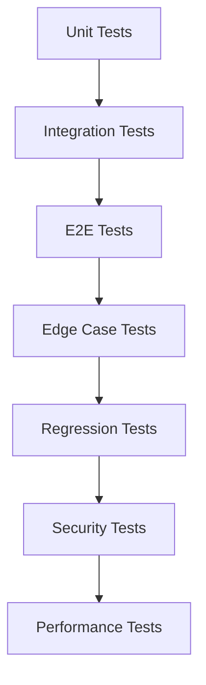

# テスト項目書: REQ-CLI-005 MML Tie Notation

## メタ情報

| 項目 | 内容 |
|------|------|
| ドキュメントID | TEST-CLI-005 |
| 対象機能 | MMLタイ記号 (F-030) |
| 基本設計書参照 | BASIC-CLI-005_Tie-Notation.md (v1.1.0) |
| 詳細設計書参照 | DET-TIE-001 (v1.0.0) |
| 作成日 | 2026-01-12 |
| バージョン | 1.0 |
| ステータス | ドラフト |
| 対象バージョン | sine-mml v2.2 (Phase 2.2) |

---

## 1. テスト概要

### 1.1 テスト目的

MMLタイ記号（`&`）機能の品質を保証し、以下を確認する：

1. **機能要件の充足**: タイ記号による音符連結が正しく動作すること
2. **ビジネスルールの遵守**: 同一音程のみ連結、休符のタイ許可などのルールが守られること
3. **エラーハンドリング**: 異なる音程のタイ、音符と休符のタイなどが適切にエラーとなること
4. **後方互換性**: 既存のMML構文が正常に動作し続けること
5. **性能要件**: タイ解析・音長計算のオーバーヘッドが許容範囲内であること

### 1.2 テスト方針

| レベル | 対象 | カバレッジ目標 |
|--------|------|---------------|
| Unit | Token::Tie、TiedDuration、parse_note/parse_rest | 95%以上 |
| Integration | パーサー統合、音長計算 | 90%以上 |
| E2E | CLIコマンド実行、音声出力 | 主要パス100% |

### 1.3 テスト優先度

| 優先度 | 説明 | 実装タイミング |
|--------|------|---------------|
| P0 | クリティカルパス（基本的なタイ、エラー検出） | Week 1 |
| P1 | 重要機能（複数連結、付点、休符） | Week 2 |
| P2 | エッジケース（超長音、超短音） | Week 2 |

---

## 2. テスト環境

### 2.1 実行環境

- **OS**: macOS, Linux (CI環境)
- **Rust**: 1.70+
- **テストフレームワーク**: 
  - ユニットテスト: Rust標準 `#[test]`
  - E2Eテスト: `assert_cmd`, `predicates`, `tempfile`
- **データベース**: SQLite (in-memory for tests)

### 2.2 テストデータ

#### 正常系テストデータ

```rust
// 基本的なタイ
const BASIC_TIE: &str = "C4&8";
const BASIC_TIE_REST: &str = "R4&8";

// 複数連結
const MULTIPLE_TIE: &str = "C4&8&16";
const LONG_TIE: &str = "C1&1&1&1";

// 付点付き
const TIE_WITH_DOT_BEFORE: &str = "C4.&8";
const TIE_WITH_DOT_AFTER: &str = "C4&8.";

// 空白許容
const TIE_WITH_SPACE: &str = "C4 & 8";

// 音程指定パターン
const TIE_WITH_PITCH: &str = "C4&C8";
```

#### 異常系テストデータ

```rust
// 異なる音程
const DIFFERENT_PITCH: &str = "C4&D4";
const DIFFERENT_ACCIDENTAL: &str = "C#4&C4";

// タイ後に音符がない
const TIE_NO_FOLLOWING: &str = "C4&";
const TIE_NO_FOLLOWING_COMMAND: &str = "C4&T120";

// 音符と休符のタイ
const NOTE_REST_TIE: &str = "C4&R4";
const REST_NOTE_TIE: &str = "R4&C4";

// トップレベルのタイ
const TOP_LEVEL_TIE: &str = "&C4";
```

---

## 3. テスト項目一覧

### 3.1 テストケースサマリー

| カテゴリ | テストケース数 | 優先度 |
|---------|--------------|--------|
| ユニットテスト（Token::Tie） | 3件 | P0 |
| ユニットテスト（TiedDuration） | 5件 | P0 |
| ユニットテスト（parse_note） | 10件 | P0-P1 |
| ユニットテスト（parse_rest） | 4件 | P1 |
| ユニットテスト（音長計算） | 6件 | P0 |
| 統合テスト | 5件 | P1 |
| E2Eテスト | 7件 | P0-P1 |
| エッジケーステスト | 3件 | P2 |
| 回帰テスト | 5件 | P1 |
| **合計** | **48件** | - |

---

## 4. ユニットテスト項目

### 4.1 Token::Tie トークン化テスト

#### TC-030-U-001: タイ記号のトークン化

| 項目 | 内容 |
|------|------|
| 優先度 | P0 |
| テスト対象 | `tokenize()` |
| 前提条件 | - |
| 入力 | `"C4&8"` |
| 期待結果 | `[Pitch(C), Number(4), Tie, Number(8)]` |
| 対応BR | BR-089 |

**テストコード:**
```rust
#[test]
fn test_tokenize_tie() {
    let tokens = tokenize("C4&8").unwrap();
    assert_eq!(tokens.len(), 4);
    assert_eq!(tokens[0].token, Token::Pitch(Pitch::C));
    assert_eq!(tokens[1].token, Token::Number(4));
    assert_eq!(tokens[2].token, Token::Tie);
    assert_eq!(tokens[3].token, Token::Number(8));
}
```

---

#### TC-030-U-002: タイ記号の位置情報

| 項目 | 内容 |
|------|------|
| 優先度 | P0 |
| テスト対象 | `tokenize()` |
| 前提条件 | - |
| 入力 | `"C4&8"` |
| 期待結果 | `&` の位置が `2` |
| 対応BR | - |

**テストコード:**
```rust
#[test]
fn test_tokenize_tie_position() {
    let tokens = tokenize("C4&8").unwrap();
    assert_eq!(tokens[2].position, 2);
}
```

---

#### TC-030-U-003: 空白を含むタイ記号

| 項目 | 内容 |
|------|------|
| 優先度 | P1 |
| テスト対象 | `tokenize()` |
| 前提条件 | - |
| 入力 | `"C4 & 8"` |
| 期待結果 | `[Pitch(C), Number(4), Tie, Number(8)]`（空白除去） |
| 対応BR | BR-089 |

**テストコード:**
```rust
#[test]
fn test_tokenize_tie_with_space() {
    let tokens = tokenize("C4 & 8").unwrap();
    assert_eq!(tokens.len(), 4);
    assert_eq!(tokens[2].token, Token::Tie);
}
```

---

### 4.2 TiedDuration 構造体テスト

#### TC-030-U-004: TiedDuration 音長計算（基本）

| 項目 | 内容 |
|------|------|
| 優先度 | P0 |
| テスト対象 | `TiedDuration::duration_in_seconds()` |
| 前提条件 | BPM=120, default_length=4 |
| 入力 | `TiedDuration { duration: Some(8), dots: 0 }` |
| 期待結果 | `0.25秒` |
| 対応BR | - |

**テストコード:**
```rust
#[test]
fn test_tied_duration_basic() {
    let tied = TiedDuration {
        duration: Some(8),
        dots: 0,
    };
    let duration = tied.duration_in_seconds(120, 4);
    assert!((duration - 0.25).abs() < 0.001);
}
```

---

#### TC-030-U-005: TiedDuration 音長計算（付点）

| 項目 | 内容 |
|------|------|
| 優先度 | P1 |
| テスト対象 | `TiedDuration::duration_in_seconds()` |
| 前提条件 | BPM=120, default_length=4 |
| 入力 | `TiedDuration { duration: Some(8), dots: 1 }` |
| 期待結果 | `0.375秒`（0.25 * 1.5） |
| 対応BR | BR-087 |

**テストコード:**
```rust
#[test]
fn test_tied_duration_with_dot() {
    let tied = TiedDuration {
        duration: Some(8),
        dots: 1,
    };
    let duration = tied.duration_in_seconds(120, 4);
    assert!((duration - 0.375).abs() < 0.001);
}
```

---

#### TC-030-U-006: TiedDuration デフォルト音長使用

| 項目 | 内容 |
|------|------|
| 優先度 | P1 |
| テスト対象 | `TiedDuration::duration_in_seconds()` |
| 前提条件 | BPM=120, default_length=4 |
| 入力 | `TiedDuration { duration: None, dots: 0 }` |
| 期待結果 | `0.5秒`（デフォルト音長4を使用） |
| 対応BR | - |

**テストコード:**
```rust
#[test]
fn test_tied_duration_default_length() {
    let tied = TiedDuration {
        duration: None,
        dots: 0,
    };
    let duration = tied.duration_in_seconds(120, 4);
    assert!((duration - 0.5).abs() < 0.001);
}
```

---

#### TC-030-U-007: TiedDuration 複数付点

| 項目 | 内容 |
|------|------|
| 優先度 | P2 |
| テスト対象 | `TiedDuration::duration_in_seconds()` |
| 前提条件 | BPM=120, default_length=4 |
| 入力 | `TiedDuration { duration: Some(8), dots: 2 }` |
| 期待結果 | `0.4375秒`（0.25 * 1.75） |
| 対応BR | BR-087 |

**テストコード:**
```rust
#[test]
fn test_tied_duration_multiple_dots() {
    let tied = TiedDuration {
        duration: Some(8),
        dots: 2,
    };
    let duration = tied.duration_in_seconds(120, 4);
    assert!((duration - 0.4375).abs() < 0.001);
}
```

---

#### TC-030-U-008: TiedDuration 異なるBPM

| 項目 | 内容 |
|------|------|
| 優先度 | P1 |
| テスト対象 | `TiedDuration::duration_in_seconds()` |
| 前提条件 | BPM=60, default_length=4 |
| 入力 | `TiedDuration { duration: Some(4), dots: 0 }` |
| 期待結果 | `1.0秒`（BPM=60で4分音符） |
| 対応BR | - |

**テストコード:**
```rust
#[test]
fn test_tied_duration_different_bpm() {
    let tied = TiedDuration {
        duration: Some(4),
        dots: 0,
    };
    let duration = tied.duration_in_seconds(60, 4);
    assert!((duration - 1.0).abs() < 0.001);
}
```

---

### 4.3 parse_note タイ解析テスト

#### TC-030-U-009: 基本的なタイ（音長のみ）

| 項目 | 内容 |
|------|------|
| 優先度 | P0 |
| テスト対象 | `parse_note()` |
| 前提条件 | - |
| 入力 | `"C4&8"` |
| 期待結果 | `Note { pitch: C, duration: 4, tied_durations: [TiedDuration { 8, 0 }] }` |
| 対応BR | BR-084 |

**テストコード:**
```rust
#[test]
fn test_parse_note_tie_duration_only() {
    let mml = parse("C4&8").unwrap();
    assert_eq!(mml.commands.len(), 1);
    match &mml.commands[0] {
        Command::Note(n) => {
            assert_eq!(n.pitch, Pitch::C);
            assert_eq!(n.duration, Some(4));
            assert_eq!(n.tied_durations.len(), 1);
            assert_eq!(n.tied_durations[0].duration, Some(8));
            assert_eq!(n.tied_durations[0].dots, 0);
        }
        _ => panic!("Expected Note"),
    }
}
```

---

#### TC-030-U-010: タイ（音程指定）

| 項目 | 内容 |
|------|------|
| 優先度 | P1 |
| テスト対象 | `parse_note()` |
| 前提条件 | - |
| 入力 | `"C4&C8"` |
| 期待結果 | `Note { pitch: C, duration: 4, tied_durations: [TiedDuration { 8, 0 }] }` |
| 対応BR | BR-084 |

**テストコード:**
```rust
#[test]
fn test_parse_note_tie_with_pitch() {
    let mml = parse("C4&C8").unwrap();
    match &mml.commands[0] {
        Command::Note(n) => {
            assert_eq!(n.pitch, Pitch::C);
            assert_eq!(n.tied_durations.len(), 1);
            assert_eq!(n.tied_durations[0].duration, Some(8));
        }
        _ => panic!("Expected Note"),
    }
}
```

---

#### TC-030-U-011: 複数連結

| 項目 | 内容 |
|------|------|
| 優先度 | P0 |
| テスト対象 | `parse_note()` |
| 前提条件 | - |
| 入力 | `"C4&8&16"` |
| 期待結果 | `tied_durations: [TiedDuration { 8, 0 }, TiedDuration { 16, 0 }]` |
| 対応BR | BR-088 |

**テストコード:**
```rust
#[test]
fn test_parse_note_multiple_tie() {
    let mml = parse("C4&8&16").unwrap();
    match &mml.commands[0] {
        Command::Note(n) => {
            assert_eq!(n.tied_durations.len(), 2);
            assert_eq!(n.tied_durations[0].duration, Some(8));
            assert_eq!(n.tied_durations[1].duration, Some(16));
        }
        _ => panic!("Expected Note"),
    }
}
```

---

#### TC-030-U-012: タイ後の付点

| 項目 | 内容 |
|------|------|
| 優先度 | P1 |
| テスト対象 | `parse_note()` |
| 前提条件 | - |
| 入力 | `"C4&8."` |
| 期待結果 | `tied_durations: [TiedDuration { 8, 1 }]` |
| 対応BR | BR-087 |

**テストコード:**
```rust
#[test]
fn test_parse_note_tie_with_dot_after() {
    let mml = parse("C4&8.").unwrap();
    match &mml.commands[0] {
        Command::Note(n) => {
            assert_eq!(n.tied_durations.len(), 1);
            assert_eq!(n.tied_durations[0].duration, Some(8));
            assert_eq!(n.tied_durations[0].dots, 1);
        }
        _ => panic!("Expected Note"),
    }
}
```

---

#### TC-030-U-013: タイ前の付点

| 項目 | 内容 |
|------|------|
| 優先度 | P1 |
| テスト対象 | `parse_note()` |
| 前提条件 | - |
| 入力 | `"C4.&8"` |
| 期待結果 | `Note { dots: 1, tied_durations: [TiedDuration { 8, 0 }] }` |
| 対応BR | BR-087 |

**テストコード:**
```rust
#[test]
fn test_parse_note_tie_with_dot_before() {
    let mml = parse("C4.&8").unwrap();
    match &mml.commands[0] {
        Command::Note(n) => {
            assert_eq!(n.dots, 1);
            assert_eq!(n.tied_durations.len(), 1);
            assert_eq!(n.tied_durations[0].duration, Some(8));
        }
        _ => panic!("Expected Note"),
    }
}
```

---

#### TC-030-U-014: 異なる音程のタイ（エラー）

| 項目 | 内容 |
|------|------|
| 優先度 | P0 |
| テスト対象 | `parse_note()` |
| 前提条件 | - |
| 入力 | `"C4&D4"` |
| 期待結果 | `Err(ParseError::TieDifferentPitch { position: 3 })` |
| 対応BR | BR-085 |

**テストコード:**
```rust
#[test]
fn test_parse_note_tie_different_pitch_error() {
    let err = parse("C4&D4").unwrap_err();
    match err {
        ParseError::TieDifferentPitch { position } => {
            assert_eq!(position, 3);
        }
        _ => panic!("Expected TieDifferentPitch, got {:?}", err),
    }
}
```

---

#### TC-030-U-015: 異なる臨時記号のタイ（エラー）

| 項目 | 内容 |
|------|------|
| 優先度 | P1 |
| テスト対象 | `parse_note()` |
| 前提条件 | - |
| 入力 | `"C#4&C4"` |
| 期待結果 | `Err(ParseError::TieDifferentPitch { position: 4 })` |
| 対応BR | BR-085 |

**テストコード:**
```rust
#[test]
fn test_parse_note_tie_different_accidental_error() {
    let err = parse("C#4&C4").unwrap_err();
    match err {
        ParseError::TieDifferentPitch { position } => {
            assert_eq!(position, 4);
        }
        _ => panic!("Expected TieDifferentPitch, got {:?}", err),
    }
}
```

---

#### TC-030-U-016: タイ後に音符がない（エラー）

| 項目 | 内容 |
|------|------|
| 優先度 | P0 |
| テスト対象 | `parse_note()` |
| 前提条件 | - |
| 入力 | `"C4&"` |
| 期待結果 | `Err(ParseError::TieNoFollowingNote { position: 2 })` |
| 対応BR | - |

**テストコード:**
```rust
#[test]
fn test_parse_note_tie_no_following_error() {
    let err = parse("C4&").unwrap_err();
    match err {
        ParseError::TieNoFollowingNote { position } => {
            assert_eq!(position, 2);
        }
        _ => panic!("Expected TieNoFollowingNote, got {:?}", err),
    }
}
```

---

#### TC-030-U-017: 音符と休符のタイ（エラー）

| 項目 | 内容 |
|------|------|
| 優先度 | P0 |
| テスト対象 | `parse_note()` |
| 前提条件 | - |
| 入力 | `"C4&R4"` |
| 期待結果 | `Err(ParseError::TieNoteAndRest { position: 2 })` |
| 対応BR | - |

**テストコード:**
```rust
#[test]
fn test_parse_note_tie_note_and_rest_error() {
    let err = parse("C4&R4").unwrap_err();
    match err {
        ParseError::TieNoteAndRest { position } => {
            assert_eq!(position, 2);
        }
        _ => panic!("Expected TieNoteAndRest, got {:?}", err),
    }
}
```

---

#### TC-030-U-018: タイ後にコマンド（エラー）

| 項目 | 内容 |
|------|------|
| 優先度 | P1 |
| テスト対象 | `parse_note()` |
| 前提条件 | - |
| 入力 | `"C4&T120"` |
| 期待結果 | `Err(ParseError::TieNoFollowingNote { position: 2 })` |
| 対応BR | - |

**テストコード:**
```rust
#[test]
fn test_parse_note_tie_followed_by_command_error() {
    let err = parse("C4&T120").unwrap_err();
    match err {
        ParseError::TieNoFollowingNote { position } => {
            assert_eq!(position, 2);
        }
        _ => panic!("Expected TieNoFollowingNote, got {:?}", err),
    }
}
```

---

### 4.4 parse_rest タイ解析テスト

#### TC-030-U-019: 休符のタイ（音長のみ）

| 項目 | 内容 |
|------|------|
| 優先度 | P1 |
| テスト対象 | `parse_rest()` |
| 前提条件 | - |
| 入力 | `"R4&8"` |
| 期待結果 | `Rest { duration: 4, tied_durations: [TiedDuration { 8, 0 }] }` |
| 対応BR | BR-086 |

**テストコード:**
```rust
#[test]
fn test_parse_rest_tie_duration_only() {
    let mml = parse("R4&8").unwrap();
    match &mml.commands[0] {
        Command::Rest(r) => {
            assert_eq!(r.duration, Some(4));
            assert_eq!(r.tied_durations.len(), 1);
            assert_eq!(r.tied_durations[0].duration, Some(8));
        }
        _ => panic!("Expected Rest"),
    }
}
```

---

#### TC-030-U-020: 休符のタイ（休符指定）

| 項目 | 内容 |
|------|------|
| 優先度 | P2 |
| テスト対象 | `parse_rest()` |
| 前提条件 | - |
| 入力 | `"R4&R8"` |
| 期待結果 | `Rest { duration: 4, tied_durations: [TiedDuration { 8, 0 }] }` |
| 対応BR | BR-086 |

**テストコード:**
```rust
#[test]
fn test_parse_rest_tie_with_rest() {
    let mml = parse("R4&R8").unwrap();
    match &mml.commands[0] {
        Command::Rest(r) => {
            assert_eq!(r.tied_durations.len(), 1);
            assert_eq!(r.tied_durations[0].duration, Some(8));
        }
        _ => panic!("Expected Rest"),
    }
}
```

---

#### TC-030-U-021: 休符と音符のタイ（エラー）

| 項目 | 内容 |
|------|------|
| 優先度 | P0 |
| テスト対象 | `parse_rest()` |
| 前提条件 | - |
| 入力 | `"R4&C4"` |
| 期待結果 | `Err(ParseError::TieNoteAndRest { position: 2 })` |
| 対応BR | - |

**テストコード:**
```rust
#[test]
fn test_parse_rest_tie_rest_and_note_error() {
    let err = parse("R4&C4").unwrap_err();
    match err {
        ParseError::TieNoteAndRest { position } => {
            assert_eq!(position, 2);
        }
        _ => panic!("Expected TieNoteAndRest, got {:?}", err),
    }
}
```

---

#### TC-030-U-022: 休符のタイ後に音符がない（エラー）

| 項目 | 内容 |
|------|------|
| 優先度 | P1 |
| テスト対象 | `parse_rest()` |
| 前提条件 | - |
| 入力 | `"R4&"` |
| 期待結果 | `Err(ParseError::TieNoFollowingNote { position: 2 })` |
| 対応BR | - |

**テストコード:**
```rust
#[test]
fn test_parse_rest_tie_no_following_error() {
    let err = parse("R4&").unwrap_err();
    match err {
        ParseError::TieNoFollowingNote { position } => {
            assert_eq!(position, 2);
        }
        _ => panic!("Expected TieNoFollowingNote, got {:?}", err),
    }
}
```

---

### 4.5 音長計算テスト

#### TC-030-U-023: Note音長計算（基本的なタイ）

| 項目 | 内容 |
|------|------|
| 優先度 | P0 |
| テスト対象 | `Note::duration_in_seconds()` |
| 前提条件 | BPM=120, default_length=4 |
| 入力 | `Note { duration: 4, tied_durations: [TiedDuration { 8, 0 }] }` |
| 期待結果 | `0.75秒`（0.5 + 0.25） |
| 対応BR | - |

**テストコード:**
```rust
#[test]
fn test_note_duration_with_tie() {
    let note = Note {
        pitch: Pitch::C,
        accidental: Accidental::Natural,
        duration: Some(4),
        dots: 0,
        tied_durations: vec![
            TiedDuration { duration: Some(8), dots: 0 },
        ],
    };
    let duration = note.duration_in_seconds(120, 4);
    assert!((duration - 0.75).abs() < 0.001);
}
```

---

#### TC-030-U-024: Note音長計算（複数連結）

| 項目 | 内容 |
|------|------|
| 優先度 | P0 |
| テスト対象 | `Note::duration_in_seconds()` |
| 前提条件 | BPM=120, default_length=4 |
| 入力 | `Note { duration: 4, tied_durations: [TiedDuration { 8, 0 }, TiedDuration { 16, 0 }] }` |
| 期待結果 | `0.875秒`（0.5 + 0.25 + 0.125） |
| 対応BR | BR-088 |

**テストコード:**
```rust
#[test]
fn test_note_duration_multiple_tie() {
    let note = Note {
        pitch: Pitch::C,
        accidental: Accidental::Natural,
        duration: Some(4),
        dots: 0,
        tied_durations: vec![
            TiedDuration { duration: Some(8), dots: 0 },
            TiedDuration { duration: Some(16), dots: 0 },
        ],
    };
    let duration = note.duration_in_seconds(120, 4);
    assert!((duration - 0.875).abs() < 0.001);
}
```

---

#### TC-030-U-025: Note音長計算（タイ後の付点）

| 項目 | 内容 |
|------|------|
| 優先度 | P1 |
| テスト対象 | `Note::duration_in_seconds()` |
| 前提条件 | BPM=120, default_length=4 |
| 入力 | `Note { duration: 4, tied_durations: [TiedDuration { 8, 1 }] }` |
| 期待結果 | `0.875秒`（0.5 + 0.375） |
| 対応BR | BR-087 |

**テストコード:**
```rust
#[test]
fn test_note_duration_tie_with_dot() {
    let note = Note {
        pitch: Pitch::C,
        accidental: Accidental::Natural,
        duration: Some(4),
        dots: 0,
        tied_durations: vec![
            TiedDuration { duration: Some(8), dots: 1 },
        ],
    };
    let duration = note.duration_in_seconds(120, 4);
    assert!((duration - 0.875).abs() < 0.001);
}
```

---

#### TC-030-U-026: Rest音長計算（基本的なタイ）

| 項目 | 内容 |
|------|------|
| 優先度 | P1 |
| テスト対象 | `Rest::duration_in_seconds()` |
| 前提条件 | BPM=120, default_length=4 |
| 入力 | `Rest { duration: 4, tied_durations: [TiedDuration { 8, 0 }] }` |
| 期待結果 | `0.75秒`（0.5 + 0.25） |
| 対応BR | BR-086 |

**テストコード:**
```rust
#[test]
fn test_rest_duration_with_tie() {
    let rest = Rest {
        duration: Some(4),
        dots: 0,
        tied_durations: vec![
            TiedDuration { duration: Some(8), dots: 0 },
        ],
    };
    let duration = rest.duration_in_seconds(120, 4);
    assert!((duration - 0.75).abs() < 0.001);
}
```

---

#### TC-030-U-027: Note音長計算（タイなし）

| 項目 | 内容 |
|------|------|
| 優先度 | P1 |
| テスト対象 | `Note::duration_in_seconds()` |
| 前提条件 | BPM=120, default_length=4 |
| 入力 | `Note { duration: 4, tied_durations: [] }` |
| 期待結果 | `0.5秒`（タイなし） |
| 対応BR | - |

**テストコード:**
```rust
#[test]
fn test_note_duration_no_tie() {
    let note = Note {
        pitch: Pitch::C,
        accidental: Accidental::Natural,
        duration: Some(4),
        dots: 0,
        tied_durations: vec![],
    };
    let duration = note.duration_in_seconds(120, 4);
    assert!((duration - 0.5).abs() < 0.001);
}
```

---

#### TC-030-U-028: Note音長計算（小節をまたぐ長い音）

| 項目 | 内容 |
|------|------|
| 優先度 | P1 |
| テスト対象 | `Note::duration_in_seconds()` |
| 前提条件 | BPM=120, default_length=4 |
| 入力 | `Note { duration: 1, tied_durations: [TiedDuration { 1, 0 }] }` |
| 期待結果 | `4.0秒`（2.0 + 2.0） |
| 対応BR | - |

**テストコード:**
```rust
#[test]
fn test_note_duration_long_tie() {
    let note = Note {
        pitch: Pitch::C,
        accidental: Accidental::Natural,
        duration: Some(1),
        dots: 0,
        tied_durations: vec![
            TiedDuration { duration: Some(1), dots: 0 },
        ],
    };
    let duration = note.duration_in_seconds(120, 4);
    assert!((duration - 4.0).abs() < 0.001);
}
```

---

## 5. 統合テスト項目

### 5.1 パーサー統合テスト

#### TC-030-I-001: 複数音符とタイの混在

| 項目 | 内容 |
|------|------|
| 優先度 | P1 |
| テスト対象 | `parse()` |
| 前提条件 | - |
| 入力 | `"C4&8 D4 E4&16"` |
| 期待結果 | 3つのNoteコマンド、1つ目と3つ目にタイ |
| 対応BR | - |

**テストコード:**
```rust
#[test]
fn test_integration_multiple_notes_with_tie() {
    let mml = parse("C4&8 D4 E4&16").unwrap();
    assert_eq!(mml.commands.len(), 3);
    
    match &mml.commands[0] {
        Command::Note(n) => {
            assert_eq!(n.pitch, Pitch::C);
            assert_eq!(n.tied_durations.len(), 1);
        }
        _ => panic!("Expected Note"),
    }
    
    match &mml.commands[1] {
        Command::Note(n) => {
            assert_eq!(n.pitch, Pitch::D);
            assert_eq!(n.tied_durations.len(), 0);
        }
        _ => panic!("Expected Note"),
    }
    
    match &mml.commands[2] {
        Command::Note(n) => {
            assert_eq!(n.pitch, Pitch::E);
            assert_eq!(n.tied_durations.len(), 1);
        }
        _ => panic!("Expected Note"),
    }
}
```

---

#### TC-030-I-002: タイとテンポコマンドの混在

| 項目 | 内容 |
|------|------|
| 優先度 | P1 |
| テスト対象 | `parse()` |
| 前提条件 | - |
| 入力 | `"T120 C4&8 T140 D4"` |
| 期待結果 | Tempo, Note(タイ), Tempo, Note |
| 対応BR | - |

**テストコード:**
```rust
#[test]
fn test_integration_tie_with_tempo() {
    let mml = parse("T120 C4&8 T140 D4").unwrap();
    assert_eq!(mml.commands.len(), 4);
    
    assert!(matches!(mml.commands[0], Command::Tempo(_)));
    assert!(matches!(mml.commands[1], Command::Note(_)));
    assert!(matches!(mml.commands[2], Command::Tempo(_)));
    assert!(matches!(mml.commands[3], Command::Note(_)));
}
```

---

#### TC-030-I-003: タイとループの混在

| 項目 | 内容 |
|------|------|
| 優先度 | P1 |
| テスト対象 | `parse()` |
| 前提条件 | - |
| 入力 | `"[C4&8 D4]2"` |
| 期待結果 | ループ展開後、C4&8が2回、D4が2回 |
| 対応BR | - |

**テストコード:**
```rust
#[test]
fn test_integration_tie_with_loop() {
    let mml = parse("[C4&8 D4]2").unwrap();
    // ループ展開後のコマンド数を確認
    // 実装依存: ループ展開の仕様に応じて調整
}
```

---

#### TC-030-I-004: タイと相対ボリュームの混在

| 項目 | 内容 |
|------|------|
| 優先度 | P1 |
| テスト対象 | `parse()` |
| 前提条件 | - |
| 入力 | `"V10 C4&8 V+2 D4"` |
| 期待結果 | Volume, Note(タイ), Volume, Note |
| 対応BR | - |

**テストコード:**
```rust
#[test]
fn test_integration_tie_with_relative_volume() {
    let mml = parse("V10 C4&8 V+2 D4").unwrap();
    assert_eq!(mml.commands.len(), 4);
    
    assert!(matches!(mml.commands[0], Command::Volume(_)));
    assert!(matches!(mml.commands[1], Command::Note(_)));
    assert!(matches!(mml.commands[2], Command::Volume(_)));
    assert!(matches!(mml.commands[3], Command::Note(_)));
}
```

---

#### TC-030-I-005: タイとオクターブ変更の混在

| 項目 | 内容 |
|------|------|
| 優先度 | P1 |
| テスト対象 | `parse()` |
| 前提条件 | - |
| 入力 | `"O4 C4&8 >C4"` |
| 期待結果 | Octave, Note(タイ), OctaveUp, Note |
| 対応BR | - |

**テストコード:**
```rust
#[test]
fn test_integration_tie_with_octave() {
    let mml = parse("O4 C4&8 >C4").unwrap();
    assert_eq!(mml.commands.len(), 4);
    
    assert!(matches!(mml.commands[0], Command::Octave(_)));
    assert!(matches!(mml.commands[1], Command::Note(_)));
    assert!(matches!(mml.commands[2], Command::OctaveUp));
    assert!(matches!(mml.commands[3], Command::Note(_)));
}
```

---

## 6. E2Eテスト項目

### 6.1 CLIコマンド実行テスト

#### TC-030-E-001: 基本的なタイの再生

| 項目 | 内容 |
|------|------|
| 優先度 | P0 |
| テスト対象 | `sine-mml play` |
| 前提条件 | - |
| 入力 | `sine-mml play "C4&8"` |
| 期待結果 | 正常終了、音声出力 |
| 対応BR | BR-084 |

**テストコード:**
```rust
#[test]
fn test_e2e_play_basic_tie() {
    Command::cargo_bin("sine-mml")
        .unwrap()
        .args(&["play", "C4&8"])
        .assert()
        .success();
}
```

---

#### TC-030-E-002: 複数連結の再生

| 項目 | 内容 |
|------|------|
| 優先度 | P0 |
| テスト対象 | `sine-mml play` |
| 前提条件 | - |
| 入力 | `sine-mml play "C4&8&16"` |
| 期待結果 | 正常終了、音声出力 |
| 対応BR | BR-088 |

**テストコード:**
```rust
#[test]
fn test_e2e_play_multiple_tie() {
    Command::cargo_bin("sine-mml")
        .unwrap()
        .args(&["play", "C4&8&16"])
        .assert()
        .success();
}
```

---

#### TC-030-E-003: 休符のタイの再生

| 項目 | 内容 |
|------|------|
| 優先度 | P1 |
| テスト対象 | `sine-mml play` |
| 前提条件 | - |
| 入力 | `sine-mml play "R4&8"` |
| 期待結果 | 正常終了、休符出力 |
| 対応BR | BR-086 |

**テストコード:**
```rust
#[test]
fn test_e2e_play_rest_tie() {
    Command::cargo_bin("sine-mml")
        .unwrap()
        .args(&["play", "R4&8"])
        .assert()
        .success();
}
```

---

#### TC-030-E-004: 異なる音程のタイ（エラー）

| 項目 | 内容 |
|------|------|
| 優先度 | P0 |
| テスト対象 | `sine-mml play` |
| 前提条件 | - |
| 入力 | `sine-mml play "C4&D4"` |
| 期待結果 | エラー終了、エラーメッセージ表示 |
| 対応BR | BR-085 |

**テストコード:**
```rust
#[test]
fn test_e2e_play_different_pitch_error() {
    Command::cargo_bin("sine-mml")
        .unwrap()
        .args(&["play", "C4&D4"])
        .assert()
        .failure()
        .stderr(predicate::str::contains("タイは同一音程の音符のみ連結できます"));
}
```

---

#### TC-030-E-005: タイ後に音符がない（エラー）

| 項目 | 内容 |
|------|------|
| 優先度 | P0 |
| テスト対象 | `sine-mml play` |
| 前提条件 | - |
| 入力 | `sine-mml play "C4&"` |
| 期待結果 | エラー終了、エラーメッセージ表示 |
| 対応BR | - |

**テストコード:**
```rust
#[test]
fn test_e2e_play_no_following_note_error() {
    Command::cargo_bin("sine-mml")
        .unwrap()
        .args(&["play", "C4&"])
        .assert()
        .failure()
        .stderr(predicate::str::contains("タイの後に音符または音長がありません"));
}
```

---

#### TC-030-E-006: 音符と休符のタイ（エラー）

| 項目 | 内容 |
|------|------|
| 優先度 | P0 |
| テスト対象 | `sine-mml play` |
| 前提条件 | - |
| 入力 | `sine-mml play "C4&R4"` |
| 期待結果 | エラー終了、エラーメッセージ表示 |
| 対応BR | - |

**テストコード:**
```rust
#[test]
fn test_e2e_play_note_and_rest_error() {
    Command::cargo_bin("sine-mml")
        .unwrap()
        .args(&["play", "C4&R4"])
        .assert()
        .failure()
        .stderr(predicate::str::contains("音符と休符をタイで連結できません"));
}
```

---

#### TC-030-E-007: ファイルからタイを含むMMLを再生

| 項目 | 内容 |
|------|------|
| 優先度 | P1 |
| テスト対象 | `sine-mml play --file` |
| 前提条件 | `test.mml`に`C4&8 D4`が記述されている |
| 入力 | `sine-mml play --file test.mml` |
| 期待結果 | 正常終了、音声出力 |
| 対応BR | - |

**テストコード:**
```rust
#[test]
fn test_e2e_play_tie_from_file() {
    let dir = tempdir().unwrap();
    let file_path = dir.path().join("test.mml");
    let mut file = File::create(&file_path).unwrap();
    writeln!(file, "C4&8 D4").unwrap();
    
    Command::cargo_bin("sine-mml")
        .unwrap()
        .args(&["play", "--file", file_path.to_str().unwrap()])
        .assert()
        .success();
}
```

---

## 7. エッジケーステスト項目

### 7.1 境界値テスト

#### TC-030-B-001: 超長音（4全音符連結）

| 項目 | 内容 |
|------|------|
| 優先度 | P2 |
| テスト対象 | `parse()`, `duration_in_seconds()` |
| 前提条件 | BPM=60 |
| 入力 | `"C1&1&1&1"` |
| 期待結果 | 16秒の音（4 * 4秒） |
| 対応BR | BR-088 |

**テストコード:**
```rust
#[test]
fn test_edge_case_very_long_tie() {
    let mml = parse("C1&1&1&1").unwrap();
    match &mml.commands[0] {
        Command::Note(n) => {
            let duration = n.duration_in_seconds(60, 4);
            assert!((duration - 16.0).abs() < 0.01);
        }
        _ => panic!("Expected Note"),
    }
}
```

---

#### TC-030-B-002: 超短音（64分音符連結）

| 項目 | 内容 |
|------|------|
| 優先度 | P2 |
| テスト対象 | `parse()`, `duration_in_seconds()` |
| 前提条件 | BPM=300 |
| 入力 | `"C64&64"` |
| 期待結果 | 約0.025秒の音 |
| 対応BR | BR-088 |

**テストコード:**
```rust
#[test]
fn test_edge_case_very_short_tie() {
    let mml = parse("C64&64").unwrap();
    match &mml.commands[0] {
        Command::Note(n) => {
            let duration = n.duration_in_seconds(300, 4);
            assert!((duration - 0.025).abs() < 0.001);
        }
        _ => panic!("Expected Note"),
    }
}
```

---

#### TC-030-B-003: デフォルト音長使用のタイ

| 項目 | 内容 |
|------|------|
| 優先度 | P2 |
| テスト対象 | `parse()` |
| 前提条件 | デフォルト音長=4 |
| 入力 | `"L4 C&"` |
| 期待結果 | `Note { duration: None, tied_durations: [TiedDuration { None, 0 }] }` |
| 対応BR | - |

**テストコード:**
```rust
#[test]
fn test_edge_case_tie_default_length() {
    let mml = parse("L4 C&").unwrap();
    // デフォルト音長を使用したタイの動作を確認
    // 実装依存: パーサーの仕様に応じて調整
}
```

---

## 8. 回帰テスト項目

### 8.1 既存機能の動作確認

#### TC-030-R-001: タイなし音符の動作確認

| 項目 | 内容 |
|------|------|
| 優先度 | P1 |
| テスト対象 | `parse()` |
| 前提条件 | - |
| 入力 | `"CDEFGAB"` |
| 期待結果 | 7つのNoteコマンド、すべて`tied_durations`が空 |
| 対応BR | - |

**テストコード:**
```rust
#[test]
fn test_regression_notes_without_tie() {
    let mml = parse("CDEFGAB").unwrap();
    assert_eq!(mml.commands.len(), 7);
    
    for cmd in &mml.commands {
        match cmd {
            Command::Note(n) => {
                assert_eq!(n.tied_durations.len(), 0);
            }
            _ => panic!("Expected Note"),
        }
    }
}
```

---

#### TC-030-R-002: 付点音符の動作確認

| 項目 | 内容 |
|------|------|
| 優先度 | P1 |
| テスト対象 | `parse()` |
| 前提条件 | - |
| 入力 | `"C4."` |
| 期待結果 | `Note { duration: 4, dots: 1, tied_durations: [] }` |
| 対応BR | - |

**テストコード:**
```rust
#[test]
fn test_regression_dotted_note() {
    let mml = parse("C4.").unwrap();
    match &mml.commands[0] {
        Command::Note(n) => {
            assert_eq!(n.duration, Some(4));
            assert_eq!(n.dots, 1);
            assert_eq!(n.tied_durations.len(), 0);
        }
        _ => panic!("Expected Note"),
    }
}
```

---

#### TC-030-R-003: ループ構文の動作確認

| 項目 | 内容 |
|------|------|
| 優先度 | P1 |
| テスト対象 | `parse()` |
| 前提条件 | - |
| 入力 | `"[CDEF]2"` |
| 期待結果 | ループ展開後、8つのNoteコマンド |
| 対応BR | - |

**テストコード:**
```rust
#[test]
fn test_regression_loop_syntax() {
    let mml = parse("[CDEF]2").unwrap();
    // ループ展開後のコマンド数を確認
    // 実装依存: ループ展開の仕様に応じて調整
}
```

---

#### TC-030-R-004: 相対ボリュームの動作確認

| 項目 | 内容 |
|------|------|
| 優先度 | P1 |
| テスト対象 | `parse()` |
| 前提条件 | - |
| 入力 | `"V10 C V+2 D"` |
| 期待結果 | Volume, Note, Volume, Note |
| 対応BR | - |

**テストコード:**
```rust
#[test]
fn test_regression_relative_volume() {
    let mml = parse("V10 C V+2 D").unwrap();
    assert_eq!(mml.commands.len(), 4);
    
    assert!(matches!(mml.commands[0], Command::Volume(_)));
    assert!(matches!(mml.commands[1], Command::Note(_)));
    assert!(matches!(mml.commands[2], Command::Volume(_)));
    assert!(matches!(mml.commands[3], Command::Note(_)));
}
```

---

#### TC-030-R-005: ファイル読み込みの動作確認

| 項目 | 内容 |
|------|------|
| 優先度 | P1 |
| テスト対象 | `read_mml_file()` |
| 前提条件 | `test.mml`に`CDEFGAB`が記述されている |
| 入力 | `read_mml_file("test.mml")` |
| 期待結果 | `Ok("CDEFGAB")` |
| 対応BR | - |

**テストコード:**
```rust
#[test]
fn test_regression_file_reading() {
    let dir = tempdir().unwrap();
    let file_path = dir.path().join("test.mml");
    let mut file = File::create(&file_path).unwrap();
    writeln!(file, "CDEFGAB").unwrap();
    
    let result = read_mml_file(file_path.to_str().unwrap());
    assert_eq!(result.unwrap(), "CDEFGAB");
}
```

---

## 9. セキュリティテスト項目

### 9.1 入力検証テスト

#### TC-030-S-001: 過度に長いタイ連鎖

| 項目 | 内容 |
|------|------|
| 優先度 | P2 |
| テスト対象 | `parse()` |
| 前提条件 | - |
| 入力 | `"C4" + "&8" * 1000` |
| 期待結果 | 正常終了またはメモリ制約エラー |
| 対応BR | - |

**テストコード:**
```rust
#[test]
fn test_security_excessive_tie_chain() {
    let mut input = String::from("C4");
    for _ in 0..1000 {
        input.push_str("&8");
    }
    
    let result = parse(&input);
    // メモリ制約内で処理されることを確認
    assert!(result.is_ok() || result.is_err());
}
```

---

## 10. パフォーマンステスト項目

### 10.1 性能要件テスト

#### TC-030-P-001: タイ解析のオーバーヘッド

| 項目 | 内容 |
|------|------|
| 優先度 | P2 |
| テスト対象 | `parse()` |
| 前提条件 | 100個のタイを含むMML |
| 入力 | `"C4&8 " * 100` |
| 期待結果 | 5ms以内 |
| 対応BR | NFR-P-014 |

**テストコード:**
```rust
#[test]
fn test_performance_tie_parsing() {
    let mut input = String::new();
    for _ in 0..100 {
        input.push_str("C4&8 ");
    }
    
    let start = std::time::Instant::now();
    let _ = parse(&input).unwrap();
    let elapsed = start.elapsed();
    
    assert!(elapsed.as_millis() < 5);
}
```

---

#### TC-030-P-002: タイ音長計算のオーバーヘッド

| 項目 | 内容 |
|------|------|
| 優先度 | P2 |
| テスト対象 | `Note::duration_in_seconds()` |
| 前提条件 | 100個のタイを含むNote |
| 入力 | `Note { tied_durations: vec![TiedDuration { 8, 0 }; 100] }` |
| 期待結果 | 1ms以内 |
| 対応BR | NFR-P-015 |

**テストコード:**
```rust
#[test]
fn test_performance_tie_duration_calculation() {
    let note = Note {
        pitch: Pitch::C,
        accidental: Accidental::Natural,
        duration: Some(4),
        dots: 0,
        tied_durations: vec![TiedDuration { duration: Some(8), dots: 0 }; 100],
    };
    
    let start = std::time::Instant::now();
    let _ = note.duration_in_seconds(120, 4);
    let elapsed = start.elapsed();
    
    assert!(elapsed.as_micros() < 1000);
}
```

---

## 11. テスト実行順序



---

## 12. カバレッジ目標

| レイヤー | 目標カバレッジ | 備考 |
|---------|--------------|------|
| Token::Tie | 100% | トークン化は完全カバー必須 |
| TiedDuration | 100% | 音長計算は完全カバー必須 |
| parse_note/parse_rest | 95% | タイ解析ロジックは高カバレッジ必須 |
| Note/Rest::duration_in_seconds | 95% | 音長計算は高カバレッジ必須 |
| エラーハンドリング | 100% | 全エラーケースをテスト |

---

## 13. テストデータ管理

### 13.1 テストファイル

| ファイル名 | 内容 | 用途 |
|-----------|------|------|
| `basic_tie.mml` | `C4&8 D4` | 基本的なタイのE2Eテスト |
| `multiple_tie.mml` | `C4&8&16 D4` | 複数連結のE2Eテスト |
| `rest_tie.mml` | `R4&8 C4` | 休符のタイのE2Eテスト |
| `complex_tie.mml` | `T120 L8 O5 C4&8. D4&16 R4&8` | 複雑なタイのE2Eテスト |

---

## 14. テスト実装スケジュール

### Week 1: ユニットテスト実装（P0）

| 日 | タスク | テストケース数 |
|----|--------|---------------|
| Day 1 | Token::Tie、TiedDuration | 8件 |
| Day 2 | parse_note（正常系） | 5件 |
| Day 3 | parse_note（異常系） | 5件 |
| Day 4 | parse_rest | 4件 |
| Day 5 | 音長計算 | 6件 |

### Week 2: 統合・E2E・エッジケーステスト（P1-P2）

| 日 | タスク | テストケース数 |
|----|--------|---------------|
| Day 1 | 統合テスト | 5件 |
| Day 2 | E2Eテスト | 7件 |
| Day 3 | エッジケーステスト | 3件 |
| Day 4 | 回帰テスト | 5件 |
| Day 5 | セキュリティ・パフォーマンステスト | 3件 |

---

## 15. テスト環境セットアップ

### 15.1 依存クレート

```toml
[dev-dependencies]
assert_cmd = "2.0"
predicates = "3.0"
tempfile = "3.8"
```

### 15.2 テストファイル構成

```
tests/
├── unit/
│   ├── mml_parser_tie_test.rs      # タイ解析のユニットテスト
│   └── audio_synthesizer_tie_test.rs # タイ音長計算のユニットテスト
└── cli_integration.rs              # E2E統合テスト
```

---

## 16. 関連ドキュメント

| ドキュメント | パス | 説明 |
|-------------|------|------|
| 基本設計書 | [BASIC-CLI-005](../../basic/BASIC-CLI-005_Tie-Notation.md) | MMLタイ記号機能の基本設計 |
| 詳細設計書 | [詳細設計書](../mml-tie/詳細設計書.md) | MMLタイ記号機能の詳細設計 |
| バックエンド設計書 | [バックエンド設計書](../mml-tie/バックエンド設計書.md) | 実装詳細、コード差分 |
| 要件定義書 | REQ-CLI-005 | MMLタイ記号機能の要件定義 |

---

## 変更履歴

| 日付 | バージョン | 変更内容 | 担当者 |
|------|------------|----------|--------|
| 2026-01-12 | 1.0 | 初版作成 | test-spec-writer |
