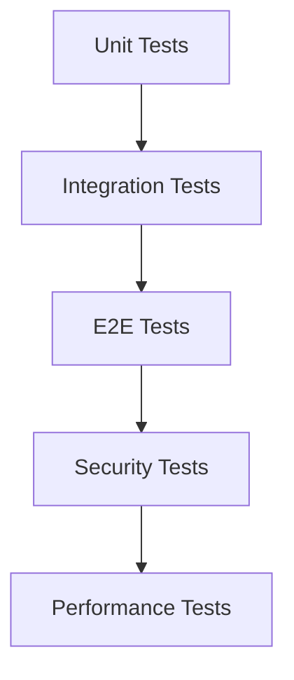

# テスト項目書: BASIC-CLI-002 MML Synthesizer CLI 機能改善

## メタ情報

| 項目 | 内容 |
|------|------|
| ドキュメントID | TEST-CLI-002 |
| バージョン | 1.0.0 |
| 対象機能 | BASIC-CLI-002 MML Synthesizer CLI 機能改善 |
| 作成日 | 2026-01-11 |
| ステータス | ドラフト |
| 対応設計書 | DET-MET-001, DET-NRM-001, DET-LOOP-001, DET-CLI-002, DET-E2E-001 |

---

## 1. テスト概要

### 1.1 テスト対象機能

| 機能ID | 機能名 | テストレベル |
|--------|--------|-------------|
| F-015 | ノイズベースクリック音 | UT, IT |
| F-016 | ビート選択 | UT, IT, E2E |
| F-017 | メトロノーム音量調節 | UT, IT, E2E |
| F-018 | ループ履歴登録 | UT, IT, E2E |
| F-019 | 音声クリッピング防止 | UT, IT |
| F-005 | BPMオプション削除 | E2E |
| F-021 | E2E統合テスト | E2E |

### 1.2 テストレベル定義

- **UT (Unit Test)**: 関数単位のテスト（Rustのmod tests）
- **IT (Integration Test)**: モジュール間連携テスト（tests/ディレクトリ）
- **E2E (End-to-End Test)**: CLIバイナリレベルのテスト（assert_cmd使用）

### 1.3 テスト方針

| テストレベル | 対象 | カバレッジ目標 |
|-------------|------|---------------|
| Unit | ドメインロジック、ユースケース | 90%以上 |
| Integration | API、DB連携 | 80%以上 |
| E2E | 主要ユーザーフロー | 主要パス100% |

---

## 2. ユニットテスト項目

### 2.1 メトロノーム機能 (F-015, F-016, F-017)

#### TC-U-MET-001: ノイズクリック音サンプル数検証

| 項目 | 内容 |
|------|------|
| 優先度 | P0 |
| テスト対象 | `generate_noise_click()` |
| 前提条件 | sample_rate=44100, volume=1.0 |
| 入力 | `generate_noise_click(44100.0, 1.0)` |
| 期待結果 | サンプル数 = 1102 (25ms) |
| 境界値 | - |

**テストコード雛形:**
```rust
#[test]
fn test_noise_click_sample_count() {
    let samples = generate_noise_click(44100.0, 1.0);
    assert_eq!(samples.len(), 1102);
}
```

#### TC-U-MET-002: ノイズクリック音量適用検証

| 項目 | 内容 |
|------|------|
| 優先度 | P0 |
| テスト対象 | `generate_noise_click()` |
| 前提条件 | sample_rate=44100, volume=0.5 |
| 入力 | `generate_noise_click(44100.0, 0.5)` |
| 期待結果 | 最大振幅 ≤ 0.5 |
| 境界値 | volume=0.0, 0.5, 1.0 |

**テストコード雛形:**
```rust
#[test]
fn test_noise_click_volume_application() {
    let samples = generate_noise_click(44100.0, 0.5);
    let max_abs = samples.iter().map(|s| s.abs()).fold(0.0, f32::max);
    assert!(max_abs <= 0.5);
}
```

#### TC-U-MET-003: 4ビート間隔計算

| 項目 | 内容 |
|------|------|
| 優先度 | P0 |
| テスト対象 | `beat_interval_seconds()` |
| 前提条件 | bpm=120, beat=4 |
| 入力 | `beat_interval_seconds(120, 4)` |
| 期待結果 | 0.5秒 |
| 境界値 | bpm=30, 120, 300 |

**テストコード雛形:**
```rust
#[test]
fn test_beat_interval_4beat() {
    assert_eq!(beat_interval_seconds(120, 4), 0.5);
}
```

#### TC-U-MET-004: 8ビート間隔計算

| 項目 | 内容 |
|------|------|
| 優先度 | P0 |
| テスト対象 | `beat_interval_seconds()` |
| 前提条件 | bpm=120, beat=8 |
| 入力 | `beat_interval_seconds(120, 8)` |
| 期待結果 | 0.25秒 |
| 境界値 | bpm=60, 120, 240 |

**テストコード雛形:**
```rust
#[test]
fn test_beat_interval_8beat() {
    assert_eq!(beat_interval_seconds(120, 8), 0.25);
}
```

#### TC-U-MET-005: 16ビート間隔計算

| 項目 | 内容 |
|------|------|
| 優先度 | P0 |
| テスト対象 | `beat_interval_seconds()` |
| 前提条件 | bpm=120, beat=16 |
| 入力 | `beat_interval_seconds(120, 16)` |
| 期待結果 | 0.125秒 |
| 境界値 | bpm=60, 120, 240 |

**テストコード雛形:**
```rust
#[test]
fn test_beat_interval_16beat() {
    assert_eq!(beat_interval_seconds(120, 16), 0.125);
}
```

#### TC-U-MET-006: メトロノームミックス加算性検証

| 項目 | 内容 |
|------|------|
| 優先度 | P1 |
| テスト対象 | `mix_metronome()` |
| 前提条件 | 元サンプル + クリック音 |
| 入力 | `mix_metronome(&mut samples, 44100.0, 120, 4, 0.3)` |
| 期待結果 | ミックス後の値 == 元 + クリック |
| 境界値 | - |

**テストコード雛形:**
```rust
#[test]
fn test_mix_metronome_additive() {
    let mut samples = vec![0.5; 44100];
    let original = samples.clone();
    mix_metronome(&mut samples, 44100.0, 120, 4, 0.3);
    // 先頭クリック位置で加算を確認
    assert!(samples[0] > original[0]);
}
```

### 2.2 ノーマライゼーション (F-019)

#### TC-U-NRM-001: クリッピング防止検証

| 項目 | 内容 |
|------|------|
| 優先度 | P0 |
| テスト対象 | `normalize_samples()` |
| 前提条件 | max_abs > 1.0 |
| 入力 | `[-1.5, 0.8, 1.2]` |
| 期待結果 | 最大絶対値 ≤ 1.0 |
| 境界値 | max=1.001, 1.5, 2.0 |

**テストコード雛形:**
```rust
#[test]
fn test_normalize_clipping_prevention() {
    let mut samples = vec![-1.5, 0.8, 1.2];
    normalize_samples(&mut samples);
    let max_abs = samples.iter().map(|s| s.abs()).fold(0.0, f32::max);
    assert!(max_abs <= 1.0);
}
```

#### TC-U-NRM-002: 非破壊性検証

| 項目 | 内容 |
|------|------|
| 優先度 | P0 |
| テスト対象 | `normalize_samples()` |
| 前提条件 | max_abs ≤ 1.0 |
| 入力 | `[-0.5, 0.3, 0.8]` |
| 期待結果 | 変更なし |
| 境界値 | max=0.5, 0.99, 1.0 |

**テストコード雛形:**
```rust
#[test]
fn test_normalize_no_change_when_within_range() {
    let original = vec![-0.5, 0.3, 0.8];
    let mut samples = original.clone();
    normalize_samples(&mut samples);
    assert_eq!(samples, original);
}
```

#### TC-U-NRM-003: 空配列処理

| 項目 | 内容 |
|------|------|
| 優先度 | P1 |
| テスト対象 | `normalize_samples()` |
| 前提条件 | 空配列 |
| 入力 | `[]` |
| 期待結果 | パニックしない |
| 境界値 | - |

**テストコード雛形:**
```rust
#[test]
fn test_normalize_empty_slice() {
    let mut samples: Vec<f32> = vec![];
    normalize_samples(&mut samples);
    assert!(samples.is_empty());
}
```

#### TC-U-NRM-004: 相対音量維持検証

| 項目 | 内容 |
|------|------|
| 優先度 | P1 |
| テスト対象 | `normalize_samples()` |
| 前提条件 | max_abs > 1.0 |
| 入力 | `[-1.5, 0.75]` |
| 期待結果 | samples[0] / samples[1] == -2.0 |
| 境界値 | - |

**テストコード雛形:**
```rust
#[test]
fn test_normalize_preserves_relative_volume() {
    let mut samples = vec![-1.5, 0.75];
    normalize_samples(&mut samples);
    let ratio = samples[0] / samples[1];
    assert!((ratio - (-2.0)).abs() < 0.01);
}
```

### 2.3 ループ履歴登録 (F-018)

#### TC-U-LOOP-001: should_save判定（MML入力）

| 項目 | 内容 |
|------|------|
| 優先度 | P0 |
| テスト対象 | `play_handler()` |
| 前提条件 | mml=Some, history_id=None |
| 入力 | `PlayArgs { mml: Some("CDEFG"), history_id: None, ... }` |
| 期待結果 | should_save == true |
| 境界値 | - |

**テストコード雛形:**
```rust
#[test]
fn test_should_save_with_mml() {
    let args = PlayArgs {
        mml: Some("CDEFG".to_string()),
        history_id: None,
        ..Default::default()
    };
    // should_saveロジックを検証
    assert!(args.mml.is_some() && args.history_id.is_none());
}
```

#### TC-U-LOOP-002: should_save判定（履歴ID）

| 項目 | 内容 |
|------|------|
| 優先度 | P0 |
| テスト対象 | `play_handler()` |
| 前提条件 | mml=None, history_id=Some |
| 入力 | `PlayArgs { mml: None, history_id: Some(1), ... }` |
| 期待結果 | should_save == false |
| 境界値 | - |

**テストコード雛形:**
```rust
#[test]
fn test_should_save_with_history_id() {
    let args = PlayArgs {
        mml: None,
        history_id: Some(1),
        ..Default::default()
    };
    // should_saveロジックを検証
    assert!(!(args.mml.is_some() && args.history_id.is_none()));
}
```

### 2.4 CLIオプション (F-005)

#### TC-U-CLI-001: ビート値検証（有効値）

| 項目 | 内容 |
|------|------|
| 優先度 | P0 |
| テスト対象 | `validate_metronome_beat()` |
| 前提条件 | beat=4, 8, 16 |
| 入力 | `validate_metronome_beat(4)` |
| 期待結果 | Ok(()) |
| 境界値 | 4, 8, 16 |

**テストコード雛形:**
```rust
#[test]
fn test_validate_metronome_beat_valid() {
    assert!(validate_metronome_beat(4).is_ok());
    assert!(validate_metronome_beat(8).is_ok());
    assert!(validate_metronome_beat(16).is_ok());
}
```

#### TC-U-CLI-002: ビート値検証（無効値）

| 項目 | 内容 |
|------|------|
| 優先度 | P0 |
| テスト対象 | `validate_metronome_beat()` |
| 前提条件 | beat=5 |
| 入力 | `validate_metronome_beat(5)` |
| 期待結果 | Err(...) |
| 境界値 | 1, 3, 5, 12, 32 |

**テストコード雛形:**
```rust
#[test]
fn test_validate_metronome_beat_invalid() {
    assert!(validate_metronome_beat(5).is_err());
    assert!(validate_metronome_beat(12).is_err());
}
```

#### TC-U-CLI-003: 音量範囲検証（有効値）

| 項目 | 内容 |
|------|------|
| 優先度 | P0 |
| テスト対象 | clap validation |
| 前提条件 | volume=0.0-1.0 |
| 入力 | `--metronome-volume 0.5` |
| 期待結果 | Ok(0.5) |
| 境界値 | 0.0, 0.5, 1.0 |

**テストコード雛形:**
```rust
#[test]
fn test_metronome_volume_valid() {
    // clap parserのテスト
    let args = Args::parse_from(&["sine-mml", "play", "C4", "--metronome-volume", "0.5"]);
    assert_eq!(args.play.metronome_volume, 0.5);
}
```

#### TC-U-CLI-004: 音量範囲検証（無効値）

| 項目 | 内容 |
|------|------|
| 優先度 | P0 |
| テスト対象 | clap validation |
| 前提条件 | volume < 0.0 または volume > 1.0 |
| 入力 | `--metronome-volume 1.5` |
| 期待結果 | Err(...) |
| 境界値 | -0.1, 1.1, 2.0 |

**テストコード雛形:**
```rust
#[test]
#[should_panic]
fn test_metronome_volume_invalid() {
    Args::parse_from(&["sine-mml", "play", "C4", "--metronome-volume", "1.5"]);
}
```

---

## 3. 統合テスト項目

### 3.1 メトロノーム統合

#### TC-I-MET-001: メトロノームミックス統合

| テストID | テスト名 | シナリオ | 期待値 |
|----------|---------|---------|--------|
| TC-I-MET-001 | メトロノームミックス | synthesize() with metronome=true | クリック音が含まれる |

**テストコード雛形:**
```rust
#[test]
fn test_synthesize_with_metronome() {
    let synthesizer = Synthesizer::default();
    let mml = "T120 C4 D4 E4";
    let samples = synthesizer.synthesize(mml, true, 4, 0.3).unwrap();
    // クリック音が含まれることを確認（サンプルが0でない箇所が多い）
    let non_zero_count = samples.iter().filter(|&&s| s.abs() > 0.01).count();
    assert!(non_zero_count > 0);
}
```

#### TC-I-MET-002: ノーマライゼーション連携

| テストID | テスト名 | シナリオ | 期待値 |
|----------|---------|---------|--------|
| TC-I-MET-002 | ノーマライゼーション連携 | メトロノーム後にnormalize | クリッピングなし |

**テストコード雛形:**
```rust
#[test]
fn test_metronome_with_normalization() {
    let synthesizer = Synthesizer::default();
    let mml = "T120 V15 C4 D4 E4"; // 高音量
    let samples = synthesizer.synthesize(mml, true, 16, 1.0).unwrap();
    // 最大値が1.0以下であることを確認
    let max_abs = samples.iter().map(|s| s.abs()).fold(0.0, f32::max);
    assert!(max_abs <= 1.0);
}
```

### 3.2 履歴統合

#### TC-I-HIST-001: 履歴保存タイミング

| テストID | テスト名 | シナリオ | 期待値 |
|----------|---------|---------|--------|
| TC-I-HIST-001 | 履歴保存タイミング | play --loop 2秒後中断 | 履歴に保存されている |

**テストコード雛形:**
```rust
#[test]
fn test_loop_saves_history_integration() {
    // テスト用インメモリDB
    let db = Database::open_in_memory().unwrap();
    
    // ループ再生をシミュレート（実際の実装では非同期処理）
    // play_handler内で履歴保存が先に実行されることを確認
    
    let history_count_before = db.list(None).unwrap().len();
    
    // play処理実行（ループフラグあり）
    // ...
    
    let history_count_after = db.list(None).unwrap().len();
    assert_eq!(history_count_after, history_count_before + 1);
}
```

---

## 4. E2Eテスト項目

### 4.1 メトロノーム機能テスト

#### TC-E2E-001: メトロノーム16ビート再生

| テストID | テスト名 | コマンド | 期待値 |
|----------|---------|---------|--------|
| TC-E2E-001 | メトロノーム16ビート | `play "T120 C4" --metronome --metronome-beat 16` | 成功 + "✓" 表示 |

**テストコード雛形:**
```rust
#[test]
fn test_play_with_metronome_16beat() {
    Command::cargo_bin("sine-mml")
        .unwrap()
        .arg("play")
        .arg("T120 C4 D4 E4")
        .arg("--metronome")
        .arg("--metronome-beat")
        .arg("16")
        .assert()
        .success()
        .stdout(predicates::str::contains("✓"));
}
```

#### TC-E2E-002: メトロノーム音量調整

| テストID | テスト名 | コマンド | 期待値 |
|----------|---------|---------|--------|
| TC-E2E-002 | メトロノーム音量 | `play "C4" --metronome --metronome-volume 0.5` | 成功 |

**テストコード雛形:**
```rust
#[test]
fn test_metronome_volume_adjustment() {
    Command::cargo_bin("sine-mml")
        .unwrap()
        .arg("play")
        .arg("C4 D4 E4")
        .arg("--metronome")
        .arg("--metronome-volume")
        .arg("0.5")
        .assert()
        .success();
}
```

#### TC-E2E-003: 無効ビート値エラー

| テストID | テスト名 | コマンド | 期待値 |
|----------|---------|---------|--------|
| TC-E2E-003 | 無効ビート値エラー | `play "C4" --metronome-beat 5` | エラー終了 |

**テストコード雛形:**
```rust
#[test]
fn test_invalid_beat_value_error() {
    Command::cargo_bin("sine-mml")
        .unwrap()
        .arg("play")
        .arg("C4")
        .arg("--metronome-beat")
        .arg("5")
        .assert()
        .failure()
        .stderr(predicates::str::contains("invalid value"));
}
```

### 4.2 破壊的変更テスト

#### TC-E2E-004: BPMオプション削除確認

| テストID | テスト名 | コマンド | 期待値 |
|----------|---------|---------|--------|
| TC-E2E-004 | BPMオプション削除 | `play "C4" --bpm 140` | "unexpected argument" エラー |

**テストコード雛形:**
```rust
#[test]
fn test_bpm_option_removed() {
    Command::cargo_bin("sine-mml")
        .unwrap()
        .arg("play")
        .arg("C4")
        .arg("--bpm")
        .arg("140")
        .assert()
        .failure()
        .stderr(predicates::str::contains("unexpected argument"));
}
```

### 4.3 履歴保存テスト

#### TC-E2E-005: ループ履歴保存

| テストID | テスト名 | コマンド | 期待値 |
|----------|---------|---------|--------|
| TC-E2E-005 | ループ履歴保存 | `play "C4" --loop` (2秒後中断) | 履歴に保存 |

**テストコード雛形:**
```rust
#[test]
fn test_loop_saves_history() {
    let temp_dir = TempDir::new().unwrap();
    let db_path = temp_dir.path().join("test_history.db");
    
    std::env::set_var("SINE_MML_DB_PATH", db_path.to_str().unwrap());
    
    let mut cmd = Command::cargo_bin("sine-mml").unwrap();
    cmd.arg("play")
       .arg("C4 D4 E4")
       .arg("--loop")
       .timeout(Duration::from_secs(2));
    
    // タイムアウトで終了（期待通り）
    let _ = cmd.assert();
    
    // 履歴DBを確認
    let db = Database::init_with_path(&db_path).unwrap();
    let history = db.list(Some(1)).unwrap();
    assert!(!history.is_empty());
    assert!(history.iter().any(|e| e.mml.contains("C4")));
}
```

#### TC-E2E-006: エクスポート正常動作

| テストID | テスト名 | コマンド | 期待値 |
|----------|---------|---------|--------|
| TC-E2E-006 | エクスポート正常 | `export --history-id N -o out.wav` | ファイル生成 |

**テストコード雛形:**
```rust
#[test]
fn test_export_with_history() {
    let temp_dir = TempDir::new().unwrap();
    let output_path = temp_dir.path().join("output.wav");
    
    // 前提: 履歴ID 1が存在する
    Command::cargo_bin("sine-mml")
        .unwrap()
        .arg("export")
        .arg("--history-id")
        .arg("1")
        .arg("--output")
        .arg(output_path.to_str().unwrap())
        .assert()
        .success();
    
    assert!(output_path.exists());
}
```

---

## 5. エッジケース・境界値テスト

### 5.1 入力値の境界

| TC-ID | 対象 | 境界条件 | テスト値 | 期待結果 |
|-------|------|---------|---------|---------|
| TC-B-001 | metronome_beat | 最小有効値 | 4 | 成功 |
| TC-B-002 | metronome_beat | 最大有効値 | 16 | 成功 |
| TC-B-003 | metronome_beat | 境界-1 | 3 | エラー |
| TC-B-004 | metronome_beat | 境界+1 | 17 | エラー |
| TC-B-005 | metronome_volume | 最小値 | 0.0 | 成功 |
| TC-B-006 | metronome_volume | 最大値 | 1.0 | 成功 |
| TC-B-007 | metronome_volume | 境界-1 | -0.1 | エラー |
| TC-B-008 | metronome_volume | 境界+1 | 1.1 | エラー |
| TC-B-009 | BPM（MML内） | 最小値 | T30 | 成功 |
| TC-B-010 | BPM（MML内） | 最大値 | T300 | 成功 |

### 5.2 特殊ケース

| TC-ID | ケース | 入力 | 期待結果 |
|-------|--------|------|---------|
| TC-S-001 | 空MML | "" | エラー |
| TC-S-002 | 極端に長いMML | 10000文字のMML | タイムアウトまたは成功 |
| TC-S-003 | Unicode文字 | "♪♫♬" | エラー（無効なMML） |
| TC-S-004 | 制御文字 | "\n\t\r" | エラー |

---

## 6. セキュリティテスト項目

| TC-ID | テスト観点 | テスト内容 | 期待結果 |
|-------|-----------|-----------|---------|
| TC-SEC-001 | パストラバーサル | `--output ../../../etc/passwd` | エラー（不正なパス） |
| TC-SEC-002 | SQLi | `--history-id "1; DROP TABLE history"` | パース失敗またはエスケープ |
| TC-SEC-003 | リソース枯渇 | BPM=30000（巨大値） | エラー（範囲外） |
| TC-SEC-004 | メモリリーク | 1000回連続再生 | メモリ使用量が一定 |

---

## 7. パフォーマンステスト項目

| TC-ID | テスト対象 | 条件 | 目標値 |
|-------|-----------|------|--------|
| TC-P-001 | ノーマライゼーション | 1分間の音声 | 1.5ms以内 |
| TC-P-002 | メトロノームミックス | 1分間、16ビート | 5ms以内 |
| TC-P-003 | 初回再生レイテンシ | play "C4" | 100ms以内 |
| TC-P-004 | 履歴保存 | DB INSERT | 50ms以内 |

---

## 8. テストデータ

### 8.1 正常系テストデータ

```json
{
  "validMML": {
    "simple": "C4 D4 E4",
    "withTempo": "T120 C4 D4 E4",
    "withVolume": "V10 C4 D4 E4",
    "complex": "T140 L8 O5 C D E F G A B >C"
  },
  "validMetronome": {
    "beat": [4, 8, 16],
    "volume": [0.0, 0.3, 0.5, 1.0]
  }
}
```

### 8.2 異常系テストデータ

```json
{
  "invalidMML": {
    "empty": "",
    "invalidCommand": "X4 Y8",
    "unicode": "♪♫♬"
  },
  "invalidMetronome": {
    "beat": [0, 1, 3, 5, 12, 32],
    "volume": [-0.1, 1.1, 2.0, -1.0]
  }
}
```

---

## 9. テスト実行順序



---

## 10. カバレッジ目標

| レイヤー | 目標カバレッジ | 備考 |
|---------|--------------|------|
| Domain | 95% | ビジネスロジックは高カバレッジ必須 |
| Application | 90% | ユースケースは高カバレッジ必須 |
| Infrastructure | 70% | 外部依存はモック可 |
| Presentation | 60% | UIはE2Eでカバー |

---

## 11. テスト環境

### 11.1 必要条件

- Rust 1.70+
- cargo test
- assert_cmd, predicates (dev-dependencies)
- tempfile (テスト用一時ファイル管理)

### 11.2 CI環境考慮

- オーディオデバイスなしでも動作すること
- タイムアウト設定（ループテスト用）
- 並列実行時のDB競合回避（UUID使用）

### 11.3 テスト実行コマンド

```bash
# 全テスト実行
cargo test

# ユニットテストのみ
cargo test --lib

# 統合テストのみ
cargo test --test '*'

# E2Eテストのみ
cargo test --test cli_integration

# カバレッジ計測
cargo tarpaulin --out Html
```

---

## 12. 回帰テスト戦略

### 12.1 回帰テスト対象

| 変更機能 | 回帰リスク | 回帰テスト項目 |
|---------|-----------|---------------|
| メトロノーム | 既存再生機能への影響 | メトロノームなし再生が正常動作 |
| ノーマライゼーション | 音質変化 | 既存WAVファイルとの比較 |
| ループ履歴 | 通常再生への影響 | 非ループ再生での履歴保存 |
| BPMオプション削除 | 既存スクリプト破壊 | エラーメッセージ確認 |

### 12.2 回帰テストスイート

```bash
# 既存機能の回帰テスト
cargo test --test regression_tests
```

---

## 13. テスト自動化

### 13.1 CI/CD統合

```yaml
# .github/workflows/test.yml
name: Test

on: [push, pull_request]

jobs:
  test:
    runs-on: ubuntu-latest
    steps:
      - uses: actions/checkout@v3
      - name: Setup Rust
        uses: actions-rs/toolchain@v1
      - name: Run tests
        run: cargo test --all-features
      - name: Run E2E tests
        run: cargo test --test cli_integration
```

### 13.2 テストレポート

- カバレッジレポート: tarpaulin
- テスト実行時間: cargo test --timings
- 失敗箇所: GitHub Actions Summary

---

## 14. 変更履歴

| 日付 | バージョン | 変更内容 | 担当者 |
|------|------------|----------|--------|
| 2026-01-11 | 1.0.0 | 初版作成 | test-spec-writer |

---

## 15. 承認

| 役割 | 氏名 | 承認日 | 署名 |
|------|------|--------|------|
| テストマネージャー | - | - | - |
| 開発リーダー | - | - | - |
| 品質保証 | - | - | - |

---

## 付録A: テスト実装チェックリスト

### Phase 1: ユニットテスト実装
- [ ] TC-U-MET-001〜006 実装
- [ ] TC-U-NRM-001〜004 実装
- [ ] TC-U-LOOP-001〜002 実装
- [ ] TC-U-CLI-001〜004 実装

### Phase 2: 統合テスト実装
- [ ] TC-I-MET-001〜002 実装
- [ ] TC-I-HIST-001 実装

### Phase 3: E2Eテスト実装
- [ ] TC-E2E-001〜003 実装（メトロノーム）
- [ ] TC-E2E-004 実装（破壊的変更）
- [ ] TC-E2E-005〜006 実装（履歴・エクスポート）

### Phase 4: 品質テスト実装
- [ ] 境界値テスト（TC-B-001〜010）
- [ ] セキュリティテスト（TC-SEC-001〜004）
- [ ] パフォーマンステスト（TC-P-001〜004）

### Phase 5: CI統合
- [ ] GitHub Actions設定
- [ ] カバレッジレポート自動生成
- [ ] PRテンプレート更新

---

## 付録B: 参考資料

| 資料名 | パス |
|--------|------|
| メトロノーム詳細設計書 | docs/designs/detailed/metronome/詳細設計書.md |
| ノーマライゼーション詳細設計書 | docs/designs/detailed/normalizer/詳細設計書.md |
| ループ履歴詳細設計書 | docs/designs/detailed/loop-history/詳細設計書.md |
| CLIオプション詳細設計書 | docs/designs/detailed/cli-options/詳細設計書.md |
| E2Eテスト詳細設計書 | docs/designs/detailed/e2e-test/詳細設計書.md |
| 基本設計書 | docs/designs/basic/BASIC-CLI-002_MML-Synthesizer-Enhancement.md |
