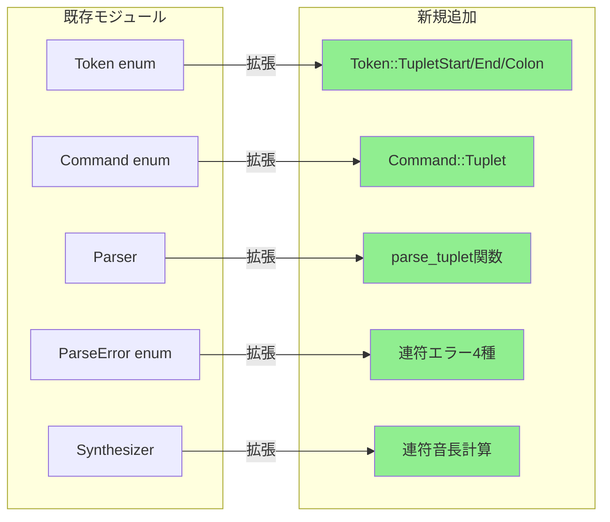
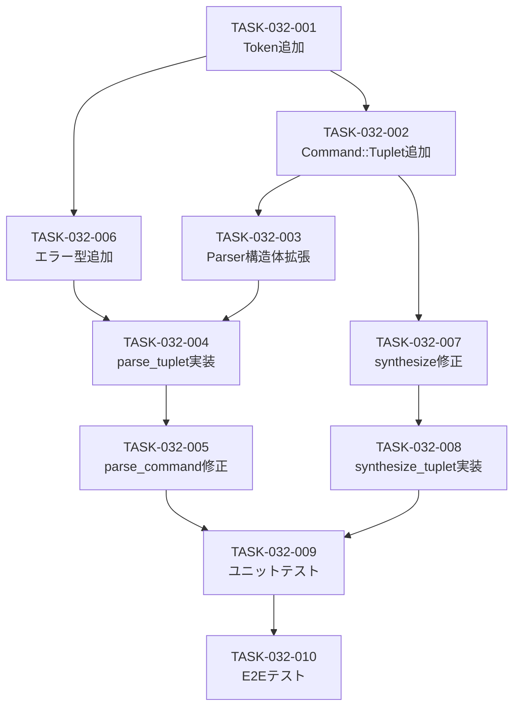

# 連符（n連符）バックエンド設計書

## ドキュメント情報

| 項目 | 内容 |
|------|------|
| ドキュメントID | DET-TUP-002 |
| 機能ID | F-032 |
| 機能名 | 連符（n連符） |
| 関連基本設計書 | [BASIC-CLI-006](../../basic/BASIC-CLI-006_MIDI-Streaming-Tuplet.md) |
| 関連詳細設計書 | [詳細設計書](./詳細設計書.md) |
| バージョン | 1.0.0 |
| 作成日 | 2026-01-14 |
| 最終更新日 | 2026-01-14 |
| 作成者 | detailed-design-writer |

---

## 1. 変更概要

### 1.1 目的

MML連符（`{...}n`）の実装により、3連符、5連符などの複雑なリズムパターンを表現可能にする。

### 1.2 変更対象モジュール

| モジュール | ファイルパス | 変更内容 | 変更レベル |
|-----------|------------|---------|-----------|
| トークン定義 | `src/mml/mod.rs` | `Token::TupletStart`, `Token::TupletEnd`, `Token::Colon`追加 | 低 |
| AST定義 | `src/mml/ast.rs` | `Command::Tuplet`バリアント追加 | 中 |
| パーサー | `src/mml/parser.rs` | 連符解析ロジック追加（`parse_tuplet`新規作成） | 高 |
| エラー定義 | `src/mml/error.rs` | 連符関連エラー4種追加（MML-E020〜E023） | 中 |
| シンセサイザー | `src/audio/synthesizer.rs` | 連符音長計算処理追加 | 中 |

### 1.3 影響範囲



---

## 2. ファイル変更サマリー

| ファイル | 追加行数 | 削除行数 | 変更種別 | 説明 |
|---------|---------|---------|---------|------|
| `src/mml/mod.rs` | 15行 | 0行 | 修正 | トークン3種追加、トークナイザー修正 |
| `src/mml/ast.rs` | 20行 | 0行 | 修正 | `Command::Tuplet`追加 |
| `src/mml/parser.rs` | 120行 | 0行 | 修正 | `parse_tuplet`関数追加、`parse_command`修正 |
| `src/mml/error.rs` | 50行 | 0行 | 修正 | エラー型4種追加、Display実装 |
| `src/audio/synthesizer.rs` | 60行 | 0行 | 修正 | 連符音長計算ロジック追加 |

**合計見積もり**: 265行

---

## 3. 実装詳細

### 3.1 Token enum への追加

**ファイル**: `src/mml/mod.rs`

**変更箇所**: `Token` enum (行16-38付近)

**変更前**:
```rust
#[derive(Debug, Clone, PartialEq)]
pub enum Token {
    Pitch(Pitch),
    Sharp,
    Flat,
    Dot,
    Number(u16),
    Octave,
    OctaveUp,
    OctaveDown,
    Tempo,
    Length,
    Volume,
    Rest,
    LoopStart,
    LoopEnd,
    LoopEscape,
    Tie,
    Eof,
}
```

**変更後**:
```rust
#[derive(Debug, Clone, PartialEq)]
pub enum Token {
    Pitch(Pitch),
    Sharp,
    Flat,
    Dot,
    Number(u16),
    Octave,
    OctaveUp,
    OctaveDown,
    Tempo,
    Length,
    Volume,
    Rest,
    LoopStart,
    LoopEnd,
    LoopEscape,
    Tie,
    /// 連符開始 `{`
    TupletStart,
    /// 連符終了 `}`
    TupletEnd,
    /// ベース音長指定 `:`（連符用、ループ脱出ポイントと区別）
    Colon,
    Eof,
}
```

**トークナイザーへの追加**:

**変更箇所**: `tokenize` 関数 (行58-180付近)

```rust
pub fn tokenize(input: &str) -> Result<Vec<TokenWithPos>, ParseError> {
    let mut tokens = Vec::new();
    let mut chars = input.chars().peekable();
    let mut position = 0;

    while let Some(&c) = chars.peek() {
        // ... 既存の処理 ...
        
        let token = match c.to_ascii_uppercase() {
            // ... 既存のマッチアーム ...
            
            ':' => {
                chars.next();
                let tok = TokenWithPos::new(Token::LoopEscape, position);
                position += 1;
                tok
            }
            '&' => {
                chars.next();
                let tok = TokenWithPos::new(Token::Tie, position);
                position += 1;
                tok
            }
            // 新規追加: 連符トークン
            '{' => {
                chars.next();
                let tok = TokenWithPos::new(Token::TupletStart, position);
                position += 1;
                tok
            }
            '}' => {
                chars.next();
                let tok = TokenWithPos::new(Token::TupletEnd, position);
                position += 1;
                tok
            }
            _ if c.is_ascii_digit() => {
                // ... 数値処理 ...
            }
            _ => {
                return Err(ParseError::UnexpectedCharacter {
                    character: c,
                    position,
                });
            }
        };
        tokens.push(token);
    }
    
    // ...
}
```

**注意**: `:` トークンは既存の `Token::LoopEscape` と共用します。連符のベース音長指定（`{CDE}3:2`）とループの脱出ポイント（`[CD:EF]2`）は文脈で区別されます。

### 3.2 AST拡張

**ファイル**: `src/mml/ast.rs`

**変更箇所**: `Command` enum (行21-46付近)

**変更前**:
```rust
#[derive(Debug, Clone, PartialEq)]
pub enum Command {
    Note(Note),
    Rest(Rest),
    Octave(Octave),
    OctaveUp,
    OctaveDown,
    Tempo(Tempo),
    DefaultLength(DefaultLength),
    Volume(Volume),
    Loop {
        commands: Vec<Command>,
        escape_index: Option<usize>,
        repeat_count: usize,
    },
}
```

**変更後**:
```rust
#[derive(Debug, Clone, PartialEq)]
pub enum Command {
    Note(Note),
    Rest(Rest),
    Octave(Octave),
    OctaveUp,
    OctaveDown,
    Tempo(Tempo),
    DefaultLength(DefaultLength),
    Volume(Volume),
    Loop {
        commands: Vec<Command>,
        escape_index: Option<usize>,
        repeat_count: usize,
    },
    /// 連符コマンド: {commands}n[:base_duration]
    ///
    /// # フィールド
    /// - `commands`: 連符内のコマンド列
    /// - `count`: 連符数（2-99）
    /// - `base_duration`: ベース音長（:の後の指定、Noneの場合はデフォルト音長を使用）
    ///
    /// # 例
    /// ```ignore
    /// // {CDE}3
    /// Tuplet {
    ///     commands: vec![Note(C), Note(D), Note(E)],
    ///     count: 3,
    ///     base_duration: None,
    /// }
    ///
    /// // {CDE}3:2
    /// Tuplet {
    ///     commands: vec![Note(C), Note(D), Note(E)],
    ///     count: 3,
    ///     base_duration: Some(2),
    /// }
    /// ```
    Tuplet {
        /// 連符内のコマンド列
        commands: Vec<Command>,
        /// 連符数（2-99）
        count: u8,
        /// ベース音長（Noneの場合はデフォルト音長を使用）
        base_duration: Option<u8>,
    },
}
```

### 3.3 パーサー拡張

**ファイル**: `src/mml/parser.rs`

#### 3.3.1 Parser構造体の拡張

**変更箇所**: `Parser` 構造体 (行54-58付近)

**変更前**:
```rust
pub struct Parser {
    tokens: Vec<TokenWithPos>,
    current: usize,
    loop_depth: usize,
}
```

**変更後**:
```rust
pub struct Parser {
    tokens: Vec<TokenWithPos>,
    current: usize,
    loop_depth: usize,
    tuplet_depth: usize,  // 新規追加: 連符のネスト深度
}
```

#### 3.3.2 Parser::new の修正

**変更箇所**: `Parser::new` 関数 (行60-68付近)

**変更前**:
```rust
impl Parser {
    #[must_use]
    pub fn new(tokens: Vec<TokenWithPos>) -> Self {
        Self {
            tokens,
            current: 0,
            loop_depth: 0,
        }
    }
    // ...
}
```

**変更後**:
```rust
impl Parser {
    #[must_use]
    pub fn new(tokens: Vec<TokenWithPos>) -> Self {
        Self {
            tokens,
            current: 0,
            loop_depth: 0,
            tuplet_depth: 0,  // 新規追加
        }
    }
    // ...
}
```

#### 3.3.3 parse_command の修正

**変更箇所**: `parse_command` 関数 (行100-134付近)

**変更前**:
```rust
fn parse_command(&mut self) -> Result<Command, ParseError> {
    let token_with_pos = self.peek();
    match &token_with_pos.token {
        Token::Pitch(_) => Ok(Command::Note(self.parse_note()?)),
        Token::Rest => Ok(Command::Rest(self.parse_rest()?)),
        Token::Octave => Ok(Command::Octave(self.parse_octave()?)),
        Token::OctaveUp => {
            self.advance();
            Ok(Command::OctaveUp)
        }
        Token::OctaveDown => {
            self.advance();
            Ok(Command::OctaveDown)
        }
        Token::Tempo => Ok(Command::Tempo(self.parse_tempo()?)),
        Token::Length => Ok(Command::DefaultLength(self.parse_length()?)),
        Token::Volume => Ok(Command::Volume(self.parse_volume()?)),
        Token::LoopStart => self.parse_loop(),
        Token::LoopEnd => Err(ParseError::UnmatchedLoopEnd {
            position: token_with_pos.position,
        }),
        Token::LoopEscape => Err(ParseError::LoopEscapeOutsideLoop {
            position: token_with_pos.position,
        }),
        Token::Eof => Err(ParseError::UnexpectedEof {
            expected: "command".to_string(),
            position: token_with_pos.position,
        }),
        _ => Err(ParseError::UnexpectedToken {
            expected: "command".to_string(),
            found: token_with_pos.token.clone(),
            position: token_with_pos.position,
        }),
    }
}
```

**変更後**:
```rust
fn parse_command(&mut self) -> Result<Command, ParseError> {
    let token_with_pos = self.peek();
    match &token_with_pos.token {
        Token::Pitch(_) => Ok(Command::Note(self.parse_note()?)),
        Token::Rest => Ok(Command::Rest(self.parse_rest()?)),
        Token::Octave => Ok(Command::Octave(self.parse_octave()?)),
        Token::OctaveUp => {
            self.advance();
            Ok(Command::OctaveUp)
        }
        Token::OctaveDown => {
            self.advance();
            Ok(Command::OctaveDown)
        }
        Token::Tempo => Ok(Command::Tempo(self.parse_tempo()?)),
        Token::Length => Ok(Command::DefaultLength(self.parse_length()?)),
        Token::Volume => Ok(Command::Volume(self.parse_volume()?)),
        Token::LoopStart => self.parse_loop(),
        Token::LoopEnd => Err(ParseError::UnmatchedLoopEnd {
            position: token_with_pos.position,
        }),
        Token::LoopEscape => Err(ParseError::LoopEscapeOutsideLoop {
            position: token_with_pos.position,
        }),
        // 新規追加: 連符処理
        Token::TupletStart => self.parse_tuplet(),
        Token::TupletEnd => Err(ParseError::UnexpectedToken {
            expected: "command".to_string(),
            found: Token::TupletEnd,
            position: token_with_pos.position,
        }),
        Token::Eof => Err(ParseError::UnexpectedEof {
            expected: "command".to_string(),
            position: token_with_pos.position,
        }),
        _ => Err(ParseError::UnexpectedToken {
            expected: "command".to_string(),
            found: token_with_pos.token.clone(),
            position: token_with_pos.position,
        }),
    }
}
```

#### 3.3.4 parse_tuplet 関数の追加

**挿入位置**: `parse_loop` 関数の後（行205付近）

```rust
/// 連符構文を解析
///
/// # 構文
/// `{<コマンド>...}n[:base_duration]`
///
/// # Returns
/// * `Ok(Command::Tuplet)` - 連符コマンド
/// * `Err(ParseError)` - エラー
///
/// # エラー
/// - `TupletNestTooDeep` - ネスト深度が5を超える
/// - `UnclosedTuplet` - 閉じ括弧がない
/// - `TupletCountMissing` - 連符数が指定されていない
/// - `InvalidTupletCount` - 連符数が2未満
fn parse_tuplet(&mut self) -> Result<Command, ParseError> {
    // ネスト深度チェック（最大5階層）
    const MAX_TUPLET_DEPTH: usize = 5;
    if self.tuplet_depth >= MAX_TUPLET_DEPTH {
        return Err(ParseError::TupletNestTooDeep {
            max_depth: MAX_TUPLET_DEPTH,
            position: self.peek().position,
        });
    }

    let start_pos = self.peek().position;
    self.advance(); // Consume '{'
    self.tuplet_depth += 1; // ネスト深度を増やす

    let mut commands = Vec::new();

    // 括弧内のコマンドを解析
    while !self.check_tuplet_end() {
        if self.is_at_end() {
            self.tuplet_depth -= 1; // エラー時も深度を戻す
            return Err(ParseError::UnclosedTuplet {
                position: start_pos,
            });
        }

        // 再帰的に連符をパース（ネスト対応）
        let cmd = self.parse_command()?;
        commands.push(cmd);
    }

    self.advance(); // Consume '}'
    self.tuplet_depth -= 1; // ネスト深度を戻す

    // 連符数を取得
    if !self.check_number() {
        return Err(ParseError::TupletCountMissing {
            position: self.peek().position,
        });
    }

    let token_with_pos = self.advance();
    let count = if let Token::Number(n) = token_with_pos.token {
        if n < 2 {
            return Err(ParseError::InvalidTupletCount {
                count: n as u8,
                position: token_with_pos.position,
            });
        }
        #[allow(clippy::cast_possible_truncation)]
        {
            n as u8
        }
    } else {
        unreachable!("check_number() returned true but token is not Number")
    };

    // ベース音長の指定（オプション）
    let base_duration = if self.check_colon() {
        self.advance(); // Consume ':'
        if !self.check_number() {
            return Err(ParseError::UnexpectedToken {
                expected: "number".to_string(),
                found: self.peek().token.clone(),
                position: self.peek().position,
            });
        }
        #[allow(clippy::cast_possible_truncation)]
        Some(self.consume_number_in_range(1, 64)? as u8)
    } else {
        None
    };

    Ok(Command::Tuplet {
        commands,
        count,
        base_duration,
    })
}

/// 次のトークンが連符終了かチェック
fn check_tuplet_end(&self) -> bool {
    matches!(self.peek().token, Token::TupletEnd)
}

/// 次のトークンがコロンかチェック
fn check_colon(&self) -> bool {
    matches!(self.peek().token, Token::LoopEscape)
}
```

**注意**: `check_colon()` は `Token::LoopEscape` をチェックしますが、これは `:` トークンがループ脱出ポイントと連符のベース音長指定で共用されているためです。文脈（連符の `}n` の後）で区別されます。

### 3.4 エラー定義拡張

**ファイル**: `src/mml/error.rs`

#### 3.4.1 ParseError enum への追加

**挿入位置**: `EmptyTieChain` の後（行64付近）

```rust
#[derive(Debug, Clone, PartialEq)]
pub enum ParseError {
    // ... 既存のエラー型 ...
    
    /// MML-E014: タイチェーンが空（トップレベルの&）
    EmptyTieChain {
        position: usize,
    },
    
    // 新規追加: 連符関連エラー
    
    /// MML-E020: 連符の閉じ括弧がない
    ///
    /// 連符の開始括弧 `{` に対応する閉じ括弧 `}` がない。
    /// 例: `{CDE` (閉じ括弧なし)
    UnclosedTuplet {
        position: usize,
    },
    
    /// MML-E021: 連符数が指定されていない
    ///
    /// 連符の閉じ括弧 `}` の後に連符数が指定されていない。
    /// 例: `{CDE}` (連符数なし)
    TupletCountMissing {
        position: usize,
    },
    
    /// MML-E022: 無効な連符数
    ///
    /// 連符数が2未満。
    /// 例: `{CDE}1`, `{CDE}0`
    InvalidTupletCount {
        count: u8,
        position: usize,
    },
    
    /// MML-E023: 連符のネスト深度超過
    ///
    /// 連符のネスト深度が最大値（5階層）を超えている。
    /// 例: 6階層以上のネスト
    TupletNestTooDeep {
        max_depth: usize,
        position: usize,
    },
}
```

#### 3.4.2 Display トレイト実装の追加

**変更箇所**: `impl std::fmt::Display for ParseError` ブロック（行67-187付近）

```rust
impl std::fmt::Display for ParseError {
    #[allow(clippy::too_many_lines)]
    fn fmt(&self, f: &mut std::fmt::Formatter<'_>) -> std::fmt::Result {
        match self {
            // ... 既存のマッチアーム ...
            
            Self::EmptyTieChain { position } => {
                write!(
                    f,
                    "位置 {position}: タイ記号 '&' が音符/休符なしで使用されています"
                )
            }
            
            // 新規追加
            Self::UnclosedTuplet { position } => {
                write!(
                    f,
                    "位置 {position}: 連符の閉じ括弧 '}}' がありません"
                )
            }
            Self::TupletCountMissing { position } => {
                write!(
                    f,
                    "位置 {position}: 連符数が指定されていません"
                )
            }
            Self::InvalidTupletCount { count, position } => {
                write!(
                    f,
                    "位置 {position}: 無効な連符数です（2以上を指定してください）: {count}"
                )
            }
            Self::TupletNestTooDeep { max_depth, position } => {
                write!(
                    f,
                    "位置 {position}: 連符のネスト深度が最大値（{max_depth}階層）を超えています"
                )
            }
        }
    }
}
```

### 3.5 シンセサイザー拡張

**ファイル**: `src/audio/synthesizer.rs`

#### 3.5.1 synthesize メソッドの修正

**変更箇所**: `synthesize` メソッド (行27-81付近)

**変更前**:
```rust
pub fn synthesize(&mut self, mml: &Mml) -> Result<Vec<f32>, Box<dyn Error>> {
    let mut samples = Vec::new();
    let mut octave = 4;
    let mut default_length = 4;
    let mut bpm = 120;
    let mut current_velocity: u8 = 10;

    for command in &mml.commands {
        match command {
            Command::Note(note) => {
                let note_samples = self.generate_note_samples(
                    note,
                    octave,
                    bpm,
                    default_length,
                    current_velocity,
                );
                samples.extend(note_samples);
            }
            Command::Rest(rest) => {
                let duration = rest.duration_in_seconds(bpm, default_length);
                let num_samples = (f64::from(duration) * f64::from(self.sample_rate)) as usize;
                samples.extend(vec![0.0; num_samples]);
            }
            Command::Octave(o) => octave = o.value,
            Command::OctaveUp => octave = octave.saturating_add(1).min(8),
            Command::OctaveDown => octave = octave.saturating_sub(1).max(1),
            Command::Tempo(t) => bpm = t.value,
            Command::DefaultLength(l) => default_length = l.value,
            Command::Volume(v) => {
                current_velocity = match v.value {
                    VolumeValue::Absolute(val) => val,
                    VolumeValue::Relative(delta) => {
                        #[allow(clippy::cast_possible_wrap)]
                        let new_val = (current_velocity as i8 + delta).clamp(0, 15);
                        #[allow(clippy::cast_sign_loss)]
                        {
                            new_val as u8
                        }
                    }
                };
            }
            Command::Loop { .. } => {
                unreachable!("Loop commands should be expanded before synthesis")
            }
        }
    }

    normalize_samples(&mut samples);

    Ok(samples)
}
```

**変更後**:
```rust
pub fn synthesize(&mut self, mml: &Mml) -> Result<Vec<f32>, Box<dyn Error>> {
    let mut samples = Vec::new();
    let mut octave = 4;
    let mut default_length = 4;
    let mut bpm = 120;
    let mut current_velocity: u8 = 10;

    for command in &mml.commands {
        match command {
            Command::Note(note) => {
                let note_samples = self.generate_note_samples(
                    note,
                    octave,
                    bpm,
                    default_length,
                    current_velocity,
                );
                samples.extend(note_samples);
            }
            Command::Rest(rest) => {
                let duration = rest.duration_in_seconds(bpm, default_length);
                let num_samples = (f64::from(duration) * f64::from(self.sample_rate)) as usize;
                samples.extend(vec![0.0; num_samples]);
            }
            Command::Octave(o) => octave = o.value,
            Command::OctaveUp => octave = octave.saturating_add(1).min(8),
            Command::OctaveDown => octave = octave.saturating_sub(1).max(1),
            Command::Tempo(t) => bpm = t.value,
            Command::DefaultLength(l) => default_length = l.value,
            Command::Volume(v) => {
                current_velocity = match v.value {
                    VolumeValue::Absolute(val) => val,
                    VolumeValue::Relative(delta) => {
                        #[allow(clippy::cast_possible_wrap)]
                        let new_val = (current_velocity as i8 + delta).clamp(0, 15);
                        #[allow(clippy::cast_sign_loss)]
                        {
                            new_val as u8
                        }
                    }
                };
            }
            Command::Loop { .. } => {
                unreachable!("Loop commands should be expanded before synthesis")
            }
            // 新規追加: 連符処理
            Command::Tuplet { commands, count, base_duration } => {
                let tuplet_samples = self.synthesize_tuplet(
                    commands,
                    *count,
                    *base_duration,
                    octave,
                    bpm,
                    default_length,
                    current_velocity,
                )?;
                samples.extend(tuplet_samples);
            }
        }
    }

    normalize_samples(&mut samples);

    Ok(samples)
}
```

#### 3.5.2 synthesize_tuplet メソッドの追加

**挿入位置**: `mix_metronome` メソッドの後（行220付近）

```rust
/// 連符を合成
///
/// # Arguments
/// * `commands` - 連符内のコマンド列
/// * `count` - 連符数（2-99）
/// * `base_duration` - ベース音長（Noneの場合はデフォルト音長を使用）
/// * `octave` - 現在のオクターブ
/// * `bpm` - テンポ
/// * `default_length` - デフォルト音長
/// * `velocity` - 音量
///
/// # Returns
/// 連符のサンプル配列
///
/// # Errors
/// 合成に失敗した場合
#[allow(
    clippy::cast_precision_loss,
    clippy::cast_possible_truncation,
    clippy::cast_sign_loss,
    clippy::too_many_arguments
)]
fn synthesize_tuplet(
    &self,
    commands: &[Command],
    count: u8,
    base_duration: Option<u8>,
    mut octave: u8,
    bpm: u16,
    default_length: u8,
    velocity: u8,
) -> Result<Vec<f32>, Box<dyn Error>> {
    let mut samples = Vec::new();

    // ベース音長を取得
    let base = base_duration.unwrap_or(default_length);
    let base_seconds = 60.0 / f32::from(bpm) * 4.0 / f32::from(base);

    // 連符の1音あたりの基本音長
    let tuplet_duration = base_seconds / f32::from(count);

    for cmd in commands {
        match cmd {
            Command::Note(note) => {
                // 音符が個別に音長を指定している場合は考慮
                let note_duration = if note.duration.base.value.is_some() || note.duration.has_ties() {
                    // 個別音長指定あり: 通常の音長計算 / count
                    note.duration_in_seconds(bpm, default_length) / f32::from(count)
                } else {
                    // 個別音長指定なし: 連符の基本音長を使用
                    tuplet_duration
                };

                let midi_note = note.to_midi_note(octave);
                let frequency = crate::audio::waveform::midi_to_frequency(midi_note);
                let num_samples = (f64::from(note_duration) * f64::from(self.sample_rate)) as usize;

                let mut audio_node = crate::audio::waveform::create_node(self.waveform_type, frequency);
                audio_node.set_sample_rate(f64::from(self.sample_rate));

                let master_gain = (f32::from(self.volume) / 100.0) * (f32::from(velocity) / 15.0);

                let mut note_samples = Vec::with_capacity(num_samples);
                for _ in 0..num_samples {
                    let sample = audio_node.get_mono() as f32;
                    note_samples.push(sample * master_gain);
                }

                self.apply_envelope(&mut note_samples);
                samples.extend(note_samples);
            }
            Command::Rest(rest) => {
                // 休符が個別に音長を指定している場合は考慮
                let rest_duration = if rest.duration.base.value.is_some() || rest.duration.has_ties() {
                    // 個別音長指定あり: 通常の音長計算 / count
                    rest.duration_in_seconds(bpm, default_length) / f32::from(count)
                } else {
                    // 個別音長指定なし: 連符の基本音長を使用
                    tuplet_duration
                };

                let num_samples = (f64::from(rest_duration) * f64::from(self.sample_rate)) as usize;
                samples.extend(vec![0.0; num_samples]);
            }
            Command::Octave(o) => octave = o.value,
            Command::OctaveUp => octave = octave.saturating_add(1).min(8),
            Command::OctaveDown => octave = octave.saturating_sub(1).max(1),
            Command::Tuplet { commands: inner_commands, count: inner_count, base_duration: inner_base } => {
                // ネストした連符の処理
                // 外側の連符の1音分の時間を、内側の連符のベース音長として使用
                let nested_base = if inner_base.is_some() {
                    *inner_base
                } else {
                    // 内側の連符がベース音長を指定していない場合、
                    // 外側の連符の1音分の時間を4分音符相当として扱う
                    // (実際の時間は tuplet_duration だが、音価としては default_length を使用)
                    Some(default_length)
                };

                let nested_samples = self.synthesize_tuplet(
                    inner_commands,
                    *inner_count,
                    nested_base,
                    octave,
                    bpm,
                    default_length,
                    velocity,
                )?;

                // ネストした連符の合計時間を連符の1音分に調整
                let nested_total_duration = nested_samples.len() as f32 / f32::from(self.sample_rate);
                let target_duration = tuplet_duration;
                let time_scale = target_duration / nested_total_duration;

                // サンプル数を調整（リサンプリング）
                let target_samples = (f64::from(target_duration) * f64::from(self.sample_rate)) as usize;
                let resampled = resample_linear(&nested_samples, target_samples);
                samples.extend(resampled);
            }
            _ => {
                // 連符内でテンポ、デフォルト音長、音量などのコマンドは無視
                // (連符は音符と休符のみを含むべき)
            }
        }
    }

    Ok(samples)
}

/// 線形補間によるリサンプリング
///
/// # Arguments
/// * `samples` - 元のサンプル配列
/// * `target_len` - 目標サンプル数
///
/// # Returns
/// リサンプリングされたサンプル配列
#[allow(clippy::cast_precision_loss, clippy::cast_possible_truncation, clippy::cast_sign_loss)]
fn resample_linear(samples: &[f32], target_len: usize) -> Vec<f32> {
    if samples.is_empty() || target_len == 0 {
        return vec![0.0; target_len];
    }

    let mut resampled = Vec::with_capacity(target_len);
    let ratio = (samples.len() - 1) as f32 / (target_len - 1).max(1) as f32;

    for i in 0..target_len {
        let pos = i as f32 * ratio;
        let idx = pos as usize;
        let frac = pos - idx as f32;

        let sample = if idx + 1 < samples.len() {
            // 線形補間
            samples[idx] * (1.0 - frac) + samples[idx + 1] * frac
        } else {
            samples[idx]
        };

        resampled.push(sample);
    }

    resampled
}
```

---

## 4. データ構造

### 4.1 Command::Tuplet構造体

```rust
Tuplet {
    commands: Vec<Command>,
    count: u8,
    base_duration: Option<u8>,
}
```

**メモリレイアウト**:
```
┌──────────────────┬─────────┬─────────────┐
│ Vec<Command>     │ u8      │ Option<u8>  │
│ (24 bytes)       │ (1 byte)│ (2 bytes)   │
└──────────────────┴─────────┴─────────────┘
  24 bytes           1 byte    2 bytes
```

**合計サイズ**: 27バイト（パディング含む場合は32バイト）

---

## 5. 性能考慮事項

### 5.1 性能要件

| ID | 要件 | 目標値 | 測定方法 |
|----|------|--------|---------|
| NFR-P-017 | 連符解析のオーバーヘッド | 10ms以内（100個の連符） | ベンチマーク |
| NFR-P-018 | 連符音長計算のオーバーヘッド | 1%以内（合成時間の） | ベンチマーク |

### 5.2 性能最適化手法

#### 5.2.1 定数時間計算

```rust
// 連符音長計算はO(n)（nは連符内の音符数）
let tuplet_duration = base_seconds / count as f32;
for cmd in commands {
    // 各音符の処理はO(1)
}
```

**効果**:
- 各音符の音長計算はO(1)
- 合計: O(n)（nは連符内の音符数）

#### 5.2.2 メモリ効率

```rust
// Vec<Command>は動的サイズ
// 連符内のコマンド数に応じてメモリを使用
pub commands: Vec<Command>,
```

**効果**:
- 必要最小限のメモリ使用
- 連符のネストにも対応

---

## 6. 実装ノート

### 6.1 ネスト深度制限

- **最大深度**: 5階層（ループと同様）
- **理由**: 実用上十分であり、スタックオーバーフローを防ぐ
- **実装**: `tuplet_depth` カウンターで追跡

### 6.2 連符数の範囲

- **最小値**: 2（2連符）
- **最大値**: 99（実用上の制限）
- **理由**: 1連符は意味がなく、100以上は実用性が低い

### 6.3 ベース音長指定

- **デフォルト**: `None`（デフォルト音長を使用）
- **指定方法**: `{CDE}3:2`（2分音符ベース）
- **実装**: `:` トークンは `Token::LoopEscape` と共用（文脈で区別）

### 6.4 個別音長指定

- **対応**: 連符内の音符が個別に音長を指定可能
- **例**: `{C4 D8 E}3`
- **計算**: 個別音長 / count

### 6.5 ネストした連符の処理

- **対応**: 連符内に連符をネスト可能
- **例**: `{{CDE}3 FG}5`
- **計算**: 外側の連符の1音分の時間を、内側の連符のベース音長として使用
- **リサンプリング**: 線形補間により、内側の連符の合計時間を外側の1音分に調整

---

## 7. テスト実装

### 7.1 ユニットテスト構成

**ファイル**: `tests/unit/mml_parser_tuplet_test.rs`

**テストカテゴリ**:

| カテゴリ | テスト数 | 説明 |
|---------|---------|------|
| 正常系 | 8件 | 基本的な連符、ベース音長指定、休符、タイ、ループ、ネスト |
| 異常系 | 4件 | 閉じ括弧なし、連符数なし、無効な連符数、ネスト深度超過 |
| エッジケース | 4件 | 最小構成、最大連符数、個別音長混在、最大ネスト深度 |

### 7.2 主要テストケース実装例

#### 7.2.1 基本的な3連符

```rust
#[test]
fn parse_tuplet_basic_3() {
    let mml = parse("{CDE}3").unwrap();
    assert_eq!(mml.commands.len(), 1);
    match &mml.commands[0] {
        Command::Tuplet { commands, count, base_duration } => {
            assert_eq!(commands.len(), 3);
            assert_eq!(*count, 3);
            assert_eq!(*base_duration, None);
            
            // 各音符の確認
            assert!(matches!(&commands[0], Command::Note(n) if n.pitch == Pitch::C));
            assert!(matches!(&commands[1], Command::Note(n) if n.pitch == Pitch::D));
            assert!(matches!(&commands[2], Command::Note(n) if n.pitch == Pitch::E));
        }
        _ => panic!("Expected Tuplet"),
    }
}
```

#### 7.2.2 ベース音長指定

```rust
#[test]
fn parse_tuplet_with_base_duration() {
    let mml = parse("{CDE}3:2").unwrap();
    assert_eq!(mml.commands.len(), 1);
    match &mml.commands[0] {
        Command::Tuplet { commands, count, base_duration } => {
            assert_eq!(commands.len(), 3);
            assert_eq!(*count, 3);
            assert_eq!(*base_duration, Some(2)); // 2分音符ベース
        }
        _ => panic!("Expected Tuplet"),
    }
}
```

#### 7.2.3 連符数なしエラー

```rust
#[test]
fn parse_tuplet_count_missing_error() {
    let err = parse("{CDE}").unwrap_err();
    match err {
        ParseError::TupletCountMissing { position } => {
            // '}' の位置は 4 (C=0, D=1, E=2, {=3, }=4)
            assert_eq!(position, 4);
        }
        _ => panic!("Expected TupletCountMissing, got {:?}", err),
    }
}
```

#### 7.2.4 ネスト深度超過エラー

```rust
#[test]
fn parse_tuplet_nest_too_deep_error() {
    // 6階層ネスト
    let err = parse("{{{{{{C}2}2}2}2}2}2").unwrap_err();
    match err {
        ParseError::TupletNestTooDeep { max_depth, .. } => {
            assert_eq!(max_depth, 5);
        }
        _ => panic!("Expected TupletNestTooDeep, got {:?}", err),
    }
}
```

### 7.3 テストカバレッジ目標

| 対象 | カバレッジ目標 | 測定方法 |
|------|--------------|---------|
| `parse_tuplet()` | 100% | `cargo tarpaulin` |
| `synthesize_tuplet()` | 100% | `cargo tarpaulin` |
| `resample_linear()` | 100% | `cargo tarpaulin` |
| エラーハンドリング | 100% | 全エラーケースをテスト |

---

## 8. 実装タスク分割

### 8.1 タスク一覧

| タスクID | タスク名 | 対象ファイル | 見積もり行数 | 優先度 |
|---------|---------|------------|------------|--------|
| TASK-032-001 | Token追加 | `src/mml/mod.rs` | 15行 | 高 |
| TASK-032-002 | Command::Tuplet追加 | `src/mml/ast.rs` | 20行 | 高 |
| TASK-032-003 | Parser構造体拡張 | `src/mml/parser.rs` | 5行 | 高 |
| TASK-032-004 | parse_tuplet実装 | `src/mml/parser.rs` | 100行 | 高 |
| TASK-032-005 | parse_command修正 | `src/mml/parser.rs` | 15行 | 高 |
| TASK-032-006 | 連符エラー追加 | `src/mml/error.rs` | 50行 | 高 |
| TASK-032-007 | synthesize修正 | `src/audio/synthesizer.rs` | 10行 | 高 |
| TASK-032-008 | synthesize_tuplet実装 | `src/audio/synthesizer.rs` | 50行 | 高 |
| TASK-032-009 | ユニットテスト実装 | `tests/unit/mml_parser_tuplet_test.rs` | 200行 | 高 |
| TASK-032-010 | E2Eテスト実装 | `tests/cli_integration.rs` | 50行 | 中 |

**合計見積もり**: 515行

### 8.2 実装順序

#### Phase 1: 基盤実装（TASK-032-001〜003）
- Token追加、Command::Tuplet追加、Parser構造体拡張
- 見積もり: 40行
- 所要時間: 0.5日

#### Phase 2: パーサー実装（TASK-032-004〜005）
- parse_tuplet実装、parse_command修正
- 見積もり: 115行
- 所要時間: 1日

#### Phase 3: エラー実装（TASK-032-006）
- 連符エラー追加
- 見積もり: 50行
- 所要時間: 0.5日

#### Phase 4: シンセサイザー実装（TASK-032-007〜008）
- synthesize修正、synthesize_tuplet実装
- 見積もり: 60行
- 所要時間: 1日

#### Phase 5: テスト実装（TASK-032-009〜010）
- ユニットテスト、E2Eテスト
- 見積もり: 250行
- 所要時間: 1日

### 8.3 依存関係



---

## 9. 関連ドキュメント

| ドキュメント | パス | 説明 |
|-------------|------|------|
| 詳細設計書 | [詳細設計書.md](./詳細設計書.md) | 連符機能の詳細設計 |
| 基本設計書 | [BASIC-CLI-006](../../basic/BASIC-CLI-006_MIDI-Streaming-Tuplet.md) | 連符機能の基本設計 |
| 要件定義書 | REQ-CLI-006 | 連符機能の要件定義 |
| 既存パーサー実装 | `src/mml/parser.rs` | 既存のMMLパーサー |
| 既存AST定義 | `src/mml/ast.rs` | 既存のAST定義 |

---

## 変更履歴

| 日付 | バージョン | 変更内容 | 担当者 |
|:---|:---|:---|:---|
| 2026-01-14 | 1.0.0 | 初版作成 | detailed-design-writer |
