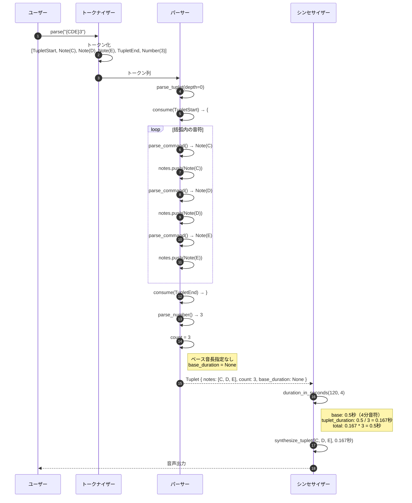

# 連符（n連符）詳細設計書

## メタ情報

| 項目 | 内容 |
|------|------|
| ドキュメントID | DET-TUP-001 |
| 機能ID | F-032 |
| 機能名 | 連符（n連符） |
| 関連基本設計書 | [BASIC-CLI-006](../../basic/BASIC-CLI-006_MIDI-Streaming-Tuplet.md) |
| 関連要件定義書 | REQ-CLI-006 |
| バージョン | 1.0.0 |
| 作成日 | 2026-01-14 |
| 最終更新日 | 2026-01-14 |
| 作成者 | detailed-design-writer |

---

## 1. 概要

### 1.1 機能概要

連符（n連符）機能は、`{...}n` ブラケット構文を使用して、複数の音符を指定された拍数に均等に配分する機能です。3連符、5連符などの複雑なリズムパターンを表現可能にします。

**主な機能**:
- 基本的な連符: `{CDE}3` → 3音を1拍に収める（3連符）
- ベース音長指定: `{CDE}3:2` → 3音を2分音符に収める
- 休符を含む連符: `{CDR}3` → 3連符の3音目が休符
- タイ記号との組み合わせ: `{C4&8 D E}3` → 連符内でタイ記号を使用
- ループとの組み合わせ: `[{CDE}3]2` → 3連符を2回繰り返し
- ネスト対応: `{{CDE}3 FG}5` → 最大5階層までのネスト

### 1.2 処理フロー概要



---

## 2. 機能要件

### 2.1 対象機能

| 機能ID | 機能名 | 概要 | 優先度 |
|--------|--------|------|--------|
| F-032 | 連符（n連符） | `{...}n` で連符を表現 | 必須 |

### 2.2 ビジネスルール

| ルールID | 内容 | 検証方法 |
|---------|------|---------|
| BR-095 | 連符数（n）は2以上の整数 | パーサーで範囲検証 |
| BR-096 | 連符のベース音長はデフォルト音長（`L4` など）または `:` 後の指定 | パーサーで音長解析 |
| BR-097 | 連符内の音符は個別に音長を指定可能（`{C4 D8 E}3` など） | パーサーで個別音長処理 |
| BR-098 | 連符内に休符を含めることが可能（`{CDR}3`） | パーサーで休符処理 |
| BR-099 | 連符内にタイ記号を含めることが可能（`{C4&8 D E}3`） | パーサーでタイ処理 |
| BR-100 | 連符のネスト深度は最大5階層（ループと同様） | パーサーで深度カウント |
| BR-101 | 連符とループの組み合わせが可能（`[{CDE}3]2`） | パーサーで組み合わせ処理 |
| BR-102 | 連符数が指定されていない場合はエラー（`{CDE}` は不可） | パーサーでエラー検出 |
| BR-103 | 連符数が0または1の場合はエラー | パーサーでエラー検出 |

---

## 3. 詳細仕様

### 3.1 対応パターン

#### 3.1.1 基本的な連符

| パターン | 例 | 説明 |
|---------|-----|------|
| 3連符 | `{CDE}3` | 3音を1拍（4分音符）に収める |
| 4連符 | `{CDEF}4` | 4音を1拍に収める |
| 5連符 | `{CDEFG}5` | 5音を1拍に収める |
| 6連符 | `{CDEFGA}6` | 6音を1拍に収める |

#### 3.1.2 ベース音長指定

| パターン | 例 | 説明 |
|---------|-----|------|
| 2分音符ベース | `{CDE}3:2` | 3音を2分音符に収める |
| 8分音符ベース | `{CDE}3:8` | 3音を8分音符に収める |
| デフォルト音長連動 | `L8 {CDE}3` | 8分音符ベースの3連符 |

#### 3.1.3 休符を含む連符

| パターン | 例 | 説明 |
|---------|-----|------|
| 休符混在 | `{CDR}3` | 3連符の3音目が休符 |
| 複数休符 | `{CRDR}4` | 4連符の2音目と4音目が休符 |

#### 3.1.4 タイ記号との組み合わせ

| パターン | 例 | 説明 |
|---------|-----|------|
| タイ記号混在 | `{C4&8 D E}3` | 連符内でタイ記号を使用 |
| 複数タイ | `{C4&8 D4&8 E}3` | 複数の音符にタイ記号 |

#### 3.1.5 ループとの組み合わせ

| パターン | 例 | 説明 |
|---------|-----|------|
| ループ内連符 | `[{CDE}3]2` | 3連符を2回繰り返し |
| 連符内ループ | `{[CD]2 E}3` | 連符内でループ使用 |

#### 3.1.6 ネスト

| パターン | 例 | 説明 |
|---------|-----|------|
| 2階層ネスト | `{{CDE}3 FG}5` | 5連符の中に3連符 |
| 3階層ネスト | `{{{AB}2 C}3 D}4` | 4連符の中に3連符、その中に2連符 |

### 3.2 音長計算式

#### 3.2.1 基本計算

```
base_duration = 60.0 / bpm * 4 / base_length
tuplet_duration = base_duration / count
```

- 4分音符ベース (base_length=4) at 120 BPM: `60.0 / 120 * 4 / 4 = 0.5秒`
- 3連符 (count=3): `0.5 / 3 = 0.167秒/音`

#### 3.2.2 個別音長指定の計算

連符内の音符が個別に音長を指定している場合：

```
individual_duration = 60.0 / bpm * 4 / specified_length / count
```

**例: `{C4 D8 E}3` at 120 BPM**
- C4: `60.0 / 120 * 4 / 4 / 3 = 0.167秒`
- D8: `60.0 / 120 * 4 / 8 / 3 = 0.083秒`
- E（デフォルト4分音符）: `60.0 / 120 * 4 / 4 / 3 = 0.167秒`
- 合計: 0.167 + 0.083 + 0.167 = 0.417秒

#### 3.2.3 ネストした連符の計算

ネストした連符の場合、内側の連符は外側の連符の音長を基準に計算：

**例: `{{CDE}3 FG}5` at 120 BPM**
1. 外側の5連符: `0.5 / 5 = 0.1秒/音`
2. 内側の3連符（外側の1音分）: `0.1 / 3 = 0.033秒/音`
3. 内側の3連符の合計: `0.033 * 3 = 0.1秒`
4. 外側の残り2音: `0.1 * 2 = 0.2秒`
5. 全体の合計: `0.1 + 0.2 = 0.3秒`（5連符の3音分）

---

## 4. 処理フロー

### 4.1 連符解析フロー

```mermaid
flowchart TD
    Start[連符開始 '{' 検出] --> CheckDepth{ネスト深度<br>< 5?}
    
    CheckDepth -->|Yes| ConsumeStart['{' を消費]
    CheckDepth -->|No| ErrorDepth[Error: TupletNestTooDeep]
    
    ConsumeStart --> ParseNotes[notes = []]
    
    ParseNotes --> CheckEnd{'}' か?}
    
    CheckEnd -->|No| CheckNested{'{' か?}
    CheckEnd -->|Yes| ConsumeEnd['}' を消費]
    
    CheckNested -->|Yes| ParseNestedTuplet[parse_tuplet(depth+1)]
    CheckNested -->|No| ParseCommand[parse_command()]
    
    ParseNestedTuplet --> AddNote[notes.push(cmd)]
    ParseCommand --> AddNote
    
    AddNote --> CheckEnd
    
    ConsumeEnd --> CheckCount{数値が続く?}
    
    CheckCount -->|Yes| ParseCount[count = parse_number()]
    CheckCount -->|No| ErrorCount[Error: TupletCountMissing]
    
    ParseCount --> ValidateCount{count >= 2?}
    
    ValidateCount -->|Yes| CheckColon{':' が続く?}
    ValidateCount -->|No| ErrorInvalid[Error: InvalidTupletCount]
    
    CheckColon -->|Yes| ParseBase[base_duration = parse_number()]
    CheckColon -->|No| NoBase[base_duration = None]
    
    ParseBase --> CreateTuplet[Tuplet { notes, count, base_duration }]
    NoBase --> CreateTuplet
    
    CreateTuplet --> End[解析完了]
    
    ErrorDepth --> End
    ErrorCount --> End
    ErrorInvalid --> End
    
    style ErrorDepth fill:#ffcccb
    style ErrorCount fill:#ffcccb
    style ErrorInvalid fill:#ffcccb
    style CreateTuplet fill:#90ee90
```

### 4.2 連符音長計算フロー

```mermaid
sequenceDiagram
    autonumber
    participant Syn as シンセサイザー
    participant Tuplet as Tuplet構造体
    participant Note as Note構造体

    Syn->>Tuplet: duration_in_seconds(120, 4)
    
    Tuplet->>Tuplet: ベース音長を取得<br>base = base_duration.unwrap_or(default_length)
    Tuplet->>Tuplet: base_seconds = 60.0 / 120 * 4 / 4 = 0.5秒
    
    Tuplet->>Tuplet: tuplet_duration = 0.5 / 3 = 0.167秒
    
    loop notes
        Tuplet->>Note: 音符の種類を判定
        
        alt 音符が個別に音長を指定
            Note->>Note: duration_in_seconds(120, 4) / 3
            Note-->>Tuplet: 個別計算結果
        else 音符が音長を指定していない
            Note-->>Tuplet: tuplet_duration (0.167秒)
        else ネストした連符
            Note->>Note: 再帰的にduration_in_seconds()
            Note-->>Tuplet: ネスト計算結果
        end
    end
    
    Tuplet->>Tuplet: total = Σ(各音符の音長)
    Tuplet-->>Syn: total (0.5秒)
```

### 4.3 連符エラー検出フロー

```mermaid
flowchart TD
    Start[連符開始 '{' 検出] --> CheckDepth{ネスト深度<br>< 5?}
    
    CheckDepth -->|No| ErrorDepth[Error: TupletNestTooDeep<br>MML-E023]
    CheckDepth -->|Yes| ParseNotes[括弧内の音符を解析]
    
    ParseNotes --> CheckClose{'}' で閉じられている?}
    
    CheckClose -->|No| ErrorUnclosed[Error: UnclosedTuplet<br>MML-E020]
    CheckClose -->|Yes| CheckNumber{数値が続く?}
    
    CheckNumber -->|No| ErrorMissing[Error: TupletCountMissing<br>MML-E021]
    CheckNumber -->|Yes| ParseCount[count = parse_number()]
    
    ParseCount --> ValidateCount{count >= 2?}
    
    ValidateCount -->|No| ErrorInvalid[Error: InvalidTupletCount<br>MML-E022]
    ValidateCount -->|Yes| Success[解析成功]
    
    ErrorDepth --> End[エラー終了]
    ErrorUnclosed --> End
    ErrorMissing --> End
    ErrorInvalid --> End
    Success --> End2[正常終了]
    
    style ErrorDepth fill:#ffcccb
    style ErrorUnclosed fill:#ffcccb
    style ErrorMissing fill:#ffcccb
    style ErrorInvalid fill:#ffcccb
    style Success fill:#90ee90
```

---

## 5. エラーハンドリング

### 5.1 エラーケース一覧

| エラーコード | エラー型 | 説明 | 発生条件 | メッセージ例 |
|-------------|---------|------|---------|-------------|
| MML-E020 | `UnclosedTuplet` | 連符の閉じ括弧がない | `{CDE` | `位置 4: 連符の閉じ括弧 '}' がありません` |
| MML-E021 | `TupletCountMissing` | 連符数が指定されていない | `{CDE}` | `位置 5: 連符数が指定されていません` |
| MML-E022 | `InvalidTupletCount` | 無効な連符数（2未満） | `{CDE}1` | `位置 5: 無効な連符数です（2以上を指定してください）: 1` |
| MML-E023 | `TupletNestTooDeep` | 連符のネスト深度超過 | 6階層以上のネスト | `位置 10: 連符のネスト深度が最大値（5階層）を超えています` |

### 5.2 エラー発生箇所のまとめ

| エラー | 発生箇所 | 発生条件 |
|--------|---------|---------|
| `UnclosedTuplet` | `parse_tuplet` | 括弧内の解析中にEOFまたは不正なトークン |
| `TupletCountMissing` | `parse_tuplet` | `}` の後に数値がない |
| `InvalidTupletCount` | `parse_tuplet` | 連符数が0または1 |
| `TupletNestTooDeep` | `parse_tuplet` | ネスト深度が5を超える |

---

## 6. テストケース

### 6.1 正常系テストケース

| テストID | 入力 | 期待される動作 | 説明 |
|---------|------|--------------|------|
| TC-032-001 | `{CDE}3` | 3連符が演奏される（各音0.167秒） | 基本的な3連符 |
| TC-032-002 | `{CDEF}4` | 4連符が演奏される（各音0.125秒） | 4連符 |
| TC-032-003 | `L8 {CDE}3` | 8分音符ベースの3連符が演奏される | デフォルト音長連動 |
| TC-032-004 | `{CDE}3:2` | 2分音符に3音を収める連符が演奏される | ベース音長指定 |
| TC-032-005 | `{CDR}3` | 休符を含む3連符が演奏される | 休符混在 |
| TC-032-006 | `{C4&8 D E}3` | タイ記号を含む3連符が演奏される | タイ記号混在 |
| TC-032-007 | `[{CDE}3]2` | ループと連符の組み合わせが演奏される | ループ内連符 |
| TC-032-008 | `{{CDE}3 FG}5` | ネストした連符が演奏される | 2階層ネスト |

### 6.2 異常系テストケース

| テストID | 入力 | 期待されるエラー | エラーメッセージ |
|---------|------|----------------|----------------|
| TC-032-009 | `{CDE}` | `TupletCountMissing` | `位置 5: 連符数が指定されていません` |
| TC-032-010 | `{CDE}1` | `InvalidTupletCount` | `位置 5: 無効な連符数です（2以上を指定してください）: 1` |
| TC-032-011 | 6階層ネスト | `TupletNestTooDeep` | `位置 X: 連符のネスト深度が最大値（5階層）を超えています` |
| TC-032-012 | `{CDE` | `UnclosedTuplet` | `位置 4: 連符の閉じ括弧 '}' がありません` |

### 6.3 エッジケーステストケース

| テストID | 入力 | 期待される動作 | 説明 |
|---------|------|--------------|------|
| TC-032-201 | `{C}2` | 2連符（1音のみ）が演奏される | 最小構成 |
| TC-032-202 | `{CDEFGABCDEFGAB}99` | 99連符が演奏される | 最大連符数 |
| TC-032-203 | `{C4 D8 E16}3` | 個別音長指定の3連符が演奏される | 個別音長混在 |
| TC-032-204 | `{{{{{C}2}2}2}2}2` | 5階層ネストが演奏される | 最大ネスト深度 |

---

## 7. 設計書一覧

| 設計書 | パス | 説明 |
|--------|------|------|
| バックエンド設計書 | [./バックエンド設計書.md](./バックエンド設計書.md) | 実装詳細、コード差分、モジュール設計 |

---

## 8. 関連ドキュメント

| ドキュメント | パス | 説明 |
|-------------|------|------|
| 基本設計書 | [BASIC-CLI-006](../../basic/BASIC-CLI-006_MIDI-Streaming-Tuplet.md) | 連符機能の基本設計 |
| 要件定義書 | REQ-CLI-006 | 連符機能の要件定義 |

---

## 変更履歴

| 日付 | バージョン | 変更内容 | 担当者 |
|:---|:---|:---|:---|
| 2026-01-14 | 1.0.0 | 初版作成 | detailed-design-writer |
