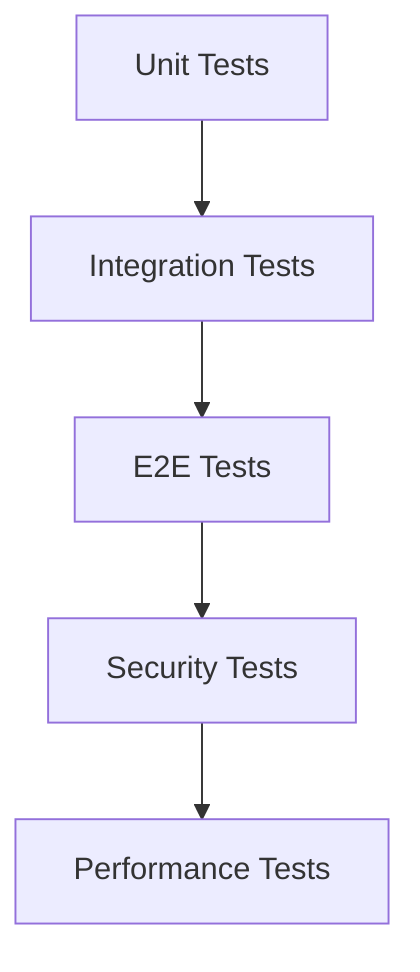

# テスト項目書: sine-mml CLI

## メタ情報

| 項目 | 内容 |
|------|------|
| ドキュメントID | TEST-ALL-001 |
| 対応設計書 | DET-MML-001, DET-AUD-001, DET-DB-001, DET-CLI-001, DET-SEC-001 |
| 作成日 | 2026-01-10 |
| ステータス | ドラフト |

---

## 1. テスト方針

### 1.1 テストレベル

| レベル | 対象 | カバレッジ目標 |
|--------|------|---------------|
| Unit | MMLパーサー、オーディオエンジン、データベース、各コンポーネント | 90%以上 |
| Integration | API、DB連携、モジュール間連携 | 80%以上 |
| E2E | CLIコマンド、主要ユーザーフロー | 主要パス100% |
| Security | 入力検証、SQLインジェクション、パストラバーサル | 全項目100% |

### 1.2 テスト優先度

| 優先度 | 説明 | 実装タイミング |
|--------|------|---------------|
| P0 | クリティカルパス（必須機能） | Sprint 1 |
| P1 | 重要機能 | Sprint 1-2 |
| P2 | エッジケース、最適化 | Sprint 2以降 |

### 1.3 テスト環境

| 項目 | 値 |
|------|-----|
| テストフレームワーク | Rust標準テストフレームワーク (#[test]) |
| テストディレクトリ | `tests/` (統合テスト), `src/*/tests.rs` (ユニットテスト) |
| CI環境 | GitHub Actions |
| 対象プラットフォーム | macOS, Linux, Windows |

---

## 2. ユニットテスト項目

### 2.1 MMLパーサー (TC-MML-UT-XXX)

#### TC-MML-UT-001: 単純な音符のパース

| 項目 | 内容 |
|------|------|
| 優先度 | P0 |
| テスト対象 | `Parser::parse()` |
| 前提条件 | - |
| 入力 | `"C"` |
| 期待結果 | `Ok(Mml { commands: [Command::Note(Note { pitch: C, accidental: Natural, duration: None, dots: 0 })] })` |
| 境界値 | - |

**テストコード雛形:**
```rust
#[test]
fn test_parse_simple_note() {
    let parser = Parser::new();
    let result = parser.parse("C");
    assert!(result.is_ok());
    let mml = result.unwrap();
    assert_eq!(mml.commands.len(), 1);
    match &mml.commands[0] {
        Command::Note(note) => {
            assert_eq!(note.pitch, Pitch::C);
            assert_eq!(note.accidental, Accidental::Natural);
            assert_eq!(note.duration, None);
            assert_eq!(note.dots, 0);
        }
        _ => panic!("Expected Note command"),
    }
}
```

#### TC-MML-UT-002: シャープ音符のパース

| 項目 | 内容 |
|------|------|
| 優先度 | P0 |
| テスト対象 | `Parser::parse()` |
| 前提条件 | - |
| 入力 | `"C#"`, `"C+"` |
| 期待結果 | `Note { pitch: C, accidental: Sharp, ... }` |
| 境界値 | - |

#### TC-MML-UT-003: フラット音符のパース

| 項目 | 内容 |
|------|------|
| 優先度 | P0 |
| テスト対象 | `Parser::parse()` |
| 前提条件 | - |
| 入力 | `"D-"` |
| 期待結果 | `Note { pitch: D, accidental: Flat, ... }` |
| 境界値 | - |

#### TC-MML-UT-004: 音長指定のパース

| 項目 | 内容 |
|------|------|
| 優先度 | P0 |
| テスト対象 | `Parser::parse()` |
| 前提条件 | - |
| 入力 | `"C4"` |
| 期待結果 | `Note { pitch: C, duration: Some(4), ... }` |
| 境界値 | 1, 2, 4, 8, 16, 32, 64 |

#### TC-MML-UT-005: 付点音符のパース

| 項目 | 内容 |
|------|------|
| 優先度 | P0 |
| テスト対象 | `Parser::parse()` |
| 前提条件 | - |
| 入力 | `"C4."`, `"C4.."` |
| 期待結果 | `Note { pitch: C, duration: Some(4), dots: 1 }`, `dots: 2` |
| 境界値 | dots: 0, 1, 2, 3 |

#### TC-MML-UT-006: 休符のパース

| 項目 | 内容 |
|------|------|
| 優先度 | P0 |
| テスト対象 | `Parser::parse()` |
| 前提条件 | - |
| 入力 | `"R"`, `"R8"`, `"R4."` |
| 期待結果 | `Rest { duration: None, dots: 0 }`, `Some(8)`, `Some(4), dots: 1` |
| 境界値 | - |

#### TC-MML-UT-007: オクターブコマンドのパース

| 項目 | 内容 |
|------|------|
| 優先度 | P0 |
| テスト対象 | `Parser::parse()` |
| 前提条件 | - |
| 入力 | `"O5"` |
| 期待結果 | `Octave { value: 5 }` |
| 境界値 | 1, 8 |

#### TC-MML-UT-008: テンポコマンドのパース

| 項目 | 内容 |
|------|------|
| 優先度 | P0 |
| テスト対象 | `Parser::parse()` |
| 前提条件 | - |
| 入力 | `"T120"` |
| 期待結果 | `Tempo { value: 120 }` |
| 境界値 | 30, 300 |

#### TC-MML-UT-009: 音長設定コマンドのパース

| 項目 | 内容 |
|------|------|
| 優先度 | P0 |
| テスト対象 | `Parser::parse()` |
| 前提条件 | - |
| 入力 | `"L4"` |
| 期待結果 | `DefaultLength { value: 4 }` |
| 境界値 | 1, 64 |

#### TC-MML-UT-010: 音量コマンドのパース

| 項目 | 内容 |
|------|------|
| 優先度 | P0 |
| テスト対象 | `Parser::parse()` |
| 前提条件 | - |
| 入力 | `"V8"` |
| 期待結果 | `Volume { value: 8 }` |
| 境界値 | 0, 15 |

#### TC-MML-UT-011: 複合MMLのパース

| 項目 | 内容 |
|------|------|
| 優先度 | P0 |
| テスト対象 | `Parser::parse()` |
| 前提条件 | - |
| 入力 | `"O4L4 C D E F G A B"` |
| 期待結果 | `[Octave(4), DefaultLength(4), Note(C), Note(D), ...]` |
| 境界値 | - |

#### TC-MML-UT-012: オクターブ範囲外エラー

| 項目 | 内容 |
|------|------|
| 優先度 | P1 |
| テスト対象 | `Parser::parse()` |
| 前提条件 | - |
| 入力 | `"O9"`, `"O0"` |
| 期待結果 | `Err(ParseError::InvalidNumber { value: 9, range: (1, 8), ... })` |
| 境界値 | 0, 9 |

#### TC-MML-UT-013: テンポ範囲外エラー

| 項目 | 内容 |
|------|------|
| 優先度 | P1 |
| テスト対象 | `Parser::parse()` |
| 前提条件 | - |
| 入力 | `"T400"`, `"T20"` |
| 期待結果 | `Err(ParseError::InvalidNumber { value: 400, range: (30, 300), ... })` |
| 境界値 | 29, 301 |

#### TC-MML-UT-014: 不明な文字エラー

| 項目 | 内容 |
|------|------|
| 優先度 | P1 |
| テスト対象 | `Parser::parse()` |
| 前提条件 | - |
| 入力 | `"X"`, `"H"` |
| 期待結果 | `Err(ParseError::UnexpectedCharacter { character: 'X', position: 0 })` |
| 境界値 | - |

#### TC-MML-UT-015: 空の入力エラー

| 項目 | 内容 |
|------|------|
| 優先度 | P1 |
| テスト対象 | `Parser::parse()` |
| 前提条件 | - |
| 入力 | `""` |
| 期待結果 | `Err(ParseError::EmptyInput)` |
| 境界値 | - |

#### TC-MML-UT-016: 途中終了エラー

| 項目 | 内容 |
|------|------|
| 優先度 | P1 |
| テスト対象 | `Parser::parse()` |
| 前提条件 | - |
| 入力 | `"O"`, `"T"` |
| 期待結果 | `Err(ParseError::UnexpectedEof { expected: "number", ... })` |
| 境界値 | - |

---

### 2.2 オーディオエンジン (TC-AUD-UT-XXX)

#### TC-AUD-UT-001: サイン波生成

| 項目 | 内容 |
|------|------|
| 優先度 | P0 |
| テスト対象 | `Synthesizer::generate_note_samples()` |
| 前提条件 | `waveform = Sine, sample_rate = 44100` |
| 入力 | `frequency = 440Hz, duration = 1.0s` |
| 期待結果 | 44100サンプル、振幅が-1.0〜1.0の範囲内 |
| 境界値 | - |

**テストコード雛形:**
```rust
#[test]
fn test_generate_sine_wave() {
    let synth = Synthesizer::new(WaveformType::Sine, 1.0);
    let samples = synth.generate_note_samples(440.0, 1.0);
    
    assert_eq!(samples.len(), 44100);
    for sample in &samples {
        assert!(sample >= &-1.0 && sample <= &1.0);
    }
}
```

#### TC-AUD-UT-002: 周波数精度検証

| 項目 | 内容 |
|------|------|
| 優先度 | P0 |
| テスト対象 | `Synthesizer::synthesize()` - MIDIノート番号→周波数変換 |
| 前提条件 | - |
| 入力 | C4 (MIDIノート番号60) |
| 期待結果 | 周波数 261.63Hz (許容誤差 ±0.01Hz) |
| 境界値 | - |

#### TC-AUD-UT-003: 音量適用

| 項目 | 内容 |
|------|------|
| 優先度 | P0 |
| テスト対象 | `Synthesizer::generate_note_samples()` |
| 前提条件 | `waveform = Sine` |
| 入力 | `volume = 0.5` |
| 期待結果 | 振幅が元の0.5倍になる（最大振幅 ≈ 0.5） |
| 境界値 | 0.0, 0.5, 1.0 |

#### TC-AUD-UT-004: 音長計算（BPM=120, length=4）

| 項目 | 内容 |
|------|------|
| 優先度 | P0 |
| テスト対象 | 音長計算ロジック |
| 前提条件 | `BPM = 120` |
| 入力 | `length = 4` (4分音符) |
| 期待結果 | 0.5秒 |
| 境界値 | length: 1, 2, 4, 8, 16 |

#### TC-AUD-UT-005: 付点音符の音長計算

| 項目 | 内容 |
|------|------|
| 優先度 | P0 |
| テスト対象 | 付点音符の音長計算 |
| 前提条件 | `BPM = 120` |
| 入力 | `length = 4, dots = 1` |
| 期待結果 | 0.75秒 (0.5 × 1.5) |
| 境界値 | dots: 0, 1, 2 |

#### TC-AUD-UT-006: エンベロープ適用

| 項目 | 内容 |
|------|------|
| 優先度 | P1 |
| テスト対象 | `calculate_envelope()` |
| 前提条件 | - |
| 入力 | 短い音符（100サンプル） |
| 期待結果 | フェードイン/アウトが適用され、プチノイズがない |
| 境界値 | - |

#### TC-AUD-UT-007: WAV出力フォーマット検証

| 項目 | 内容 |
|------|------|
| 優先度 | P0 |
| テスト対象 | `WavExporter::export()` |
| 前提条件 | 44100サンプルのPCMデータ |
| 入力 | `samples: Vec<f32>` |
| 期待結果 | 正しいWAVファイル（44.1kHz, 16bit, モノラル）が生成される |
| 境界値 | - |

#### TC-AUD-UT-008: メトロノームクリック生成

| 項目 | 内容 |
|------|------|
| 優先度 | P1 |
| テスト対象 | `Synthesizer::generate_click_samples()` |
| 前提条件 | `BPM = 120` |
| 入力 | - |
| 期待結果 | 0.5秒ごとにクリック音が生成される、クリック長 50ms |
| 境界値 | - |

---

### 2.3 データベース (TC-DB-UT-XXX)

#### TC-DB-UT-001: スキーマ初期化

| 項目 | 内容 |
|------|------|
| 優先度 | P0 |
| テスト対象 | `schema::initialize()` |
| 前提条件 | 空のDBファイル、または新規作成 |
| 入力 | - |
| 期待結果 | `history` テーブルが正常に作成される |
| 境界値 | - |

**テストコード雛形:**
```rust
#[test]
fn test_schema_initialization() {
    let temp_db = NamedTempFile::new().unwrap();
    let conn = Connection::open(temp_db.path()).unwrap();
    
    let result = schema::initialize(&conn);
    assert!(result.is_ok());
    
    // テーブルの存在確認
    let table_exists: i64 = conn
        .query_row(
            "SELECT COUNT(*) FROM sqlite_master WHERE type='table' AND name='history'",
            [],
            |row| row.get(0)
        )
        .unwrap();
    assert_eq!(table_exists, 1);
}
```

#### TC-DB-UT-002: 履歴保存（正常系）

| 項目 | 内容 |
|------|------|
| 優先度 | P0 |
| テスト対象 | `history::save()` |
| 前提条件 | スキーマ初期化済み |
| 入力 | `HistoryRecord { mml: "C D E", waveform: Sine, volume: 0.5, bpm: 120 }` |
| 期待結果 | 新しい履歴が保存され、IDが返却される |
| 境界値 | - |

#### TC-DB-UT-003: 履歴一覧取得

| 項目 | 内容 |
|------|------|
| 優先度 | P0 |
| テスト対象 | `history::list()` |
| 前提条件 | 複数の履歴が保存済み |
| 入力 | - |
| 期待結果 | 履歴が作成日時の降順で取得される（新しいものが先） |
| 境界値 | - |

#### TC-DB-UT-004: 履歴取得（正常系）

| 項目 | 内容 |
|------|------|
| 優先度 | P0 |
| テスト対象 | `history::get_by_id()` |
| 前提条件 | ID=1の履歴が存在 |
| 入力 | `id = 1` |
| 期待結果 | 正しい履歴データが返却される |
| 境界値 | - |

#### TC-DB-UT-005: 履歴取得（異常系 - NotFound）

| 項目 | 内容 |
|------|------|
| 優先度 | P1 |
| テスト対象 | `history::get_by_id()` |
| 前提条件 | - |
| 入力 | `id = 9999` (存在しないID) |
| 期待結果 | `Err(DbError::NotFound { id: 9999 })` |
| 境界値 | - |

#### TC-DB-UT-006: パス解決（macOS）

| 項目 | 内容 |
|------|------|
| 優先度 | P1 |
| テスト対象 | `get_db_path()` |
| 前提条件 | macOS環境 |
| 入力 | - |
| 期待結果 | `~/.local/share/sine-mml/history.db` |
| 境界値 | - |

#### TC-DB-UT-007: パス解決（Linux）

| 項目 | 内容 |
|------|------|
| 優先度 | P1 |
| テスト対象 | `get_db_path()` |
| 前提条件 | Linux環境 |
| 入力 | - |
| 期待結果 | `$XDG_DATA_HOME/sine-mml/history.db` または `~/.local/share/sine-mml/history.db` |
| 境界値 | - |

---

### 2.4 CLIインターフェース (TC-CLI-UT-XXX)

#### TC-CLI-UT-001: 引数解析（play - MML直接）

| 項目 | 内容 |
|------|------|
| 優先度 | P0 |
| テスト対象 | `clap` 引数解析 |
| 前提条件 | - |
| 入力 | `["sine-mml", "play", "C D E"]` |
| 期待結果 | `PlayCommand { mml: Some("C D E"), history_id: None, ... }` |
| 境界値 | - |

#### TC-CLI-UT-002: 引数解析（play - 履歴ID）

| 項目 | 内容 |
|------|------|
| 優先度 | P0 |
| テスト対象 | `clap` 引数解析 |
| 前提条件 | - |
| 入力 | `["sine-mml", "play", "--history-id", "5"]` |
| 期待結果 | `PlayCommand { mml: None, history_id: Some(5), ... }` |
| 境界値 | - |

#### TC-CLI-UT-003: 引数解析（異常系 - 両方指定）

| 項目 | 内容 |
|------|------|
| 優先度 | P1 |
| テスト対象 | `validate_play_args()` |
| 前提条件 | - |
| 入力 | `PlayCommand { mml: Some("C D E"), history_id: Some(5), ... }` |
| 期待結果 | `Err(CliError::InvalidArgCombination)` |
| 境界値 | - |

#### TC-CLI-UT-004: 音量範囲検証

| 項目 | 内容 |
|------|------|
| 優先度 | P1 |
| テスト対象 | `validate_volume()` |
| 前提条件 | - |
| 入力 | `volume = -0.1`, `1.5` |
| 期待結果 | `Err(CliError::VolumeOutOfRange)` |
| 境界値 | -0.1, 0.0, 1.0, 1.1 |

#### TC-CLI-UT-005: BPM範囲検証

| 項目 | 内容 |
|------|------|
| 優先度 | P1 |
| テスト対象 | `validate_bpm()` |
| 前提条件 | - |
| 入力 | `bpm = 29`, `301` |
| 期待結果 | `Err(CliError::BpmOutOfRange)` |
| 境界値 | 29, 30, 300, 301 |

#### TC-CLI-UT-006: カラー出力

| 項目 | 内容 |
|------|------|
| 優先度 | P2 |
| テスト対象 | `format_success_message()` |
| 前提条件 | - |
| 入力 | `"Successfully played MML"` |
| 期待結果 | 緑色のテキストが返却される（ANSIエスケープシーケンス含む） |
| 境界値 | - |

---

### 2.5 セキュリティ (TC-SEC-UT-XXX)

#### TC-SEC-UT-001: MML最大文字数検証

| 項目 | 内容 |
|------|------|
| 優先度 | P0 |
| テスト対象 | `validate_mml_input()` |
| 前提条件 | - |
| 入力 | 10,001文字のMML |
| 期待結果 | `Err(SecurityError::InputTooLarge { max: 10000, actual: 10001 })` |
| 境界値 | 9999, 10000, 10001 |

**テストコード雛形:**
```rust
#[test]
fn test_mml_input_too_large() {
    let large_mml = "C".repeat(10001);
    let result = validate_mml_input(&large_mml);
    assert!(result.is_err());
    match result {
        Err(SecurityError::InputTooLarge { max, actual }) => {
            assert_eq!(max, 10000);
            assert_eq!(actual, 10001);
        }
        _ => panic!("Expected InputTooLarge error"),
    }
}
```

#### TC-SEC-UT-002: MML不正文字検証

| 項目 | 内容 |
|------|------|
| 優先度 | P0 |
| テスト対象 | `validate_mml_input()` |
| 前提条件 | - |
| 入力 | `"C D & E"`, `"C D % E"` |
| 期待結果 | `Err(SecurityError::InvalidCharacter { character: '&', position: 4 })` |
| 境界値 | - |

#### TC-SEC-UT-003: 制御文字検証

| 項目 | 内容 |
|------|------|
| 優先度 | P1 |
| テスト対象 | `validate_mml_input()` |
| 前提条件 | - |
| 入力 | `"C D \x00 E"`, `"C D \x1F E"` |
| 期待結果 | `Err(SecurityError::InvalidCharacter)` |
| 境界値 | - |

#### TC-SEC-UT-004: SQLパラメータ化クエリ検証

| 項目 | 内容 |
|------|------|
| 優先度 | P0 |
| テスト対象 | `history::get_by_id()` |
| 前提条件 | - |
| 入力 | `id = 1` (正常なID) |
| 期待結果 | パラメータ化クエリが使用され、SQLインジェクションが発生しない |
| 境界値 | - |

#### TC-SEC-UT-005: パストラバーサル検出

| 項目 | 内容 |
|------|------|
| 優先度 | P0 |
| テスト対象 | `validate_output_path()` |
| 前提条件 | - |
| 入力 | `"../../../etc/passwd.wav"` |
| 期待結果 | `Err(SecurityError::PathTraversal { path: ... })` |
| 境界値 | - |

#### TC-SEC-UT-006: パス最大長検証

| 項目 | 内容 |
|------|------|
| 優先度 | P1 |
| テスト対象 | `validate_output_path()` |
| 前提条件 | - |
| 入力 | 261文字のパス |
| 期待結果 | `Err(SecurityError::PathTooLong { max: 260, actual: 261 })` |
| 境界値 | 259, 260, 261 |

#### TC-SEC-UT-007: 不正な拡張子検証

| 項目 | 内容 |
|------|------|
| 優先度 | P1 |
| テスト対象 | `validate_output_path()` |
| 前提条件 | - |
| 入力 | `"output.mp3"`, `"output.txt"` |
| 期待結果 | `Err(SecurityError::InvalidExtension { expected: "wav", found: ... })` |
| 境界値 | - |

---

## 3. 統合テスト項目

### 3.1 MMLパーサー統合テスト (TC-MML-IT-XXX)

#### TC-MML-IT-001: 簡単なメロディ

| 項目 | 内容 |
|------|------|
| 優先度 | P0 |
| 入力MML | `"O4L4 CDEFGAB"` |
| 検証項目 | 正しくASTに変換され、エラーがないこと |

#### TC-MML-IT-002: テンポ変更を含む

| 項目 | 内容 |
|------|------|
| 優先度 | P0 |
| 入力MML | `"T60 C D T120 E F"` |
| 検証項目 | テンポ変更が正しく反映されること |

#### TC-MML-IT-003: オクターブ変更

| 項目 | 内容 |
|------|------|
| 優先度 | P0 |
| 入力MML | `"O3 C O4 C O5 C"` |
| 検証項目 | オクターブ変更が正しく反映されること |

#### TC-MML-IT-004: 複雑なリズム

| 項目 | 内容 |
|------|------|
| 優先度 | P0 |
| 入力MML | `"C4 D8 E16 F4. G2.."` |
| 検証項目 | 音長と付点が正しく解析されること |

#### TC-MML-IT-005: 大文字小文字混在

| 項目 | 内容 |
|------|------|
| 優先度 | P1 |
| 入力MML | `"c D e F"` |
| 検証項目 | 正しく解析されること（大文字小文字を区別しない） |

#### TC-MML-IT-006: 空白・改行混在

| 項目 | 内容 |
|------|------|
| 優先度 | P1 |
| 入力MML | `"C\nD E\n\nF  G"` |
| 検証項目 | 空白・改行が正しく無視されること |

---

### 3.2 オーディオエンジン統合テスト (TC-AUD-IT-XXX)

#### TC-AUD-IT-001: 単音再生

| 項目 | 内容 |
|------|------|
| 優先度 | P0 |
| MML入力 | `"O4 C4"` |
| 検証項目 | 正しい周波数（261.63Hz）で0.5秒間のサンプルが生成されること |

#### TC-AUD-IT-002: 音階再生

| 項目 | 内容 |
|------|------|
| 優先度 | P0 |
| MML入力 | `"O4 C D E F G A B"` |
| 検証項目 | 各音が正しい周波数で生成されること |

#### TC-AUD-IT-003: テンポ変更

| 項目 | 内容 |
|------|------|
| 優先度 | P0 |
| MML入力 | `"T60 C4 T120 C4"` |
| 検証項目 | 最初のC4が1.0秒、2番目のC4が0.5秒であること |

#### TC-AUD-IT-004: 波形切り替え

| 項目 | 内容 |
|------|------|
| 優先度 | P0 |
| MML入力 | `"O4 C4"` (Sine, Sawtooth, Square) |
| 検証項目 | 異なる音色（波形）が生成されること |

#### TC-AUD-IT-005: ループ再生

| 項目 | 内容 |
|------|------|
| 優先度 | P1 |
| MML入力 | `"C D E F"` + `loop=true` |
| 検証項目 | ループ再生が正しく動作すること（Ctrl+Cで停止可能） |

#### TC-AUD-IT-006: WAVエクスポート

| 項目 | 内容 |
|------|------|
| 優先度 | P0 |
| MML入力 | `"O4 C4 D4 E4"` |
| 検証項目 | WAVファイルが正しく保存され、再生可能であること |

#### TC-AUD-IT-007: メトロノーム付き再生

| 項目 | 内容 |
|------|------|
| 優先度 | P1 |
| MML入力 | `"T120 C4 D4 E4"` + `metronome=true` |
| 検証項目 | クリック音が各拍（0.5秒ごと）で生成されること |

---

### 3.3 データベース統合テスト (TC-DB-IT-XXX)

#### TC-DB-IT-001: E2E履歴保存・取得

| 項目 | 内容 |
|------|------|
| 優先度 | P0 |
| ステップ | 1. `save_history()` で履歴保存 → 2. `list_history()` で一覧取得 → 3. `get_by_id()` で個別取得 |
| 検証項目 | すべての操作が正常に動作し、データの整合性が保たれること |

#### TC-DB-IT-002: マイグレーション

| 項目 | 内容 |
|------|------|
| 優先度 | P1 |
| ステップ | 1. 旧バージョンのDBファイルを用意 → 2. 新バージョンで開く |
| 検証項目 | マイグレーションが正常に実行され、データが保持されること |

---

### 3.4 CLIインターフェース統合テスト (TC-CLI-IT-XXX)

#### TC-CLI-IT-001: playコマンド（直接MML）

| 項目 | 内容 |
|------|------|
| 優先度 | P0 |
| 入力 | `sine-mml play "C D E"` |
| 期待される動作 | 音声が再生され、履歴が保存される |

#### TC-CLI-IT-002: playコマンド（履歴ID）

| 項目 | 内容 |
|------|------|
| 優先度 | P0 |
| 入力 | `sine-mml play --history-id 1` |
| 期待される動作 | 履歴が再生される |

#### TC-CLI-IT-003: historyコマンド

| 項目 | 内容 |
|------|------|
| 優先度 | P0 |
| 入力 | `sine-mml history` |
| 期待される動作 | 履歴一覧が表示される |

#### TC-CLI-IT-004: exportコマンド

| 項目 | 内容 |
|------|------|
| 優先度 | P0 |
| 入力 | `sine-mml export --history-id 1 -o output.wav` |
| 期待される動作 | WAVファイルが生成される |

#### TC-CLI-IT-005: エラーハンドリング

| 項目 | 内容 |
|------|------|
| 優先度 | P1 |
| 入力 | 不正なMML（例: `"X Y Z"`） |
| 期待される動作 | エラーメッセージが表示され、終了コード1で終了 |

---

## 4. E2Eテスト項目

### 4.1 ユーザーフロー: 新規MML演奏から履歴再生 (TC-E2E-001)

| 項目 | 内容 |
|------|------|
| 優先度 | P0 |
| 前提条件 | アプリケーションがインストール済み |
| 手順 | 1. `sine-mml play "O4 CDEFGAB"`<br>2. `sine-mml history` で履歴確認<br>3. `sine-mml play --history-id N` で再生 |
| 期待結果 | 1. 音声が再生され、履歴が保存される<br>2. 履歴一覧に表示される<br>3. 同じ音声が再生される |
| スクリーンショット | - |

### 4.2 ユーザーフロー: 履歴からエクスポート (TC-E2E-002)

| 項目 | 内容 |
|------|------|
| 優先度 | P0 |
| 前提条件 | 履歴が1件以上存在 |
| 手順 | 1. `sine-mml play "O4 C D E F"`<br>2. `sine-mml export --history-id N -o output.wav`<br>3. `output.wav` をメディアプレイヤーで再生 |
| 期待結果 | 1. 音声が再生され、履歴が保存される<br>2. WAVファイルが生成される<br>3. 正しく再生される |
| スクリーンショット | - |

### 4.3 ユーザーフロー: エラーからの回復 (TC-E2E-003)

| 項目 | 内容 |
|------|------|
| 優先度 | P1 |
| 前提条件 | - |
| 手順 | 1. `sine-mml play "X Y Z"` (不正なMML)<br>2. エラーメッセージ確認<br>3. `sine-mml play "C D E"` (正しいMML)<br>4. 成功確認 |
| 期待結果 | 1. パースエラーが表示される<br>2. エラーコード `MML-E003` が表示される<br>3. 音声が正常に再生される<br>4. 履歴が保存される |
| スクリーンショット | - |

### 4.4 ユーザーフロー: ループ再生と停止 (TC-E2E-004)

| 項目 | 内容 |
|------|------|
| 優先度 | P1 |
| 前提条件 | - |
| 手順 | 1. `sine-mml play --loop "C D E F"`<br>2. 数秒待機<br>3. Ctrl+Cで停止 |
| 期待結果 | 1. ループ再生が開始される<br>2. メロディが繰り返される<br>3. Ctrl+Cで停止する |
| スクリーンショット | - |

---

## 5. エッジケース・境界値テスト

### 5.1 入力値の境界

| TC-ID | 対象 | 境界条件 | テスト値 | 期待結果 |
|-------|------|---------|---------|---------|
| TC-B-001 | オクターブ | 最小値 | `O1` | 正常にパース |
| TC-B-002 | オクターブ | 最大値 | `O8` | 正常にパース |
| TC-B-003 | オクターブ | 境界-1 | `O0` | MML-E002エラー |
| TC-B-004 | オクターブ | 境界+1 | `O9` | MML-E002エラー |
| TC-B-005 | テンポ | 最小値 | `T30` | 正常にパース |
| TC-B-006 | テンポ | 最大値 | `T300` | 正常にパース |
| TC-B-007 | テンポ | 境界-1 | `T29` | MML-E002エラー |
| TC-B-008 | テンポ | 境界+1 | `T301` | MML-E002エラー |
| TC-B-009 | 音長 | 最小値 | `L1` | 正常にパース |
| TC-B-010 | 音長 | 最大値 | `L64` | 正常にパース |
| TC-B-011 | 音長 | 境界-1 | `L0` | MML-E002エラー |
| TC-B-012 | 音長 | 境界+1 | `L65` | MML-E002エラー |
| TC-B-013 | 音量 | 最小値 | `V0` | 正常にパース |
| TC-B-014 | 音量 | 最大値 | `V15` | 正常にパース |
| TC-B-015 | 音量 | 境界+1 | `V16` | MML-E002エラー |

### 5.2 特殊ケース

| TC-ID | ケース | 入力 | 期待結果 |
|-------|--------|------|---------|
| TC-S-001 | 空文字 | `""` | MML-E005エラー |
| TC-S-002 | 空白のみ | `"   "` | MML-E005エラー（または空のAST） |
| TC-S-003 | 改行のみ | `"\n\n\n"` | MML-E005エラー（または空のAST） |
| TC-S-004 | 超長文MML | 10,000文字のMML | 正常にパース |
| TC-S-005 | 超長文MML（範囲外） | 10,001文字のMML | SEC-E001エラー |
| TC-S-006 | Unicode文字 | `"C D 🎵 E"` | SEC-E002エラー |
| TC-S-007 | 連続する付点 | `"C4..."` | 正常にパース（dots=3） |
| TC-S-008 | 複数のシャープ | `"C##"` | パースエラー（2番目の#が不正） |

---

## 6. セキュリティテスト項目

| TC-ID | テスト観点 | テスト内容 | 期待結果 |
|-------|-----------|-----------|---------|
| TC-SEC-001 | 入力検証 | 10,001文字のMML | SEC-E001エラー |
| TC-SEC-002 | 入力検証 | 不正な文字（`&`, `%`, `@`） | SEC-E002エラー |
| TC-SEC-003 | 入力検証 | 制御文字（`\x00`, `\x1F`） | SEC-E003エラー |
| TC-SEC-004 | SQLインジェクション | `--history-id="1 OR 1=1"` | 型エラー（整数のみ受付） |
| TC-SEC-005 | SQLインジェクション | `--history-id="1; DROP TABLE history;"` | 型エラー（整数のみ受付） |
| TC-SEC-006 | パストラバーサル | `--output="../../../etc/passwd.wav"` | SEC-E007エラー |
| TC-SEC-007 | パストラバーサル | `--output="/etc/passwd.wav"` | 書き込み先検証（ユーザー確認） |
| TC-SEC-008 | シンボリックリンク | シンボリックリンク経由のDB読み込み | 通常動作（読み込みは許可） |
| TC-SEC-009 | リソース枯渇 | 100,000文字のMML | SEC-E001エラー |
| TC-SEC-010 | 不正な拡張子 | `--output="output.mp3"` | SEC-E010エラー |

---

## 7. パフォーマンステスト項目

| TC-ID | テスト対象 | 条件 | 目標値 |
|-------|-----------|------|--------|
| TC-P-001 | MMLパース | 1000文字のMML | 10ms以内 |
| TC-P-002 | 音声合成 | 1分間のMML | 100ms以内 |
| TC-P-003 | DB保存 | 履歴1件保存 | 100ms以内 |
| TC-P-004 | DB一覧取得 | 1000件の履歴 | 500ms以内 |
| TC-P-005 | WAV書き込み | 1分間の音声 | 500ms以内 |
| TC-P-006 | リアルタイム再生 | レイテンシ測定 | 50ms以内 |

---

## 8. テストデータ

### 8.1 正常系テストデータ

**有効なMML例:**
```json
{
  "simpleMelody": "O4 C D E F G A B",
  "tempoChange": "T60 C D E T120 F G A",
  "octaveChange": "O3 C D O4 E F O5 G A",
  "complexRhythm": "C4 D8 E16 F4. G2..",
  "withRests": "C4 R4 D4 R8 E4",
  "sharpsAndFlats": "C# D- E# F G# A- B",
  "fullSong": "T120 L4 O4 C D E F G A B >C <B A G F E D C R2"
}
```

### 8.2 異常系テストデータ

**無効なMML例:**
```json
{
  "invalidCharacter": "C D X E F",
  "octaveOutOfRange": "O9 C D E",
  "tempoOutOfRange": "T400 C D E",
  "emptyInput": "",
  "incompleteCommand": "O",
  "tooLongInput": "C".repeat(10001)
}
```

---

## 9. テスト実行順序



---

## 10. カバレッジ目標

| レイヤー | 目標カバレッジ | 備考 |
|---------|--------------|------|
| MMLパーサー | 95% | ビジネスロジックは高カバレッジ必須 |
| オーディオエンジン | 90% | 数値計算の精度が重要 |
| データベース | 90% | CRUD操作は高カバレッジ必須 |
| CLIインターフェース | 70% | ユーザー入力の検証が重要 |
| 全体 | 85% | プロジェクト全体の目標 |

---

## 11. 継続的インテグレーション

### 11.1 CI/CDパイプライン

```yaml
# .github/workflows/test.yml
name: Test Suite

on: [push, pull_request]

jobs:
  test:
    runs-on: ${{ matrix.os }}
    strategy:
      matrix:
        os: [ubuntu-latest, macos-latest, windows-latest]
    steps:
      - uses: actions/checkout@v3
      - name: Setup Rust
        uses: actions-rs/toolchain@v1
        with:
          toolchain: stable
      - name: Run Unit Tests
        run: cargo test --lib
      - name: Run Integration Tests
        run: cargo test --test '*'
      - name: Run Security Tests
        run: cargo audit
      - name: Generate Coverage
        run: cargo tarpaulin --out Xml
      - name: Upload Coverage
        uses: codecov/codecov-action@v3
```

---

## 変更履歴

| 日付 | バージョン | 変更内容 | 担当者 |
|:---|:---|:---|:---|
| 2026-01-10 | 1.0.0 | 初版作成 | Antigravity |
